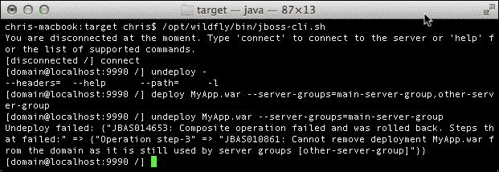
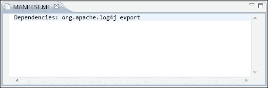
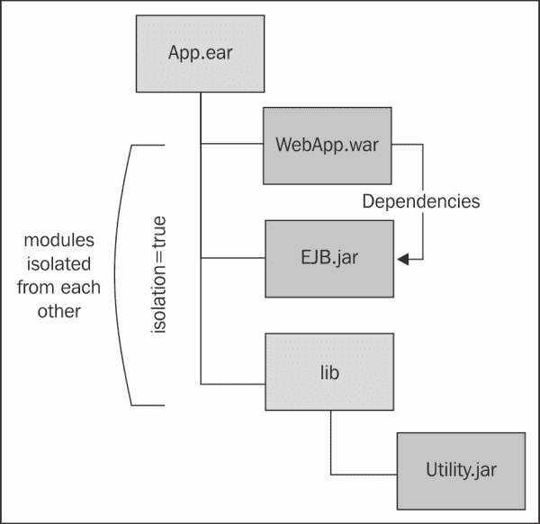

# 第六章 应用结构及部署

部署是将资源或应用程序上传到应用程序服务器的过程。在软件开发生命周期中，它是开发阶段之后的逻辑步骤，可以手动执行或以自动化的方式执行。

在本章中，我们将使用服务器发行版提供的工具来探索这两种方法。我们还将介绍如何使用 WildFly 插件为 Eclipse 部署资源。由于快速部署时间，这是 Java 开发者的首选选择。

在本章的最后部分，我们将介绍 WildFly 类加载器架构的细节。简而言之，本章的议程包括以下主题：

+   可以在 WildFly 上部署的资源类型

+   在 WildFly 独立实例上部署应用程序

+   在 WildFly 域上部署应用程序

+   理解 WildFly 的类加载架构

# 在应用程序服务器上部署资源

在 Java 企业应用程序中，我们基本上处理三种文件类型，如下所示：

+   **JAR**：这是最基本的包，可用于应用程序和通用资源

+   **WAR**：此文件用于打包 Web 应用程序

+   **EAR**：此文件打包多个 WAR 文件或包含一系列模块

除了这些，WildFly 还能够处理以下存档，为应用程序服务器提供额外的功能：

+   **RAR**：这是资源适配器文件，用于定义资源适配器组件（资源适配器子系统由`IronJacamar`项目提供；更多信息，请访问[`www.jboss.org/ironjacamar`](http://www.jboss.org/ironjacamar))

+   **SAR**：此文件使服务存档的部署成为可能，其中包含`MBean`服务，这是由应用程序服务器的早期版本支持的

在本章中，我们将讨论前三种类型的存档，它们构成了 Java 企业应用程序的典型打包解决方案。在讨论应用程序部署之前，让我们更详细地了解一下单一存档。

## JAR 文件

**Java** **存档**（**JAR**）文件用于将多个文件打包成一个单一的存档。其内部物理布局类似于 ZIP 文件，实际上，它使用与 zip 实用程序相同的算法来压缩文件。

JAR 文件通常用于分发 Java 类和相关元数据。在 Java EE 应用程序中，JAR 文件通常包含实用代码、共享库和企业 JavaBeans（EJBs）。

## WAR 文件

**Web** **应用程序** **存档** (**WAR**) 文件本质上是一个用于封装 Web 应用程序的存档。Web 应用程序通常包括一组与 Web 相关的资源，例如 **Java** **服务器** **页面** (**JSP**)、servlets、XHTML/HTML 文件等。它还包括 Java 类文件，以及可能的其他文件类型，具体取决于所使用的技术。自 Java EE 6 以来，可以使用适用于 Web 应用程序类的相同打包指南将 EJBs 打包到 WAR 存档中。这意味着您可以将 EJB 类以及其他类文件放置在 `WEB-INF` 下的 `classes` 目录中。或者，您可以将 EJBs 打包到一个 JAR 文件中，然后将此 JAR 文件放置在 WAR 的 `WEB-INF\lib` 目录中。

因此，开发者更倾向于使用 WAR 文件来分发 Java EE 应用程序。

## EAR 文件

**企业** **存档** (**EAR**) 文件代表一个应用程序存档，它充当一组模块或 WAR 文件的容器。EAR 文件可以包含以下任何一种：

+   打包在 WAR 文件中的一个或多个 Web 模块

+   打包在 JAR 文件中的一个或多个 EJB 模块

+   一个或多个应用程序客户端模块

+   应用程序所需的任何附加 JAR 文件

+   JBoss 特定的存档，如 SAR 文件

### 注意

使用企业存档文件有两个明显的优势。首先，它有助于使用单个存档分发所有应用程序组件，而不是分发每个单独的模块。其次，也是最重要的，是事实上的情况，即 EAR 文件中的应用程序由单个类加载器加载。这意味着每个模块都可以看到同一存档中打包的其他模块。

可以通过向主配置文件（`domain.xml` 或 `standalone.xml`）中添加 `ear-subdeployments-isolated` 元素来修改 EAR 文件中包含的应用程序模块的隔离级别。默认值是 `false`，这意味着 WAR 文件中的类可以访问 `ejb.jar` 文件中的类。同样，`ejb.jar` 文件中的类可以相互访问。如果出于某种原因，您不希望这种行为并希望限制类的可见性，请将以下行添加到您的配置文件中：

```java
<subsystem >
 <ear-subdeployments-isolated>true</ear-subdeployments-isolated>
</subsystem>
```

在 *解释 WildFly 类加载* 部分，我们将深入讨论应用程序服务器类加载架构。我们还将向您展示如何在应用程序级别覆盖此配置设置。

# 在独立 WildFly 服务器上部署应用程序

在 JBoss 上部署应用程序传统上是一个相当简单的任务，因此您可能会想知道为什么有一个完整的章节被专门用于它。这个答案在于，在 WildFly 上部署应用程序可以通过几种方式实现，每种方式我们都会查看。

首先，我们将查看通过 `deployments` 文件夹自动部署应用程序，但在这样做之前，我们需要解释在部署应用程序时可以使用的两种模式：

+   **自动** **部署模式**：此模式由部署扫描器在`deployments`文件夹中的资源被修改时触发

+   **手动部署模式**：此模式不依赖于部署扫描器来触发部署，而是依赖于一组标记文件来决定应用程序是否需要部署/重新部署

## 自动应用部署

自动应用部署包括将您的应用程序放置在`deployments`文件夹中，该文件夹位于以下路径：

`JBOSS_HOME\standalone\deployments`

默认情况下，放置在此文件夹中的每个应用程序归档（WAR、JAR、EAR 和 SAR）都会在服务器上自动部署，如下面的截图所示：


扫描已部署资源的服务称为**部署扫描器**，它配置在`standalone.xml`配置文件中。您可以通过搜索`deployment-scanner`域来找到它。以下代码片段显示了默认部署扫描器配置：

```java
<subsystem >
    <deployment-scanner path="deployments" relative-to="jboss.server.base.dir" scan-interval="5000" runtime-failure-causes-rollback="false"/></subsystem>
```

如您所见，默认情况下，服务器每`5000`毫秒扫描一次`deployments`文件夹。此服务可以通过多种方式自定义。接下来，我们将探讨如何进一步配置部署扫描器。

### 将应用程序部署到自定义文件夹

如果您想更改部署文件夹的位置，您需要修改`relative-to`和`path`属性。如果您提供了这两个属性，则`deployments`文件夹是这两个属性的叠加。例如，假设您已定义了`wildfly8deployments`路径，您可以在以后将其作为部署的相对路径引用，如下所示：

```java
<paths>
  <path name="wildfly8deployments" path="/opt/applications" />
</paths>

<subsystem >
     <deployment-scanner path="deployments" relative-to="wildfly8deployments" scan-interval="5000" runtime-failure-causes-rollback="false"/>
</subsystem>
```

在此配置中，部署扫描器在`/opt/applications`下的`deployments`文件夹中查找应用程序。

可以使用绝对路径来设置您的部署，省略`relative-to`属性并配置`path`元素，如下例所示：

```java
<deployment-scanner scan-interval="5000" runtime-failure-causes-rollback="false" path="/opt/applications/deployments" />

```

### 修改部署扫描器的行为

默认情况下，放置在`deployments`文件夹中的每个打包归档都会自动部署。另一方面，展开的应用程序需要额外一步才能部署（请参阅*手动应用部署*部分）。

我们可以轻松地改变部署扫描器的这种行为。控制`auto-deploy`功能的属性分别是`auto-deploy-zipped`和`auto-deploy-exploded`，如下面的代码所示：

```java
<deployment-scanner scan-interval="5000" relative-to="jboss.server.base.dir"path="deployments" auto-deploy-zipped="true" auto-deploy-exploded="false"/>

```

您可以将`auto-deploy-exploded`属性设置为`true`以实现展开归档的自动部署，如下所示：

```java
<deployment-scanner scan-interval="5000" relative-to="jboss.server.base.dir"path="deployments" auto-deploy-zipped="true" auto-deploy-exploded="true"/>

```

### 部署回滚

WildFly 8 引入了一个新的选项，可以回滚失败的部署。为此，只需将`runtime-failure-causes-rollback`属性更新为`true`，如下面的代码片段所示。默认行为是`false`：

```java
<subsystem >
    <deployment-scanner path="deployments" relative-to="jboss.server.base.dir" scan-interval="5000" runtime-failure-causes-rollback="true"/></subsystem>
```

### 注意

如果`failure-causes-rollback`属性设置为`true`，部署失败也会触发作为同一扫描部分处理的任何其他部署的回滚。

### 使用 CLI 部署应用程序

复制应用程序存档通常被许多开发者所青睐，因为它可以通过开发环境自动执行。然而，我们强调使用 CLI 界面（命令行界面）的优点，它提供了广泛的附加选项，在部署时使用，并允许你远程部署应用程序。

部署应用程序存档只需登录 CLI，无论是本地还是远程实例，然后发出`deploy`命令。当不带参数使用时，`deploy`命令会打印出当前已部署的应用程序列表。看看以下命令：

```java
[disconnected /] connect
[standalone@localhost:9990 /] deploy MyApp.war

```

要将你的应用程序部署到独立服务器，传递存档的相对（或绝对）路径。显然，如果你连接到远程服务器，此路径与客户端机器相关。这立即将你的应用程序部署到服务器。看看以下截图：

```java
[standalone@localhost:9990 /] deploy ./target/MyApp.war

```

当你指定一个相对路径时，它是相对于你启动 CLI 实用程序的位置而言的。然而，在指定存档位置时，你可以使用绝对路径。CLI 自动完成功能（使用*Tab*键）可以轻松完成这项工作。看看以下命令：

```java
[standalone@localhost:9990 /] deploy /opt/workspace/my-app/target/MyApp.war

```

默认情况下，当你通过 CLI 部署时，应用程序会被部署并启用，以便用户可以访问它。如果你想只执行应用程序的部署并在稍后启用它，你可以添加`--disabled`开关，如下所示：

```java
[standalone@localhost:9990 /] deploy ./target/MyApp.war --disabled

```

为了启用应用程序，只需发出另一个不带`--disabled`开关的`deploy`命令，如下所示：

```java
[standalone@localhost:9990 /] deploy --name=MyApp.war

```

### 注意

你注意到新增的可选`--name`开关了吗？使用此开关时，你可以使用**tab 完成**功能，以便自动找到不活动的部署单元。

重新部署应用程序需要向`deploy`命令添加一个额外的标志。如果你不使用此标志尝试两次部署相同的应用程序，将会得到错误。`–f`参数强制重新部署应用程序，如下所示：

```java
[standalone@localhost:9990 /] deploy -f ./target/MyApp.war

```

通过`undeploy`命令可以卸载应用程序，该命令将部署名称作为参数，如下所示：

```java
[standalone@localhost:9990 /] undeploy MyApp.war

```

在检查配置文件`standalone.xml`时，你会注意到你的应用程序的`deployment`元素已被删除。

### 使用 Web 管理控制台部署应用程序

应用程序部署也可以通过 Web 管理控制台完成：

1.  在你的浏览器中启动控制台超链接，`http://localhost:9990/console`。

1.  您需要添加至少一个管理用户以访问 Web 控制台。要添加新用户，请在您的 WildFly 安装目录的 `bin` 文件夹中执行 `add-user.bat` 或 `add-user.sh` 脚本，并输入所需信息。有关更多详细信息，请参阅第十章 [Chapter 10. Securing WildFly]，*Securing WildFly*。

1.  服务器部署通过在顶部菜单中选择 **运行时** 并然后选择 **管理部署** 选项来管理。如果您想向 WildFly 添加新应用程序，只需单击控制台的 **添加** 按钮即可，如下面的屏幕截图所示：

    一个直观的向导将引导您选择应用程序并为它提供一个运行时名称，如下面的屏幕截图所示：

    

向导中显示的两个属性可能会引起一些混淆：

+   **名称** 属性是部署在服务器运行时中应知的名称，例如，`MyApp-1.0.0.war`。这用作模块名称的基础，通常是存档的名称。

+   **运行时名称** 通常与 **名称** 相同，但可能存在您希望具有相同运行时名称的两个部署的情况。例如，您可能在内容库中有 `MyApp-1.0.0.war` 和 `MyApp-1.0.1.war`，但两个存档的运行时名称都是 `MyApp.war`。它们不能同时部署，其中一个需要被禁用。

默认情况下，管理员控制台部署应用程序但不启用它。通过单击 **启用** 按钮，现在可以访问应用程序，如下面的屏幕截图所示：


### 使用 WildFly Eclipse 插件部署应用程序

Eclipse 是 Java 开发者最广泛使用的应用程序开发环境，也是 JBoss 开发者的首选 IDE，因为 JBoss Tools 项目 ([`www.jboss.org/tools`](http://www.jboss.org/tools)) 通过提供一组插件来支持 Eclipse 环境。

在本书的第一章中，我们概述了 Eclipse 和 JBoss 工具的安装步骤。我们还设置了 WildFly 服务器适配器，它允许您使用独立模式在 WildFly 上启动、停止、调试和部署应用程序。

一旦安装了 WildFly Eclipse 插件，部署应用程序到 WildFly 就变得简单：

1.  简单地导航到 **服务器** 选项卡，右键单击 **WildFly 运行时服务器**，然后选择 **添加和移除**。您将看到一个窗口，如下面的屏幕截图所示：

1.  接下来，点击你的应用程序，选择**添加**，然后点击**完成**。项目现在将发布到服务器。如果你需要重新部署，点击你想要部署的项目，并选择**完全** **发布**，如图所示：

#### 配置 Eclipse 部署

通过双击 WildFly 运行时，你可以访问一个带标签的菜单，其中包含两个选项：**概览**和**部署**。**部署**选项是针对 JBoss 工具的，允许你选择部署位置和部署打包风格。请查看以下截图：


在勾选**将项目作为压缩存档部署**选项后，你的应用程序将被压缩并打包。

### 注意

如果你选择将应用程序作为展开的存档部署，一旦应用程序被复制到`deployments`文件夹，Eclipse 就会添加一个`.dodeploy`标记文件。这会触发应用程序的即时部署。有关标记文件的更多信息，请参阅下一节。

## 手动应用程序部署

当使用手动应用程序部署方法时，部署扫描器不会自动部署放置在`deployments`文件夹中的应用程序。相反，它使用一组标记文件，这些文件用于触发应用程序重新部署并捕获操作的结果。

你可能会想知道应用程序服务器为什么使用标记文件，以及为什么默认服务器配置设置为使用展开部署。

实际上，这个选择有几个原因，它们都与操作系统的文件系统工作方式有关。展开存档涉及在文件系统中移动/替换文件，这应该自动执行。通过原子操作，我们指的是文件系统操作需要作为一个单一操作执行。不幸的是，一些操作系统，如 Windows，不会将复杂的文件系统操作，如文件移动，视为原子操作。

大多数 Windows 用户在 JBoss AS 7 之前的 WildFly 版本发布时经常遇到部署问题。这是因为 JVM 拒绝释放对`META-INF/application.xml`或 EJB 描述符文件的文件句柄。这是因为 Windows 使用强制文件锁定，这阻止任何应用程序访问该文件。另一方面，像 UNIX 这样的操作系统使用建议性文件锁定，这意味着除非应用程序检查文件锁定，否则不会阻止它访问文件。

此外，使用标记文件，应用程序服务器能够解决与大型部署文件相关的一个常见问题。如果你曾经尝试部署一个大型包单元（尤其是在网络上），你可能已经经历过部署错误，因为部署扫描器在复制操作完成之前就开始部署，导致部署不完整。默认情况下，标记文件用于展开部署。它们由用户或容器添加的空文件组成，带有后缀，用于指示操作的成果。

最相关的标记文件是 `.dodeploy`，它触发应用程序重新部署。实际上，当我们添加一个展开的部署，并且部署扫描器配置中的 `auto-deploy-exploded` 属性为 `false` 时，控制台日志会警告我们应用程序尚未部署，如下所示：

```java
21:51:54,915 INFO  [org.jboss.as.server.deployment.scanner] (DeploymentScanner-threads - 1) JBAS015003: Found MyApp.war in deployment directory. To trigger deployment create a file called MyApp.war.dodeploy

```

Windows 和 Unix 用户可以通过简单地运行以下命令来触发部署：

```java
echo "" > MyApp.war.dodeploy

```

一旦你开始部署过程，应用程序服务器会回复两种可能的结果。部署扫描器服务将部署标记文件（例如，`MyApp.war.deployed`）放置在 `deployments` 目录中，以指示给定内容已部署到服务器，并且你的日志应该确认结果，如下所示：

```java
22:23:18,887 INFO  [org.jboss.as.server] (ServerService Thread Pool -- 28) JBAS018559: Deployed "MyApp.war" (runtime-name : "MyApp.war")

```

### 注意

如果你删除了 `.deployed` 文件，应用程序将被卸载，并在 `deployments` 文件夹中添加一个 `.undeployed` 标记文件（例如，`MyApp.war.undeployed`）。如果你尝试删除 `.undeployed` 文件，应用程序将再次部署。这是一个有用的快捷方式，可以快速卸载（或重新部署）应用程序，而无需在文件系统中删除它。

另一种可能的结果是部署失败，这由一个 `.failed` 标记来指示。文件内容包含一些关于失败原因的信息；然而，你应该检查服务器日志以获取有关错误原因的更详细信息。

当使用自动部署模式时，你可以删除 `.failed` 标记文件，当部署扫描器重新扫描文件夹时，它将重新部署应用程序。此外，用户可以放置 `.skipdeploy` 标记文件（例如，`MyApp.war.skipdeploy`），这将禁用内容在标记文件存在期间进行 `auto-deploy`。如果你依赖自动部署并希望确保在更新尚未完成时不会触发任何部署，请使用此功能。

让我们看看一个示例脚本，该脚本可以在使用 Linux 操作系统时，安全地重新部署名为 `MyApp.war` 的网络应用程序：

```java
touch $JBOSS_HOME/standalone/deployments/MyApp.war.skipdeploy
cp -r MyApp.war/  $JBOSS_HOME/standalone/deployments
rm $JBOSS_HOME/standalone/deployments/MyApp.war.skipdeploy

```

Windows 的等效定义如下：

```java
echo "" > "%JBOSS_HOME%\standalone\deployments\MyApp.war.skipdeploy"
xcopy MyApp.war %JBOSS_HOME%\standalone\deployments\MyApp.war /E /I
del %JBOSS_HOME%\standalone\deployments\MyApp.war.skipdeploy

```

最后，应用程序服务器提供了一些额外的临时标记文件，如`.isdeploying`、`.isundeploying`或`.pending`，这些文件由部署扫描器放置，以指示资源部署或卸载的转换。有关标记文件的完整详细信息，请参阅放置在服务器分发`deployments`文件夹中的`README.txt`文件。以下表格显示了应用程序服务器使用的可用标记文件的简要总结：

| 标记 | 创建者 | 描述 |
| --- | --- | --- |
| `.dodeploy` | 用户 | 创建此文件将触发应用程序部署。触摸此文件将导致应用程序重新部署。 |
| `.skipdeploy` | 用户 | 只要此文件存在，应用程序的自动部署就被禁用。 |
| `.deployed` | WildFly | 应用程序已部署。移除它将导致应用程序卸载。 |
| `.undeployed` | WildFly | 应用程序已被卸载。移除它将导致应用程序重新部署。 |
| `.failed` | WildFly | 应用程序部署失败。 |
| `.isdeploying` | WildFly | 应用程序部署正在进行中。 |
| `.isundeploying` | WildFly | 应用程序卸载正在进行中。 |
| `.pending` | WildFly | 有一个条件阻止应用程序部署（例如，文件正在复制中）。 |

# 在 WildFly 域上部署应用程序

在 WildFly 域上部署应用程序并不像在独立服务器上部署那样简单。域安装中没有预定义的`deployments`文件夹。这是因为，在`domain`模式下，可以有属于不同服务器组的多个服务器，每个服务器运行不同的配置文件。在这种情况下，一个单独的`deployments`文件夹会引发一个明显的问题：哪个服务器组将使用该文件夹？

接下来，我们将探讨在 WildFly 域上部署应用程序时可用的一些选项。这两个选项如下：

+   **命令行界面**（CLI）

+   管理员 Web 界面

## 使用 CLI 部署到域

让我们看看如何使用命令行界面（CLI）部署应用程序。首先启动 CLI，然后连接到域控制器，如下所示：

```java
[disconnected /] connect
domain@localhost:9990 /]

```

当您使用域模式部署应用程序时，您必须指定部署关联的服务器组。CLI 允许您在以下两个选项之间进行选择：

+   部署到所有服务器组

+   部署到单个服务器组

### 部署到所有服务器组

当选择将应用程序部署到所有服务器组的选项时，应用程序将被部署到所有可用的服务器组。可以使用`--all-server-groups`标志将应用程序部署到所有可用的服务器组。例如，使用以下命令：

```java
[domain@localhost:9990 /] deploy ../application.ear --all-server-groups

```

如果您想从属于域的所有服务器组中卸载应用程序，您必须发出`undeploy`命令，如下所示：

```java
[domain@localhost:9990 /] undeploy application.ear --all-relevant-server-groups

```

您可能已经注意到，`undeploy`命令使用`--all-relevant-server-groups`而不是`--all-server-groups`。这种差异的原因是部署可能并未在所有服务器组上启用，因此使用此选项实际上只是从所有那些已启用部署的服务器组卸载它。

### 注意

将应用程序作为`disabled`部署可能很有用，如果您有一些启动豆（当应用程序启用时被激活）并且您想加载它们，但又不想触发它们的执行，例如，如果数据库或其他企业信息系统暂时不可用。

### 部署到单个服务器组

单独部署到单个服务器组的选项允许您仅对您指定的服务器组执行选择性部署，如下所示：

```java
[domain@localhost:9990 /] deploy application.ear --server-groups=main-server-group

```

您不受单个服务器组的限制。要部署到多个服务器组，请用逗号分隔它们，如下所示：

```java
[domain@localhost:9990 /] deploy application.ear --server-groups=main-server-group,other-server-group

```

记住，您可以使用自动完成功能（*Tab*键）显示可用的`--server-groups`列表。

现在，假设我们只想从单个服务器组中卸载应用程序。可能会有两种可能的结果。如果应用程序仅在该服务器组上可用，您将成功完成卸载：

```java
[domain@localhost:9990 /] undeploy MyApp.war --server-groups=main-server-group

```

另一方面，如果您的应用程序在其他服务器组上可用，CLI 将返回以下错误：



此错误发生是因为当您从服务器组中删除应用程序时，域控制器会验证应用程序是否未被任何其他服务器组引用。如果是，则`undeploy`命令将失败。

如果您希望从单个服务器组中删除应用程序，您需要指定`-keep-content`参数。这将导致域控制器从服务器组卸载应用程序，同时保留内容：

```java
[domain@localhost:9990 /] undeploy application.ear --server-groups=main-server-group --keep-content

```

我们已经介绍了许多将应用程序部署到域的可用选项。在转到管理控制台之前，让我们回顾以下表格中显示的 CLI 部署选项：

| 命令 | 选项 | 影响 |
| --- | --- | --- |
| `deploy` | `--all-server-groups` | 将应用程序部署到所有服务器组。 |
| `undeploy` | `--server-groups` | 将应用程序部署到一个或多个服务器组。 |
| `undeploy` | `--all-relevant-server-groups` | 从所有服务器组卸载并删除应用程序。 |
| `undeploy` | `--server-groups` | 从一个服务器组卸载应用程序。如果它在另一个服务器组中被引用，则此操作将失败。 |
| `undeploy` | `--server-groups -keep-content` | 从一个服务器组卸载应用程序而不删除它。 |

## 使用管理控制台部署到域

使用**管理**控制台部署应用程序非常直观，只需要几个简单的步骤：

1.  首先通过默认地址`http://localhost:9990`登录到 Web 应用程序。

1.  然后，在顶部菜单中选择**Runtime**标签页，并在屏幕左侧面板中选择**Manage Deployments**，如图所示：

1.  在您可以将应用程序部署到服务器组之前，您需要将其上传到服务器，在那里它被存储在内容仓库中。为此，点击**CONTENT REPOSITORY**，然后点击**Add**。

    这将显示以下对话框，允许您上传您的应用程序：

    

1.  完成上传向导后，应用程序将被上传到域名仓库。为了将其部署/取消部署到单个服务器组，您需要选择**SERVER GROUPS**标签页，然后点击您希望部署到的服务器组上的**View**按钮，如图所示：

1.  下一屏显示了此服务器组的所有部署。现在，点击**Assign**按钮。这允许您从内容仓库中当前存储的应用程序中选择。勾选您的应用程序的复选框，然后点击**Save**，如图所示：

1.  在此阶段，应用程序已部署但尚未启用。选择**En/Disable**按钮以完成应用程序的部署，如图所示：

在**SERVER GROUPS**标签页中点击**Remove**按钮会从所选的服务器组中移除部署，而**CONTENT** **REPOSITORY**标签页中的另一个**Remove**按钮实际上会从临时域名仓库中删除部署，该仓库用于打包上传的应用程序。

# 解释 WildFly 类加载

管理依赖关系有两种方法，第一种是**Class-Path**方法，第二种是**Dependencies**方法。在本节中，我们将介绍这两个主题，但在我们这样做之前，让我们看看 WildFly 中类加载的历史，以便了解为什么类加载以这种方式工作。根据 Java EE 规范的要求，应用程序服务器需要提供一个环境，其中任何已部署的应用程序都可以访问特定版本的任何类或类库。

这也被称为**类命名空间隔离**（Java EE 5 规范，第 EE.8.4 节）。然而，从不同的命名空间加载类可能会引发一些不易解决的问题。例如，如果你将一个实用库的新版本打包到你的应用程序中，而应用程序服务器已经加载了该库的旧版本，会发生什么？或者，你如何在同一个应用程序服务器的同一个实例中同时使用同一实用库的两个不同版本？

JBoss AS 的类加载策略在多年中已经合理地发生了变化。应用程序服务器的 4.x 版本使用了`UnifiedClassLoader`，旨在减少运行应用程序之间的通信开销，因为类数据可以通过引用或简单的复制共享。

使用`UnifiedClassLoader`未能解决的问题之一是**类加载依赖**。其理念是，如果一个应用程序（A）使用了另一个应用程序（B）的类，当 B 被重新部署时，系统应该知道如何重新部署 A；否则，它将引用过时的类。实际上，曾有两个不同的尝试试图在不让用户进行任何配置的情况下使这一机制工作。但这两个尝试都没有真正成功，并且都被放弃了。

在 JBoss AS 5.0 中，一个新的类加载器基于新的**虚拟文件系统**（**VFS**）。VFS 被实现以简化并统一应用程序服务器内的文件处理。新的类加载器，命名为 VFS 类加载器，使用 VFS 来定位 JAR 和类文件。尽管这代表了 JBoss AS 5.0 中类加载方式的重大变化，但最终的行为与之前版本的 JBoss AS 非常相似。

一个常见的错误来源是将 API 类包含在由容器也提供的部署中。这可能导致创建多个版本的类，并且部署无法正确部署。

自从 JBoss AS 7 以来，类加载标志着与之前尝试的彻底转变。类加载现在基于 JBoss 模块项目，任何部署的应用程序实际上都是一个模块。这一事实可能会引发一些问题，例如，应该分配什么模块名称给部署的应用程序，以及应用程序服务器如何处理模块之间的依赖关系。

这些问题将在接下来的几节中得到解答。

## 了解模块名称

了解模块名称并非是一项学术练习。我们甚至可以进一步建立模块之间的依赖关系。因此，在许多情况下，你需要知道模块名称是如何分配给应用程序的。

被打包为顶级归档（如 WAR、JAR 和 SAR）的应用程序被分配以下模块名称：

`deployment.[归档名称]`

例如，一个名为`WebExample1.war`的 Web 应用程序使用以下模块名称进行部署：

`deployment.WebExample1.war`

另一方面，对于包含嵌套模块的应用程序（如 EAR），每个存档都使用以下约定分配一个模块名称：

`deployment.[ear archive name].[sub deployment archive name]`

因此，例如，前面的 Web 归档，如果包含在名为 `EnterpriseApp.ear` 的 EAR 文件中，将使用以下名称进行部署：

`deployment.EnterpriseApp.ear.WebExample1.war`

## 查找隔离级别

在 WildFly 8 中，一个通用规则是每个部署的应用程序模块都与其他模块隔离，也就是说，默认情况下，应用程序无法看到 AS 模块，AS 模块也无法看到应用程序。

使用应用服务器模块相对简单，可以总结为一句：向所需模块添加依赖项，AS 将会使用它。一些依赖项会自动添加到应用服务器中，而其他依赖项则需要用户进行标记：

+   核心模块库（即，`Enterprise` 类）被视为隐式依赖项，因此当部署者检测到它们的用法时，它们会自动添加到您的应用程序中

+   其他模块库需要用户在应用程序的 `MANIFEST` 文件中或在一个名为 `jboss-deployment-structure.xml` 的自定义 JBoss 部署文件中显式声明（关于此文件的更多信息，请参阅 *高级部署策略* 部分）

### 隐式依赖项

重复声明企业应用程序中常用的依赖项变得非常繁琐。这就是为什么应用程序服务器会自动为您添加核心模块。其中一些核心模块仅在应用程序服务器检测到特定技术的注解或配置文件时才添加。例如，添加 `beans.xml` 文件会自动触发 **Weld** 依赖项（Weld 是 WildFly 中使用的上下文和依赖注入实现）。

下表概述了自动添加到您的应用程序中的模块：

| 子系统 | 自动依赖项 | 触发依赖项 | 触发条件 |
| --- | --- | --- | --- |
| 核心服务器 | `javax.api` `sun.jdk` `org.jboss.vfs` |   |   |
| EE | `javaee.api` |   |   |
| EJB3 |   | `javaee.api` | 存在 `ejb-jar.xml` 或 EJB 注解 |
| JAX-RS | `javax.xml.bind.api` | `org.jboss.resteasy` | 存在 JAX-RS 注解 |
| JPA | `javax.persistence` | `javaee.api` `org.jboss.as.jpa` `org.hibernate` | 存在 `@PersistenceUnit` 或 `@PersistenceContext` 或等效 XML |
| 日志记录 | `org.jboss.logging` `org.apache.commons.logging` `org.apache.log4j` `org.slf4j` |   |   |
| 安全性 | `org.picketbox` |   |   |
| Web |   | `javaee.api` `com.sun.jsf-impl` `org.hibernate.validator` `org.jboss.as.web` `org.jboss.logging` | 部署 WEB 归档；如果使用，则添加 JSF |
| Web 服务 | `org.jboss.ws.api` `org.jboss.ws.spi` |   |   |
| 焊接 |   | `javax.persistence.api` `javaee.api` `org.javassist` `org.jboss.interceptor` `org.jboss.as.weld` `org.jboss.logging` `org.jboss.weld.core` `org.jboss.weld.api` `org.jboss.weld.spi` | `beans.xml` 文件的存在 |

如果你的应用程序使用了所指示的任何核心模块，那么你不需要指定其依赖项，因为应用程序服务器会自动链接该模块。如果你使用 Maven，则可以将这些依赖项标记为提供。

### 显式依赖项

需要由用户声明的模块不是隐式依赖项。假设你想使用打包在应用程序服务器发行版中的 log4j 库。实现这一点的最简单和推荐的方法是在 `META-INF/MANIFEST.MF` 中包含 `Dependencies: [module]` 声明。本章的示例代码使用 Maven 来填充 `MANIFEST.MF` 文件：

```java
<plugin>
    <artifactId>maven-war-plugin</artifactId>
    <version>2.1.1</version>
    <configuration>
        <failOnMissingWebXml>false</failOnMissingWebXml>
        <archive>
            <manifestEntries>
                <Dependencies>org.apache.log4j</Dependencies>
            </manifestEntries>
        </archive>
    </configuration>
</plugin>
```

这将导致在您的 `MANIFEST.MF` 文件中添加以下内容：


### 注意

请注意，模块名称不一定与库的包名称匹配。实际的模块名称由 `module.xml` 文件中 `module` 元素的 `name` 属性指定。

你不受单个依赖项的限制，因为你可以通过逗号分隔添加多个依赖项。例如，为了添加对 log4j 和 Apache Velocity API 的依赖项，请使用以下命令：

```java
Dependencies: org.apache.log4j,org.apache.velocity
```

你甚至可以通过添加 `export` 关键字将一个应用程序模块使用的依赖项导出到其他应用程序。例如，除了前面的示例之外，我们现在将依赖项导出到其他模块，如下所示：



### 注意

可以使用 `export` 参数将依赖项导出到 EAR 中包含的所有子部署。因此，如果你从 EAR 的顶层（或 `ear/lib` 目录中的 JAR）导出依赖项，则该依赖项也对所有子部署单元可用。

标记为依赖于 `deployment.WebApp1.war` 模块的应用程序也可以访问其依赖项：


在 `META-INF/MANIFEST.MF` 中，你也可以指定可以修改服务器部署者行为的附加命令。例如，可以添加 `optional` 属性来指定如果模块在部署时未找到，则部署不会失败。

最后，当指定 `services` 关键字时，部署者会尝试加载存放在存档的 `META-INF/services` 目录中的服务。

### 注意

在 Java SE 6 中，`service` API 已变为 `public`。**服务**可以定义为一组编程接口和类，它们提供对某些特定应用程序功能或特性的访问。**服务提供者接口**（**SPI**）是服务定义的 `public` 接口和 `abstract` 类的集合。

您可以通过实现服务提供者 API 来定义服务提供者。通常，您创建一个 JAR 文件来存放您的提供者。要注册您的提供者，您必须在 JAR 文件的`META-INF/services`目录中创建一个提供者配置文件。当您将`services`属性添加到您的`META-INF/MANIFEST.MF`文件中时，您实际上能够加载`META-INF/services`目录中包含的服务。

一个关于 SPI API 的优秀介绍可以在[这里](http://www.oracle.com/technetwork/articles/javase/extensible-137159.html)找到。

## 设置全局模块

设置全局模块类似于旧 AS 加载常用库的方法，您过去通常将它们放在`JBOSS_HOME/common`下的`lib`文件夹中。

如果您在`standalone.xml/domain.xml`中定义了一个名为`global-modules`的部分，那么您使该模块对其他 AS 模块可访问。例如，您可以使用以下部分而不是声明对 log4j 的依赖：[log4j 依赖激活](https://wiki.example.org/log4j_dependency_activation)

```java
<subsystem >
  <global-modules>
    <module name="org.apache.log4j" />
  </global-modules>
</subsystem>
```

虽然这种方法通常不推荐，因为它使我们回到了单体应用程序服务器的概念，但它仍然可以带来一些好处，例如在迁移一些较老的应用程序时，以及当您不想或无法指定存档的依赖项时。

## 高级部署策略

到目前为止涵盖的主题对于绝大多数应用程序来说已经足够了。如果您使用的是复杂的存档配置，例如包含多个模块和依赖项的 EAR 存档，那么在单个文件中定义您的类加载策略可能很有用。配置文件`jboss-deployment-structure.xml`正是这样做的。使用此文件的一些优点如下：

+   您可以在单个文件中定义所有应用程序模块的依赖项

+   您可以通过包含/排除所有或部分模块的所有部分以细粒度方式加载模块类

+   您可以为打包在企业存档中的应用程序定义类加载隔离策略

让我们通过查看一些实际示例来看看`jboss-deployment-structure.xml`能为您做什么。

### 设置单个模块依赖

我们已经学习了如何使用存档的`MANIFEST`文件中的`Dependencies`属性激活`log4j`依赖。使用`jboss-deployment-structure.xml`文件也可以达到相同的效果。让我们回顾一下存档结构，它基本上由一个名为`WebApp.war`的 Web 应用程序组成。

如以下图所示，`jboss-deployment-structure.xml`文件需要放置在 EAR 的`META-INF`文件夹中：


以下为`jboss-deployment-structure.xml`的内容：

```java
<jboss-deployment-structure>
  <sub-deployment name="WebApp.war">
    <dependencies>
      <module name="org.apache.log4j" />
    </dependencies>
  </sub-deployment>
</jboss-deployment-structure>
```

`jboss-deployment-structure`文件不仅限于用于 EAR，还可以通过将其放置在`WEB-INF`文件夹中来在 WAR 存档中使用。然而，它仅适用于顶级存档。因此，如果将`jboss-deployment-structure.xml`文件放置在 WAR 的`WEB-INF`文件夹中，并且 WAR 被打包在 EAR 文件中，那么`jboss-deployment-structure.xml`文件将被忽略。该文件的相关部分是子部署元素，它引用了 Web 应用程序，包括`dependencies`元素。预期的结果是应用程序服务器触发对 Log4J API 的依赖，因此它对我们 Web 应用程序是可见的。

### 排除服务器的自动依赖项

在本章的早期部分，我们讨论了当满足某些条件时，应用程序服务器可以自动触发依赖项。例如，如果你部署了一个 JSF 应用程序（包含`faces-config.xml`文件），那么 JSF 2.2 API 实现将自动添加。

这可能不是始终是期望的选项，因为你可能希望为该模块提供另一个发布实现。你可以通过在`jboss-deployment-structure.xml`文件中使用`exclusion`元素轻松实现这一点，如下面的代码片段所示：

```java
<jboss-deployment-structure>
  <deployment>
    <exclusions>
      <module name="javax.faces.api" />
      <module name="com.sun.jsf-impl" />
    </exclusions>
    <dependencies>
      <module name="javax.faces.api" slot="2.1"/>
      <module name="com.sun.jsf-impl" slot="2.1"/>
    </dependencies>
  </deployment>
</jboss-deployment-structure>
```

注意在`dependencies`部分，我们添加了我们的替代 JSF 2.1 实现，这是由你的应用程序使用的。你需要安装前面代码中显示的这两个模块，如第二章中所述，*配置 WildFly 核心子系统*。它们可以通过创建一个名为`2.1`的文件夹与 WildFly 提供的实现并排放置。以下命令行中突出显示了 JSF 2.1 存档的新文件夹，加粗显示：

```java
$JBOSS_HOME/modules/system/layers/base/javax/faces/api/main
$JBOSS_HOME/modules/system/layers/base/javax/faces/api/main/jboss-jsf-api_2.2_spec-2.2.6.jar
$JBOSS_HOME/modules/system/layers/base/javax/faces/api/main/module.xml
$JBOSS_HOME/modules/system/layers/base/javax/faces/api/2.1
$JBOSS_HOME/modules/system/layers/base/javax/faces/api/2.1/jsf-api-2.1.jar
$JBOSS_HOME/modules/system/layers/base/javax/faces/api/2.1/module.xml

```

你还需要将`slot`属性添加到`module.xml`文件中，如下面的代码片段所示：

```java
<module  name="javax.faces.api" slot="2.1" >
    ...
</module>
```

### 隔离子部署

考虑到你有一个由 Web 应用程序、EJB 模块和包含实用类 JAR 文件组成的 EAR 应用程序，所有子部署都放置在存档的根目录，以便它们可以相互看到。但是，假设你的 Web 应用程序包含一些相同的 EJB 实现。这是绝对可能的，因为 Java EE 允许你的 Web 应用程序在`WEB-INF/classes`或`WEB-INF/lib`文件夹中包含 EJB 类，如下面的图所示：


类加载器是如何解决这个冲突的呢？应用程序服务器类加载器在加载类时有一个优先级列表，因此可以减少加载类之间的任何冲突，如下所示：

+   容器自动将最高优先级赋予模块，包括 Java EE API。包含在`modules`文件夹中的库属于这一类别。

+   下一个优先级是给那些在打包归档的 `MANIFEST.MF` 文件中指定为依赖项（或在 `jboss-deployment-structure.xml` 文件中）的库。

+   上一优先级是给那些打包在应用程序本身的库，例如 `WEB-INF/lib` 或 `WEB-INF/classes` 中包含的类。

+   最后，最低优先级是给那些打包在同一 EAR 归档内的库（位于 EAR 的 `lib` 文件夹中）。

因此，在这个例子中，位于 `WEB-INF` 文件夹中的 EJB 库隐藏了 `EJB.jar` 顶级部署的实现。如果这不是你想要的结果，你可以简单地覆盖它，如下所示：

```java
<jboss-deployment-structure>
  <ear-subdeployments-isolated>false</ear-subdeployments-isolated>
  <sub-deployment name="WebApp.war">
    <dependencies>
      <module name="deployment.App.ear.EJB.jar" />
    </dependencies>
  </sub-deployment>
</jboss-deployment-structure>
```

在前面的代码片段中，我们添加了对 `EJB.jar` 部署的依赖，该部署位于 EAR 的根目录，并覆盖了在 Web 应用程序中打包的实现。

### 注意

注意文件顶部的 `ear-subdeployments-isolated` 元素。通过设置 EAR 隔离级别，你将能够指示子部署模块是否彼此可见。

`ear-subdeployments-isolated` 元素的默认值是 `false`，这意味着子部署模块可以彼此看到。如果你将隔离设置为 `true`，那么每个模块将由不同的类加载器加载，这意味着 Web 应用程序将无法找到 `EJB.jar` 和 `Utility.jar` 库中包含的类）。

如果你想要保持部署隔离但允许某些依赖项之间的可见性，那么你有两个选择可用：

+   将库移动到 `EAR/lib` 文件夹，以便它作为一个单独的模块被选中

+   在调用应用的 `MANIFEST.MF` 文件中使用 Dependencies 或 Class-Path 指定依赖

在下面的图中，你可以看到如何正确设置你的 EAR，通过将公共库放在 `lib` 文件夹中，并添加对 EJB 类的依赖：



下面是 `jboss-deployment-structure.xml` 中所需的相应配置：

```java
<jboss-deployment-structure>
  <ear-subdeployments-isolated>true</ear-subdeployments-isolated>
  <sub-deployment name="WebApp.war">
    <dependencies>
      <module name="deployment.App.ear.EJB.jar" />
    </dependencies>
  </sub-deployment>
</jboss-deployment-structure>
```

### 注意

在你的 EAR 中将库打包成共享库是一个选项。从 Java EE 5 开始，可以将这些文件放置在名为 `lib` 的共享库文件夹中。你可以使用 `META-INF/application.xml` 文件中的 `library-directory` 元素来覆盖默认文件夹名称。例如，假设你想使用 `common` 文件夹来存放你的共享库，在这种情况下，你可以在你的 `application.xml` 中添加以下行：

```java
<library-directory>common</library-directory>
```

作为旁注，你应该避免在共享文件夹中放置组件声明注解（如 EJB3），因为它可能会对部署过程产生意外的后果。因此，强烈建议你将你的实用类放在共享库文件夹中。

### 使用 Class-Path 声明解决依赖

到目前为止，我们使用 JBoss 方式配置了模块之间的依赖关系，这是推荐的选择。尽管如此，我们也应该考虑到 Java 的可移植方式来引用包含在 EAR 文件中的一个或多个库。这可以通过向`MANIFEST.MF`文件添加`Class-Path`属性来实现。这允许一个模块引用另一个对应用程序不可见的库（回想一下之前示例中的部署单元，其隔离设置为`true`）。

例如，考虑到你需要从你的 Web 应用程序中引用`Utility.jar`应用程序，你只需直接在你的 EAR 文件中的`META-INF/MANIFEST.MF`文件中添加以下内容即可：

```java
Manifest-Version: 1.0
Class-Path: Utility.jar
```

你实际上可以将多个库包含到`Class-Path`属性中，通过逗号分隔它们。

### 注意

与`Dependencies`属性不同，`Class-Path`属性指向实际的 JAR 文件名（而不是模块名称），以引用依赖库。

在选择类路径方法与 JBoss 依赖方法之间取决于你的应用程序结构：使用 JBoss 依赖方法为你提供更丰富的选项，特别是能够将依赖项导出到其他部署中，正如我们之前所展示的。支持 JBoss 依赖方法的一个额外点是能够引用实际上未打包在应用程序内的模块。

另一方面，类路径方法的主要优势在于应用程序的可移植性。因此，如果你将完全可移植的解决方案作为优先考虑，你可以考虑切换到`Class-Path`清单属性。

# 摘要

在本章中，我们涵盖了与应用程序部署相关的各种功能。应用程序的部署方式不同，这取决于它们是部署到独立服务器还是服务器域。

就独立服务器而言，应用程序可以自动或手动部署。默认情况下，打包的存档会自动部署。这意味着你所需做的只是将存档放置在应用程序服务器的`standalone`/`deployments`文件夹中。手动部署的应用程序（默认情况下为展开的存档）需要标记文件来激活部署。

就域服务器而言，由于应用程序服务器无法确定你希望将部署指向哪个服务器组，因此在使用命令行界面或 Web 管理界面时，你需要指定此信息。

使用服务器域的一个巨大优势是能够在单个或多个服务器组上部署应用程序，这些服务器组甚至可以在运行时创建和配置。

在本章的后续部分，我们介绍了应用服务器使用的类加载机制。部署到 WildFly 的每个应用都被视为一个模块，所有这些模块都与应用服务器分发中的其他模块隔离。代表 Java EE API 类的模块会隐式地添加到你的应用程序的类路径中作为依赖项，这意味着你不需要任何特殊的配置来部署 Java EE 应用程序。

如果你想引用应用服务器中包含的其他模块，你只需在应用的`META-INF/MANIFEST.MF`文件中添加一个`Dependencies`属性。企业存档也可以通过在`META-INF/MANIFEST.MF`文件中设置`Class-Path`属性来指定对其他模块的依赖。

如果你希望将所有依赖项维护在一个单独的文件中，你可以使用`jboss-deployment-structure.xml`文件。这允许你在存档内定义所有依赖项，包括覆盖默认的 EAR 隔离级别和过滤进/出类，这些类是应用服务器部署的一部分。

在下一章中，我们将通过详细探讨命令行界面和 Web 管理控制台来介绍应用服务器的管理。
