# 第七章。使用管理接口

在本章中，我们将描述 WildFly 提供的管理工具，这些工具可以用来控制您的应用程序服务器实例。

WildFly 提供了几个管理通道。其中之一是 CLI，它包含许多独特的功能，使得日常系统管理和监控应用程序服务器资源变得方便。

管理工具还包括一个提供应用程序服务器子系统优雅视图的 Web 管理控制台，允许您以简单的方式执行管理任务。

在本章中，我们将描述以下管理工具：

+   命令行界面 (CLI)

+   Web 管理控制台

我们还将涵盖以下主题：

+   创建和修改数据源

+   从 CLI 获取帮助

+   批处理脚本

+   配置服务器配置文件

+   添加 JMS 目的地

+   配置 JMS 目的地

+   配置套接字绑定组

+   在 CLI 和 Web 控制台之间进行选择

# 命令行界面 (CLI)

终端和控台是系统管理员和机器之间最早的通信接口类型之一。由于这种长期存在，大多数系统管理员更喜欢使用命令行的原始力量来执行管理任务。使用低级接口，如 shell，的一个最明显的优点是任务通常可以作为批处理或宏的一部分执行，用于重复性操作。

### 提示

正如我们在本书开头所指出的，CLI 位于 `JBOSS_HOME/bin` 文件夹中，并由 `jboss-cli.sh`（对于 Windows 用户，是 `jboss-cli.bat`）包装。

通过启动 shell 脚本，您将以断开连接的会话开始。您可以在任何时候使用 `connect [standalone/domain controller]` 命令连接，默认情况下，该命令连接到位于 `localhost` 的服务器控制器，端口号为 `9990`：

```java
You are disconnected at the moment. Type 'connect' to connect to the server or 'help' for the list of supported commands.
[disconnected /] connect
[standalone@localhost:9990 /]

```

您可以通过修改以下代码片段中突出显示的行来调整原生接口运行的默认端口，该代码片段位于 `standalone.xml` 或 `domain.xml` 配置文件中：

```java
<management-interfaces>

   <http-interface security-realm="ManagementRealm" http-upgrade-enabled="true">
       <socket-binding http="management-http"/>
   </http-interface>
 </management-interfaces>

 <socket-binding-group name="standard-sockets" default-interface="public" port-offset="0">
...

 <socket-binding name="management-http" interface="management" port="9990"/>
 <socket-binding name="management-https" interface="management" port="9993"/>
...
</socket-binding-group>
```

如您从前面的代码片段中看到的，套接字管理别名定义在 `management-interfaces` 部分，而相应的端口包含在 `socket-binding` 部分。

一个方便的开关是 `--connect`，可以在启动 CLI 时自动连接到您的独立/域控制器，如下所示：

```java
$JBOSS_HOME/bin/jboss-cli.sh --connect

```

在 Windows 机器上，使用以下命令：

```java
$JBOSS_HOME/bin/jboss-cli.bat --connect

```

退出 CLI 的相应命令可以是 `quit` 或 `exit`，这将关闭与主控制器的连接：

```java
[standalone@localhost:9990 /] quit

```

## 重新加载服务器配置

虽然通过命令行对配置所做的更改大多数会立即生效，但有些更改不会立即生效，需要重新加载服务器配置，例如，更改套接字绑定组。要重新加载服务器配置，您需要发出 `:reload` 命令，如下所示：

```java
[standalone@localhost:9990 /] :reload
{
 "outcome" => "success",
 "result" => undefined
}

```

## 使用 CLI

CLI 最有趣的功能之一是其自动补全功能，这有助于你找到资源和命令的正确拼写。这可以通过简单地按*Tab*键实现。你甚至可以使用它来查找特定命令所需的参数，而无需查阅参考手册。

这引导我们进入旅程的第一部分，我们将学习可用的命令。所以，一旦你成功连接，按下*Tab*键，它将列出你可用选项。以下截图显示了输出：

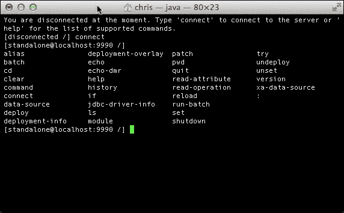

如你所见，有超过 30 个选项可用。然而，我们可以将所有与 CLI 发生的交互分为两大类：

+   **操作**：这些包括它们所执行的资源路径（地址）。

+   **命令**：这些命令独立于当前资源的路径执行动作。这些命令不包括资源路径。

### 在资源间导航并执行操作

操作严格绑定到应用程序服务器资源路径。资源树中的路径由`/`字符表示，它实际上代表树的根，就像在 Unix 文件系统中一样。

当在服务器资源上执行操作时，你必须使用一个定义良好的语法：

```java
[node-type=node-name (,node-type=node-name)*] : operation-name [( [parameter-name=parameter-value (,parameter-name=parameter-value)*] )]

```

初看可能有些不自然；然而，我们将通过以下示例来尝试揭开它的神秘面纱：

```java
[standalone@localhost:9990 /] /subsystem=deployment-scanner/scanner=default:write-attribute(name=scan-interval,value=2500)
{"outcome" => "success"}
```

在这里，我们告诉 CLI 导航到默认扫描资源下的`deployment-scanner`子系统，并使用`write-attribute`操作将`scan-interval`属性设置为`2500`毫秒。

此示例还展示了资源、属性和操作之间的区别。

资源是位于路径下的配置元素。所有被分类为资源的元素都可以通过 WildFly 的接口进行管理。例如，`deployment-scanner`是位于`subsystem`路径下的资源。它有一个名为`default`的子元素（当没有指定名称属性时，名称默认为`default`）。在单个资源或子资源上，你可以调用一些操作，例如读取或写入属性的值（`scan-interval`）。

最后，请注意，操作由`:`前缀引入，而资源由`/`字符引入。以下截图有助于你巩固基本概念：


为了在资源路径中移动，你可以要么指定完整的树路径（如早期示例所示），要么使用`cd`命令或等效的`cn`（更改节点）命令导航到路径，然后发出所需的命令。例如，前面的代码片段也可以重写为：

```java
[standalone@localhost:9990 /] cd /subsystem=deployment-scanner/scanner=default

[standalone@localhost:9990 scanner=default] :write-attribute(name=scan-interval,value=2500)
{"outcome" => "success"}

```

### 小贴士

**CLI 修改的属性在服务器重启后是否仍然存在？**

当使用 CLI 时，每次更改都会持久化到服务器配置文件中。这意味着你必须小心通过 CLI 更改服务器的配置。为了安全起见，在做出重大更改之前，拍摄服务器配置的快照是明智的。请参阅*拍摄配置快照*部分。

就像操作系统 shell 一样，发出 `cd ..` 将将资源指针移动到父资源：

```java
[standalone@localhost:9990 scanner=default] cd ..
[standalone@localhost:9990 subsystem=deployment-scanner]

```

你可以随时通过发出一个空的 `cd` 命令或仅仅 `pwd` 来检查你所在的位置的资源路径，就像你在 Unix shell 中做的那样，如下所示：

```java
[standalone@localhost:9990 scanner=default] pwd
/subsystem=deployment-scanner/scanner=default

```

最后，为了简化你的导航，我们将通过提供应用服务器树或资源的鸟瞰图来结束本节，如下所示：

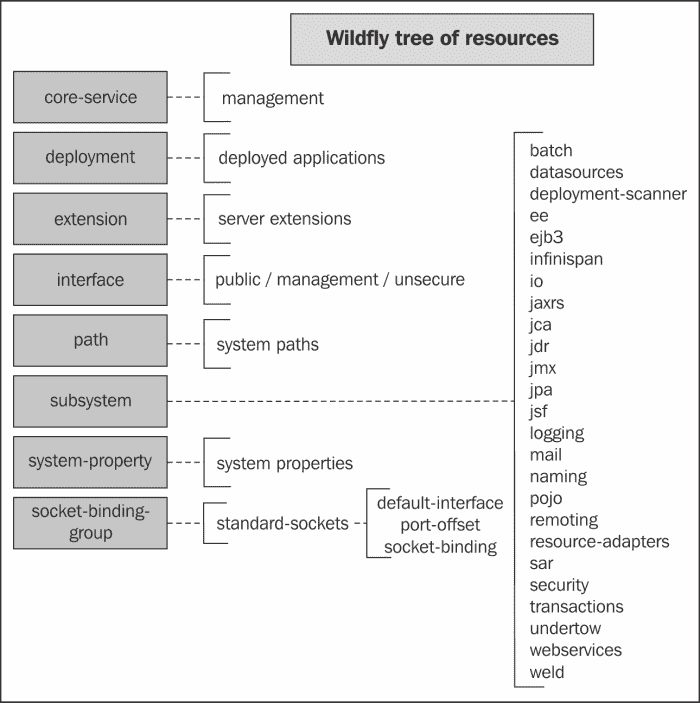

如你所见，资源树包括八个子资源，每个子资源处理应用服务器的一个核心方面。在附录中，*CLI References*，你可以找到一个有用的命令列表，这些命令可以用于你的日常系统管理。大多数时候，你会导航到包含所有应用服务器核心模块的子系统资源。你可能还想了解更多关于核心服务的信息，它处理管理接口（例如 CLI 本身），部署资源，它可以用来操作已部署的工件，以及`socket-binding-group`，这是你需要更改应用服务器使用的端口的资源。

#### 可在资源上发出的操作

在学习了通过资源导航的基本知识后，让我们看看可以在资源上发出的命令。操作由 `:` 字符触发。你可以通过使用自动完成功能（*Tab* 键）来获取它们的列表。以下是一个命令列表：

| 命令 | 含义 |
| --- | --- |
| `read-resource` | 此命令读取模型资源的属性值，以及关于任何子资源的基本或完整信息。 |
| `read-resource-description` | 此命令为选定的资源输出一个描述。 |
| `read-operation-names` | 此命令读取节点上可用的操作名称。 |
| `read-operation-description` | 此命令为可用的操作输出一个描述。 |
| `read-children-names` | 此命令获取选定资源下所有子资源的名称。 |
| `read-children-resources` | 此命令读取关于给定类型的所有子资源的信息。 |
| `read-children-types` | 此命令提供选定资源下子资源的列表。 |
| `read-attribute` | 此命令获取选定资源的属性值。 |
| `write-attribute` | 此命令为选定的资源写入一个属性。 |

`read-resource`命令值得进一步解释。在没有额外参数的情况下，它提供关于资源属性和直接子节点的信息。

例如，以下是对数据源子系统的资源扫描，它包括默认数据源名为`ExampleDS`：

```java
[standalone@localhost:9990 /] /subsystem=datasources:read-resource()
{
 "outcome" => "success",
 "result" => {
 "xa-data-source" => undefined,
 "data-source" => {"java:jboss/datasources/ExampleDS" => undefined},
 "jdbc-driver" => {"h2" => undefined}
 }
}

```

你可能已经注意到了某些元素的`undefined`属性。`read-resource`命令提供的信息仅限于列出子资源名称。如果你想要读取关于所有子资源的信息，包括它们对应的属性，你必须使用额外的（`recursive=true`）参数执行命令，如下所示：

```java
[standalone@localhost:9990 /] /subsystem=datasources:read-resource(recursive=true)
{
 "outcome" => "success",
 "result" => {
 "data-source" => {
 "ExampleDS" => {
 "connection-properties" => undefined,
 "connection-url" => "jdbc:h2:mem:test;DB_CLOSE_DELAY=-1;DB_CLOSE_ON_EXIT=FALSE",
 "datasource-class" => undefined,
 "driver-name" => "h2",
 "enabled" => true,
 ...
 }
 },
 "jdbc-driver" => {
 "h2" => {
 "driver-module-name" => "com.h2database.h2",
 "driver-name" => "h2",
 "driver-xa-datasource-class-name" => "org.h2.jdbcx.JdbcDataSource",
 ...
 }
 },
 "xa-data-source" => undefined
 }
}

```

如你所见，通过添加`recursive=true`参数，CLI 还包含了配置参数列表，这些参数作为数据源元素的子元素存储。为了简洁起见，我们有意只包括了一些数据源参数。

此外，一些资源可以生成指标，这些指标作为运行时属性被收集。除非你提供`include-runtime=true`参数，否则默认情况下这些属性不会显示。例如，在数据源子系统内，你可以查看与数据库连接池相关的统计信息：

```java
[standalone@localhost:9990 statistics=pool] :read-resource(include-runtime=true) 
{
 "outcome" => "success",
 "result" => {
 "ActiveCount" => "0",
 "AvailableCount" => "20",
 "AverageBlockingTime" => "0",
 "AverageCreationTime" => "0",
 "AverageGetTime" => "0",
 "BlockingFailureCount" => "0",
 "CreatedCount" => "0",
 "DestroyedCount" => "0",
 "IdleCount" => "0",
 "InUseCount" => "0",
 "MaxCreationTime" => "0",
 "MaxGetTime" => "0",
 "MaxUsedCount" => "0",
 "MaxWaitCount" => "0",
 "MaxWaitTime" => "0",
 "TimedOut" => "0",
 "TotalBlockingTime" => "0",
 "TotalCreationTime" => "0",
 "TotalGetTime" => "0",
 "WaitCount" => "0"
 }
}

```

如果你想要了解更多关于资源的信息，可以使用`read-resource-description`命令，它提供简短描述。它还包括资源运行时属性描述。输出可能相当冗长，所以这里我们只包括其头部部分：

```java
[standalone@localhost:9990 statistics=pool] :read-resource-description
{
 "outcome" => "success",
 "result" => {
 "description" => "Runtime statistics provided by the resource adapter.",
 "attributes" => {
 "DestroyedCount" => {
 "description" => "The destroyed count",
 "type" => INT,
 "required" => false,
 "access-type" => "metric",
 "storage" => "runtime"
 },
 "WaitCount" => {
 "description" => "The number of requests that had to wait to obtain a physical connection",
 "type" => INT,
 "required" => false,
 "access-type" => "metric",
 "storage" => "runtime"
 }
 }
 }
}

```

`read-operation-names`和`read-operation-description`命令提供关于特定资源上可用的操作及其描述的列表。这些生成与先前表格中概述的信息，因此我们在此不再重复描述。

接下来，可以使用`read-children`操作来收集关于子节点的信息。`read-children-types`命令提供关于子资源的信息，并且与简单的`ls`命令非常相似。例如，在`root`资源上，它将生成以下内容：

```java
[standalone@localhost:9990 /] :read-children-types()
{
 "outcome" => "success",
 "result" => [

 "core-service",
 "deployment",
 "deployment-overlay",
 "extension",
 "interface",
 "path",
 "socket-binding-group",
 "subsystem",
 "system-property"
 ]
}

```

`read-children-names`提供关于单个子资源的信息，并且几乎等同于执行`cd`资源后跟一个`ls`命令。例如，如果我们想了解 AS 上部署的资源列表，我们将输入以下内容：

```java
[standalone@localhost:9990 /] :read-children-names(child-type=deployment)
{
 "outcome" => "success",
 "result" => [
 "Enterprise.ear",
 "EJB.jar",
 "Utility.jar"
 ]
}

```

最后，`read-children-resources`命令返回关于特定类型子节点的信息，这需要作为参数提供。此命令相当于对每个子资源执行`read-resource`操作。在先前的例子中，当我们对一个假设的`Enterprise.ear`部署资源执行此命令时，它将提供子部署信息，如下所示：

```java
[standalone@localhost:9990 deployment=Enterprise.ear] :read-children-resources(child-type=subdeployment)
{
 "outcome" => "success",
 "result" => {
 "WebApp.war" => {
 "subdeployment" => undefined,
 "subsystem" => {"web" => undefined}
 },
 "Utility.jar" => {
 "subdeployment" => undefined,
 "subsystem" => undefined
 }
 }
}

```

可选地，你还可以将`include-runtime=true`作为参数添加，以包含运行时属性，以及`recursive=true`，它提供了关于所有子资源的递归信息。

### 使用 CLI 执行命令

如前所述，CLI 还包括一组不绑定到您在 AS 树中的导航路径的操作，但可以在任何地方发出以创建和修改资源。

例如，可以发出`version`命令以检索 WildFly 运行时关于应用程序服务器和环境的某些基本信息：

```java
[standalone@localhost:9990 /] version
JBoss Admin Command-line Interface
JBOSS_HOME: /opt/wildfly-8.1.0.Final
JBoss AS release: 8.1.0.Final "Kenny"
JAVA_HOME: /Library/Java/JavaVirtualMachines/jdk1.8.0_05.jdk/Contents/Home
java.version: 1.8.0_05
java.vm.vendor: Oracle Corporation
java.vm.version: 25.5-b02
os.name: Mac OS X
os.version: 10.8.5

```

在大多数情况下，命令用作创建一些资源的别名，例如 JMS 目标和数据源。

让我们在以下章节中看看如何实现这一点。

#### 添加 JMS 目标

您可以使用`jms-queue add`命令添加 JMS 队列。

### 注意

如您所见，操作和命令之间的重要区别之一也是传递参数时使用的样式。操作使用括号传递参数（例如，`recursive=true`）。命令使用格式（`--parameter`）传递参数，就像在 Unix shell 中一样。

以下是对`jms-queue add`命令的概述：

```java
jms-queue add --queue-address=queue_name --entries=jndi-name(,jndi-name)* [--profile=profile_name] [--selector=selector_name] [--durable=(true|false)]

```

这里唯一的必需元素是`queue-address`，它指定了队列名称以及队列将绑定到的 JNDI 名称条目。可选条目包括`selector`参数，可以添加以在队列上指定选择器以过滤消息，以及`durable`参数，它指定队列是否应该是持久的（默认为`true`）。最后，请注意可选的`profile`元素，它可以在域配置中使用，以指定将在哪个`profile`上创建`queue`。

### 提示

记得使用`-c standalone-full.xml`参数启动服务器，以便拥有包含消息子系统的服务器配置。如果不这样做，这些命令将导致错误。

以下命令创建了一个新的 JMS 队列（`queue1`），该队列绑定在 JNDI `queues/queue1`命名空间下：

```java
jms-queue add [--profile=profile_name] --queue-address=queue1 --entries=java:/jms/queues/queue1

```

添加 JMS 主题的等效命令是`jms-topic add`，其语法如下：

```java
jms-topic add [--profile=profile_name]--topic-address=topic_name [--entries=entry(,entry)*] [--profile=profile_name] 

```

这与 JMS 队列非常相似，只是 JMS 主题的参数较少。在这里不需要`selector`或`durable`参数。看看以下命令：

```java
jms-topic add [--profile=profile_name] --topic-address=topic1 --entries=topics/topic1

```

#### 创建和修改数据源

CLI 提供了一个有用的`data-source`命令来创建数据源。由于该命令的语法相当长，您可能发现将其保存为 CLI 脚本并适应您的需求很有用。

以下是对`data-source`命令的概述：

```java
data-source [--profile=<profile_name>] add/remove --jndi-name=<jndi_name> --driver-name=<driver_name> --name=<pool_name>  --connection-url=<connection_url>

```

除了`profile_name`之外，前面代码片段中显示的所有其他参数都是必需的。也就是说，如果您想添加或删除数据源，则需要指定它们。就参数而言，您至少需要声明数据源的服务器名称（`jndi-name`）、驱动程序名称（`driver-name`）、连接池名称（`name`）和连接 URL（`connection-url`）。

您可以通过添加一些可选参数来进一步自定义数据源，就像您在`standalone.xml`文件中所做的那样。让我们看看一个具体的例子，其中我们创建了一个 MySQL 数据源。首先，我们需要做的是通过部署 JAR 存档提供 JDBC 兼容的驱动程序。考虑到您正在使用独立模式，只需将 JDBC JAR 文件复制到`deployments`文件夹中。请看以下截图：

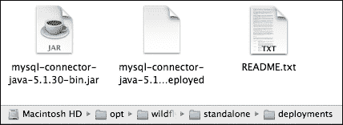

一种更简单的方法是通过命令行部署 JDBC 驱动程序。假设您从包含驱动程序的文件夹中启动命令行界面，您将运行以下命令：

```java
[standalone@localhost:9990 /] deploy ./mysql-connector-java-5.1.30-bin.jar

```

### 注意

您还可以选择将 JDBC 驱动程序作为模块安装，这是首选方式。此过程在第三章 *配置企业服务* 中展示。为了本例的目的，我们只是部署了驱动程序，因为这加快了安装过程。

现在，让我们验证驱动程序是否已正确安装在数据源子系统上。我们可以通过在数据源子系统上的`installed-drivers-list`命令来完成此操作，如下所示：

```java
[standalone@localhost:9990 /] /subsystem=datasources:installed-drivers-list
{
 "outcome" => "success",
 "result" => [
 {
 "driver-name" => "mysql-connector-java-5.1.30-bin.jar_com.mysql.jdbc.Driver_5_1",
 "deployment-name" => "mysql-connector-java-5.1.30-bin.jar_com.mysql.jdbc.Driver_5_1",
 "driver-module-name" => undefined,
 "module-slot" => undefined,
 "driver-datasource-class-name" => undefined,
 "driver-xa-datasource-class-name" => undefined,
 "driver-class-name" => "com.mysql.jdbc.Driver",
 "driver-major-version" => 5,
 "driver-minor-version" => 1,
 "jdbc-compliant" => false
 },
 {
 "driver-name" => "h2",
 "deployment-name" => undefined,
 "driver-module-name" => "com.h2database.h2",
 "module-slot" => "main",
 "driver-datasource-class-name" => "",
 "driver-xa-datasource-class-name" => "org.h2.jdbcx.JdbcDataSource",
 "driver-class-name" => "org.h2.Driver",
 "driver-major-version" => 1,
 "driver-minor-version" => 3,
 "jdbc-compliant" => true
 }
 ]
}

```

如您所见，现在已安装了两个驱动程序：默认的`H2`驱动程序和我们之前安装的`MySQL`驱动程序。

现在，我们已准备好使用 MySQL JDBC 驱动程序创建一个新的数据源：

```java
[standalone@localhost:9990 /] data-source add --jndi-name=java:/MySqlDS --name=MySQLPool --connection-url=jdbc:mysql://localhost:3306/MyDB --driver-name=mysql-connector-java-5.1.30-bin.jar_com.mysql.jdbc.Driver_5_1 --user-name=myuser --password=password --max-pool-size=30

```

在这个例子中，我们仅创建了一个使用最大连接数`30`的自定义连接池的 MySQL 绑定数据源。

### 注意

您不需要记住所有数据源参数的名称。只需使用*Tab*键来自动完成参数名称。同时，请注意您的驱动程序名称与您运行`installed-drivers-list`命令时创建的输出匹配。

`data-source`命令也可以用来从配置中删除数据源。这可以通过传递`remove`参数和`datasource`的`name`来实现，如下所示：

```java
[standalone@localhost:9990 /] data-source remove --name=MySQLPool

```

### 注意

您还可以通过在数据源系统资源上执行的操作来添加和删除数据源。请参阅附录 *CLI 参考*，其中包含最有用的 CLI 命令集。

##### 创建和修改 XA 数据源

修改用于您连接的 XA 数据源类与`data-source`类似。主要区别在于您将使用`xa-data-source`命令，如下所示：

```java
[standalone@localhost:9990 /] xa-data-source add --name=MySQLPoolXA --jndi-name=java:/MySqlDSXA --driver-name=mysql-connector-java-5.1.30-bin.jar_com.mysql.jdbc.Driver_5_1 --xa-datasource-properties=[{ServerName=localhost}{PortNumber=3306}]

```

创建 XA 数据源需要三个参数。您需要一个唯一的`name`，`jndi-name`，最后是`driver-name`。

这将在您的配置文件中添加以下代码片段：

```java
<xa-datasource jndi-name="java:/MySqlDSXA" pool-name="MySQLPoolXA" enabled="true">
    <xa-datasource-property name="ServerName">
        localhost
    </xa-datasource-property>
    <xa-datasource-property name="PortNumber">
        3306
    </xa-datasource-property>
    <driver>mysql-connector-java-5.1.30-bin.jar_com.mysql.jdbc.Driver_5_1</driver>
</xa-datasource>
```

#### 从 CLI 获取帮助

如果 CLI 命令的语法对您来说有点令人望而生畏，请不要绝望！除了 Tab 自动完成功能外，CLI 还有每个命令的主页，就像 Unix shell 一样。

如果你发出一个通用的 `help` 命令，CLI 将返回一个通用的快速入门指南到该界面。另一方面，当作为命令的参数传递时，它提供了对命令概要及其参数的有帮助描述。看看下面的代码片段：

```java
[standalone@localhost:9990 /] cd --help 
SYNOPSIS 

 cn [node_path] 
 cd [node_path] 

DESCRIPTION 

 Changes the current node path to the argument. 
 The current node path is used as the address for operation requests that don't contains the address part. If an operation request does include the address, the included address is considered relative to the current node path. The current node path may end on a node-type. In that case, to execute an operation specifying a node-name would be sufficient (e.g. logging:read-resource).
ARGUMENTS 

 node_path      - the new value for the current node path following the format 
 [node-type [=node-name (,node-type[=node-name])*]].

The following navigation signs are supported in the node-path: 
 /      - the root node (e.g. 'cd /' or 'cd /some=thing'); 
 ..     - parent node (e.g. 'cd ..'); 
 .type  - node type of the current node (e.g. 'cd .type'). 

```

## 批处理执行 CLI 脚本

`batch` 模式允许将多个 CLI 命令作为一个原子单元执行。正如你从普通事务中期望的那样，如果任何命令或操作失败，更改将被回滚。另一方面，如果执行结束而没有错误，更改将被提交。

并非每个命令都可以成为批处理的一部分。例如，导航命令如 `cd`、`pwd` 或 `help` 被排除，因为它们不会反映对服务器配置的任何更改。

你可以使用 `batch` 命令标记批处理的开始。当你处于 `batch` 模式时，你会知道，因为提示符将被 `#` 符号标记。

为了标记批处理序列的结束，你必须使用 `run-batch` 命令。一旦完成，所执行的批处理将被丢弃，CLI 将退出 `batch` 模式。看看下面的示例：

```java
[standalone@localhost:9990 /] batch
[standalone@localhost:9990 /#] jms-queue add --queue-address=queue1 --entries=queues/queue1
[standalone@localhost:9990 /#] deploy MDBApplication.jar
[standalone@localhost:9990 /#] run-batch

```

在通过输入 `run-batch` 执行批处理之前，你可以通过发出 `list-batch` 命令来获取迄今为止输入的所有 `batch` 命令的列表：

```java
[standalone@localhost:9990 /] batch
[standalone@localhost:9990 /#] jms-queue add --queue-address=queue1 --entries=queues/queue1
[standalone@localhost:9990 /#] deploy MDBApplication.jar
[standalone@localhost:9990 /] list-batch
#1 jms-queue add --queue-address=queue1 --entries=queues/queue1
#2 deploy MDBApplication.jar

```

### 高级批处理命令

脚本批处理确实可能比仅仅启动和执行一系列命令更复杂。事实上，当你处于 `batch` 模式时，按 *Tab* 完成键，你应该会看到几个额外的命令可用。其中最有用之一是 `holdback-batch` 命令，它可以用来暂时暂停命令序列，如下所示：

```java
[standalone@localhost:9990 /# ] holdback-batch

```

为了继续你的命令序列，只需再次发出 `batch` 命令，如下所示：

```java
[standalone@localhost:9990 /] batch

```

你甚至可以通过分配一个唯一的名称来保存批处理，这样你可以在脚本中有多个保存点，如下所示：

```java
[standalone@localhost:9990 /# ] holdback-batch step1

```

之后，你可以通过指定保留名称来继续执行，如下所示：

```java
[standalone@localhost:9990 /] batch step1

```

当使用 `-l` 参数执行时，`batch` 命令提供所持有的批处理文件列表：

```java
[standalone@localhost:9990 /] batch -l
step1

```

以下表格列出了所有与批处理相关的命令：

| 命令 | 描述 |
| --- | --- |
| `batch` | 此命令启动一个批处理命令。当批处理暂停时，它将重新激活批处理。 |
| `list-batch` | 此命令列出已添加到批处理的命令。 |
| `run-batch` | 此命令执行当前活动的批处理命令并退出 `batch` 模式。 |
| `holdback-batch` | 此命令保存当前活动的批处理并退出 `batch` 模式，而不执行批处理。保留的批处理可以在以后通过调用批处理命令重新激活。 |
| `clear-batch` | 此命令从当前活动的批处理中删除所有现有命令行。在命令执行后，CLI 仍处于 `batch` 模式。 |
| `discard-batch` | 此命令丢弃当前活动的批次。所有添加到批次的命令将被移除，批次将被丢弃，CLI 将退出批次模式。 |
| `edit-batch-line` | 此命令将当前活动的批次中指定行号的现有命令行替换为新命令行。 |
| `remove-batch-line` | 此命令从当前活动的批次中移除指定行号参数的现有命令行。 |
| `move-batch-line` | 此命令将现有行从指定位置移动到新位置。 |

## 在文件中执行脚本

到目前为止，我们已将 CLI 命令视为交互会话的一部分。然而，您也可以以非交互方式执行命令，将它们添加到文件中，就像 shell 脚本一样。假设您创建了一个用于发布重新部署命令的示例`test.cli`文件：

```java
connect
deploy Utility.jar --force

```

然后使用以下方式通过`-file`参数启动 CLI：

```java
./jboss-cli.sh --file=test.cli

```

Windows 用户可以使用以下等效方法：

```java
jboss-cli.bat --file=test.cli

```

### 注意

如果您需要在管理接口上进行身份验证，可以将`--user`和`--password`参数传递给`jboss-cli.sh`或`jboss-cli.bat`调用。

以非交互方式执行命令的另一种方法是向 CLI 传递包含以逗号分隔的命令行列表的`--commands`参数。例如，前面的脚本也可以这样执行（Unix 用户）：

```java
./jboss-xli.sh --commands="connect,deploy Utility.jar --force"

```

Windows 用户的等效脚本如下：

```java
jboss-cli.bat --commands="connect,deploy Utility.jar --force"

```

我们将得到以下输出：

```java
'Utility.jar' re-deployed successfully.

```

### 重定向非交互式输出

当您以非交互方式执行 CLI 时，可以将输出重定向到文件，否则将打印在屏幕上。就像您会对 shell 命令做的那样，使用`>`运算符来重定向输出：

```java
./jboss-cli.sh --file=test.cli > out.log   # Linux
jboss-cli.bat --file=test.cli > out.log    # Windows

```

## 对配置进行快照

每个人都会犯错误，但其中许多是可以预防的。每次您对配置进行多项更改时，保存工作副本总是一个好主意。这就是快照的作用；使用 CLI 的一个优点是能够创建配置的快照，这些快照存储在其`history`文件夹中。

`history`文件夹位于`configuration`文件夹的下一级。独立服务器有一个名为`standalone_xml_history`的`history`文件夹，在启动时包含以下文件：

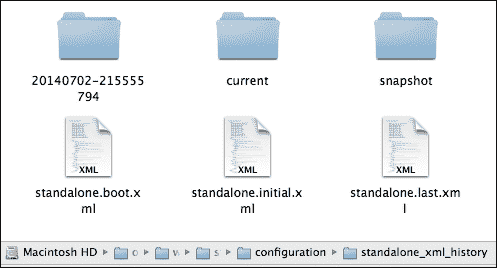

另一方面，域名配置提供了两个备份目录，分别用于域名配置文件和主机配置文件。这些文件夹分别命名为`domain_xml_history`和`host_xml_history`。为了使阅读更加简洁，我们将使用独立服务器来描述快照机制。相同的规则也适用于域名服务器，需要注意的是 AS 会同时快照`domain.xml`和`host.xml`文件。

让我们看看历史文件的内容。`standalone.initial.xml` 文件包含原始应用服务器的配置文件。此文件永远不会被 WildFly 覆盖。

### 注意

如果您需要恢复初始配置，请不要丢弃您的应用服务器安装！只需将 `standalone.xml` 文件替换为 `standalone_xml_history/standalone.initial.xml`。

`standalone.boot.xml` 文件包含服务器上次成功启动时使用的 AS 配置。每次服务器成功启动时，这个文件都会被覆盖。

### 注意

如果您想撤销当前会话中的所有更改，只需将 `standalone.xml` 文件替换为 `standalone_xml_history/standalone.boot.xml`。

最后，`standalone.last.xml` 文件包含应用服务器提交的最后一个成功配置。

### 应用服务器为您保存的内容

`current` 文件夹用作临时文件夹，用于存储当前会话中发生的配置更改。应用服务器配置模型中的每次更改都会创建一个名为 `standalone.v[n].xml` 的文件。在这里，`n` 是应用更改的次数（初始配置为 `standalone.v1.xml`，第一次更改为 `standalone.v2.xml`，依此类推）。

当应用服务器重新启动时，这些文件会被移动到 `standalone_xml_history` 文件夹中的一个带时间戳的文件夹中。正如您在以下屏幕截图中所见，上次会话中的更改在重启时被移动到 `20140702-215555794` 文件夹中：

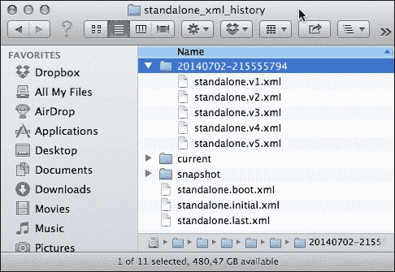

### 注意

应用服务器每 30 天轮换带时间戳的文件夹。如果您需要存储应用服务器配置的核心视图，您应该拍摄应用服务器模型的快照。下一节将展示如何进行此操作。

### 拍摄自己的快照

如早期警告所建议的，您还可以根据需要随时拍摄快照。用户创建的快照直接存储在 `snapshot` 文件夹中。为了拍摄配置的快照，只需发出 `take-snapshot` 命令，CLI 将备份您的配置。请查看以下代码块：

```java
[standalone@localhost:9990 /] :take-snapshot 
{
 "outcome" => "success",
 "result" => "/opt/wildfly-8.1.0.Final/standalone/configuration/standalone_xml_history/snapshot/20140702-230647552standalone.xml"
}

```

您可以使用 `list-snapshots` 命令检查可用的快照列表：

```java
[standalone@localhost:9990 /] :list-snapshots
{
 "outcome" => "success",
 "result" => {
 "directory" => "/opt/wildfly-8.1.0.Final/standalone/configuration/standalone_xml_history/snapshot",
 "names" => [
 "20140702-230647552standalone.xml",
 "20140702-230817640standalone.xml",
 "20140702-230825599standalone.xml",
 "20140702-230828191standalone.xml"
 ]
 }
}

```

您可以随时使用 `delete-snapshot` 命令删除特定的快照，该命令需要快照名称作为参数。假设我们需要删除我们刚刚创建的快照：

```java
[standalone@localhost:9990 /] :delete-snapshot(name=20140702-230828191standalone.xml)
{"outcome" => "success"}

```

## CLI 历史记录

在 CLI 会话中执行的 所有命令都存储在历史记录中，就像 Unix 系统的 shell 命令一样。CLI 命令保存在内存中，并在用户的家目录中名为 `.jboss-cli-history` 的文件系统中持久化。您会注意到，之前会话中输入的最新 500 个命令（默认历史记录大小）是历史记录的一部分。

如果你想查看 CLI 历史记录，只需输入 `history` 命令：

```java
[standalone@localhost:9990 /] history

```

你也可以使用箭头键在命令和操作的历史记录中前后导航，就像你在 Linux bash shell 中做的那样。

`history` 命令支持三个可选参数，可以用来暂时禁用/启用或清除历史记录。在以下表中，我们提到了它们的输出结果：

| 参数 | 影响 |
| --- | --- |
| `disable` | 此命令禁用历史扩展（但不会清除之前记录的历史）。 |
| `enable` | 此命令重新启用历史扩展（从历史扩展被禁用之前的最后一个记录的命令开始）。 |
| `clear` | 此命令清除内存中的历史记录（但不会清除文件历史记录）。 |

# 网络管理控制台

从历史上看，JBoss AS 总是提供基于 Web 的应用程序来执行一些管理和任务。4.x 版本及更早版本使用 `jmx-console` 来读取/写入并显示 `MBeans` 的值，`MBeans` 是应用程序服务器的主干。`jmx-console` 确实是一个有用的工具；然而，它也需要一定程度的经验才能开始使用。此外，此应用程序中包含的信息分布在许多 `MBeans` 中。例如，数据源信息包含在四个 `MBeans` 中，这使得管理此资源变得繁琐。

5.x 和 6.x 版本提出了一种更易于使用的方法，由管理控制台组成，该控制台作为一个基于 seam 的 Web 应用程序构建。尽管新的管理控制台是一个整洁且简单的应用程序，但有些人批评它因为消耗了大量的内存和启动时间。

WildFly 继续使用在 JBoss AS 7 中引入的网络控制台，你已经在之前的章节中看到了它。它是使用 **Google** **Web** **Toolkit** （**GWT**）构建的，并使用 HTTP 管理 API 来配置管理域或独立服务器。

与许多 GWT 应用程序一样，网络控制台使用 JSON 编码协议和去类型的 RPC 风格 API 来描述和执行对托管域或独立服务器的管理操作。

## 访问管理控制台

WildFly 默认使用端口 9990 来服务管理控制台。你可以通过 `http://localhost:9990` 访问它，如你的 `standalone.xml/domain.xml` 配置所示：

```java
<socket-binding name="management-http" interface="management" port="9990"/>
```

一旦你登录到网络管理控制台，你将进入应用程序首页。在独立模式下，你会看到四个主要选项卡：**首页**、**配置**、**运行时**和**管理**。以下是对这些选项卡的说明：

+   **首页**：此选项卡包含每个选项卡的简要描述，各种快速链接以完成常见任务，以及许多指向其他有用资源的链接，如下面的截图所示：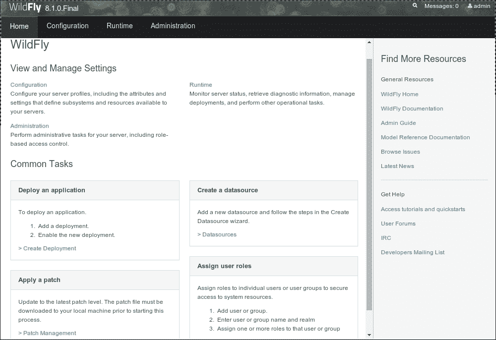

+   **配置**：此选项卡可用于建模应用程序服务器配置，如下面的截图所示：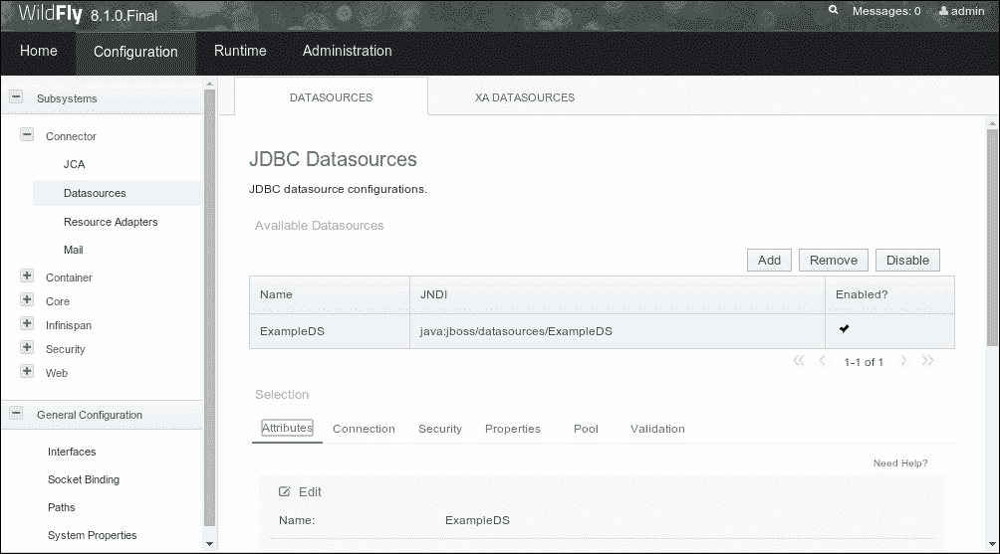

+   **运行时**：此选项卡可用于管理部署，正如我们在第六章 *应用程序结构和部署* 中所学。在下一节中，我们将展示使用 Web 管理控制台配置服务器配置文件有多简单：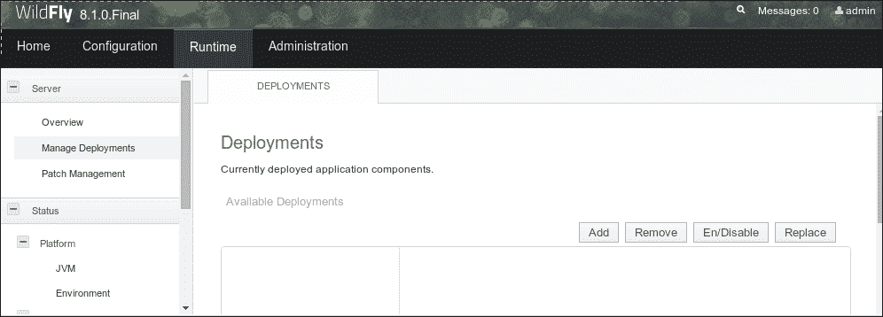

+   **管理**：此选项卡用于配置用户、组和角色。我们将在第十章 *保护 WildFly* 中更详细地介绍这一部分。

## 配置服务器配置文件

服务器配置文件位于 Web 应用的左侧，可以在**配置**选项卡下找到。在运行域模式时，你可以通过在页面左上角的组合框中选择相关配置文件来切换配置文件。

一旦你打开**配置**选项卡，你将看到可以通过 Web 界面配置的一组子系统。

在第二章 *配置核心 WildFly 子系统* 和 第三章 *配置企业服务* 中，我们展示了如何使用主要配置文件配置各种资源。如果你是那种喜欢**窗口、图标、菜单和指针**（**WIMP**）界面的系统管理员，那么接下来的部分就是为你准备的。通过 Web 控制台配置资源非常直观，为了给你一个体验，我们只需涵盖以下主题：

+   配置数据源

+   配置 JMS 资源

+   配置套接字绑定组

### 配置数据源

你可以直接从主页上的**常见任务**列表导航到数据源配置面板。否则，你需要点击**配置**选项卡，然后点击左侧的**子系统** | **连接器** | **数据源**链接。这将切换主面板到数据源配置面板。此面板包含两个上方的选项卡，用于配置**数据源**和**XA 数据源**。让我们看看第一个选项卡包含什么。

在面板中间，你可以找到配置的数据源列表。可以应用的操作位于数据源列表上方。你可以通过点击**添加**按钮来创建一个新的数据源。你还可以在**添加**按钮旁边找到**删除**和**禁用**按钮。

编辑或删除现有数据源是一个简单的任务，只需点击按钮即可执行。同样，启用和禁用所选数据源也是如此。

在这里，我们将展示如何将新的数据源添加到您的独立配置中，这需要完成几个简单的步骤。一旦您点击**添加**按钮，一个三步向导将引导您完成数据源创建。让我们通过以下步骤配置一个示例 MySQL 数据源：完成以下步骤：

1.  需要的第一个信息将是数据源名称及其 JNDI 绑定，如下截图所示：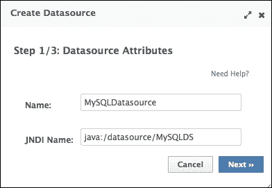

1.  下一个步骤将是选择适合您数据源的正确 JDBC 驱动程序。假设您已经在您的 AS 上成功安装了一个 JDBC 驱动程序，它应该列在可用驱动程序中：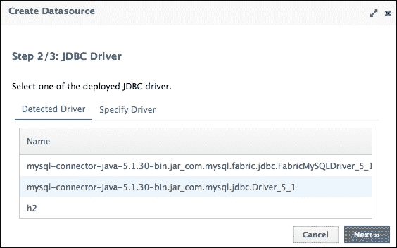

1.  选择 MySQL JDBC 驱动程序，在接下来的（最后）步骤中，您将需要输入数据源的 JDBC URL 以及**用户名**和**密码**凭据，如下截图所示：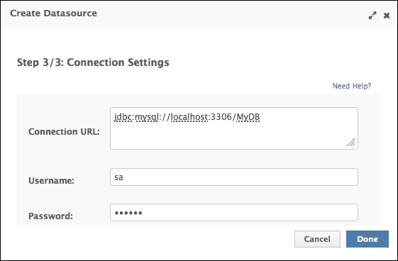

1.  点击**完成**完成向导，您将被重定向到主面板，其中新的数据源现在列在数据源列表中。最后，您需要通过点击它然后点击**启用**来启用新的数据源：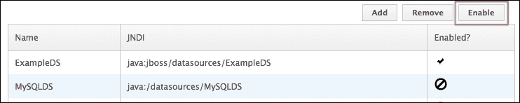

#### 创建新的 XA 数据源

如我们在*命令行界面（CLI）*部分所展示的，一个 XA 数据源需要您将 JDBC URL 输入为 XA 属性。在通过管理控制台创建 XA 数据源时也是如此。

因此，数据源 JNDI 命名和驱动程序选择与非 XA 数据源相同。在以下截图中，我们说明了完成 XA 数据源创建所需的最后两个步骤：

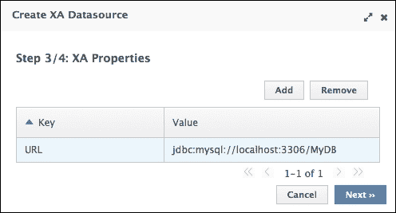

在第四步，如下截图所示，在**用户名**和**密码**下方，您将注意到添加安全域的选项。您现在可以留空。我们将在第十章*保护 WildFly*中讨论安全域。

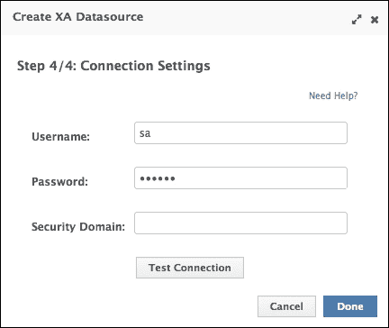

### 配置 JMS 目的地

使用 Web 控制台创建新的**队列**和**主题**更加简单。执行以下步骤：

1.  从**配置**菜单中，在子系统菜单中选择**消息传递**选项。主面板将切换以显示**消息传递**提供者。现在，选择所需的提供者，然后点击**查看**：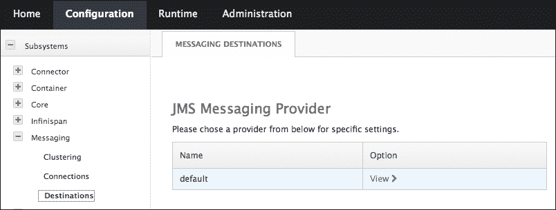

1.  从那里，选择您想要创建的资源（**队列**或**主题**）。然后，点击**添加**按钮来创建一个新的：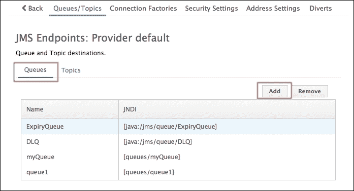

1.  如果您需要创建一个新的**队列**，您只需完成下一个简单的对话框，如下截图所示：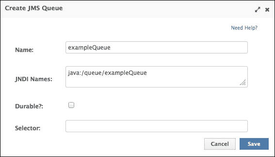

1.  当您点击**保存**时，新的 JMS 资源将被列入 JMS 子系统面板（并且也会保存在主配置文件中），如下面的截图所示：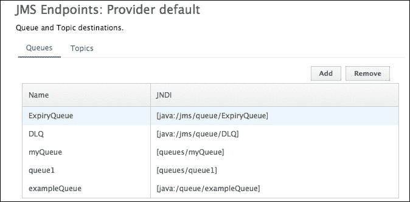

### 配置套接字绑定组

更改应用程序服务器的套接字绑定可以用来解决与其他应用程序或 WildFly 的其他实例的端口冲突。如果您正在以`domain`模式运行应用程序，您可以做的最好的事情是为您的服务器指定一个端口号偏移量，正如第四章中指出的，该章节全部关于域服务器。

然而，如果您正在以`standalone`模式运行，并且只需更改一个或多个端口号，那么通过 Web 控制台可能更容易实现。

要到达**套接字绑定组**选项，请执行以下步骤：

1.  在左侧单击**套接字绑定**，然后单击您想要修改的套接字绑定组的**查看**。

1.  然后，选择您想要更改的套接字绑定，例如**http**服务器端口。然后，向下滚动以显示编辑选项。单击**编辑**按钮并更新端口号，如下面的截图所示：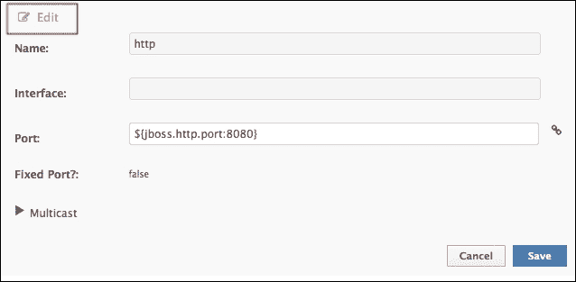

1.  完成后，单击**保存**按钮。

### 小贴士

**需要服务器重启吗？**

更改套接字绑定组不会立即产生更改服务器端口的即时效果。更新的配置必须由 AS 重新加载。您可以简单地通过发出`restart`命令重启应用程序服务器，或者，更好的是，通过从 CLI 发出`reload`命令。

# CLI 或 Web 控制台？

这两个管理接口都是强大的工具，在某些情况下，一个可能比另一个更好。

例如，CLI 为应用程序服务器提供了巨大的补充，在相对较短的时间内，它将让您以精细的细节配置其每个资源，包括运行时指标。

另一方面，Web 控制台提供了一个简单而优雅的方式来管理您的 AS 资源，几乎不需要学习曲线。特别是，我们在第三章中展示了如何轻松地使用它来管理基本域功能，例如配置、启动和停止服务器组和主机。

以下表格显示了每个接口的主要益处的摘要：

| 工具 | 最佳用途 |
| --- | --- |
| CLI | 作为专家系统管理员的无价工具，深入访问服务器属性，例如指标执行宏或批量等操作 |
| Web 控制台 | 是执行大多数基本管理任务的便捷工具管理顶级域资源 |

# 摘要

在本章中，你学习了如何使用 AS 发行版中的工具来管理应用程序服务器。

你已经熟悉了 CLI，它允许你遍历 AS 资源树并发出可以读取/修改或显示属性的命令。

CLI 的一个优点是，你可以利用其自动完成功能轻松构建复杂的管理操作。CLI 还允许你批量列出命令，以便你可以以全有或全无的方式执行它们，这在事务性系统中很典型。

另一个管理工具是 Web 界面，它允许你使用直观且简单的界面操作服务器配置。对于需要执行基本管理任务的系统管理员来说，这是一个理想的工具，因为它使用起来几乎不需要或只需要很少的经验。

到目前为止，你已经拥有了足够的专业知识来处理更复杂的话题。因此，在下一章中，我们将讨论应用程序服务器集群，这可以使你的应用程序提供可伸缩性和高可用性。
