# 第八章。集群

本章将介绍 WildFly 的集群功能。集群一词用于描述跨越多个机器的系统。系统组件在多台机器上同步通常可以提高性能和可用性。

集群是提供应用程序可伸缩性和高可用性的基本组件。使用集群的一个主要好处是，您可以通过**负载均衡**将流量负载分散到多个 AS 实例。

负载均衡是企业应用程序的一个正交方面，通常通过在应用程序服务器前面使用配置正确的 Web 服务器来实现。因此，负载均衡将在下一章中讨论，而本章我们将讨论以下主题：

+   所有可用于设置 WildFly 集群的选项，无论是使用独立配置还是服务器域

+   如何有效地配置集群所需的各个组件

+   **JGroups** 子系统，用于节点之间的底层通信

+   **Infinispan** 子系统，它使用其高级数据网格平台处理集群一致性

+   **消息传递**子系统，它使用 HornetQ 可集群实现

# 设置 WildFly 集群

为了满足那些不耐烦的读者的需求，我们将立即向您展示如何快速设置并运行 WildFly 节点集群。

您要塑造一个新的服务器配置文件只需创建一个新的 XML 配置文件。由于独立服务器只包含一个配置文件，您可能希望使用名为 `standalone-ha.xml` 或 `standalone-full-ha.xml` 的配置文件。这两个配置文件都包含在 WildFly 中。此配置文件包含所有集群子系统。

另一方面，域服务器能够存储多个配置文件在核心 `domain.xml` 配置文件中，因此您可以使用此文件既用于集群域，也用于非集群域服务器。

### 注意

集群和域是两个不同的概念，每个的功能不重叠。虽然集群的目的是提供可伸缩性、负载均衡和高可用性，但域是服务器的一个逻辑分组，这些服务器共享集中式域配置，并且可以作为一个单一单元进行管理。

现在我们将描述组装和启动独立服务器和域服务器集群的不同方法。

## 设置独立服务器集群

将 WildFly 集群配置为独立服务器可以分为两种主要可能性：

+   在不同机器上运行的 WildFly 节点集群

+   在同一机器上运行的 WildFly 节点集群

我们将依次查看这些内容。

### 在不同机器上运行的节点集群

如果你决定在每个专用机器上安装 WildFly 服务器，你正在水平扩展你的集群。在配置方面，这需要最少的努力——你所要做的就是将服务器绑定到配置文件中的 IP 地址，并使用`standalone-ha.xml`配置启动服务器。让我们通过以下图示的简单、双节点集群构建一个示例：

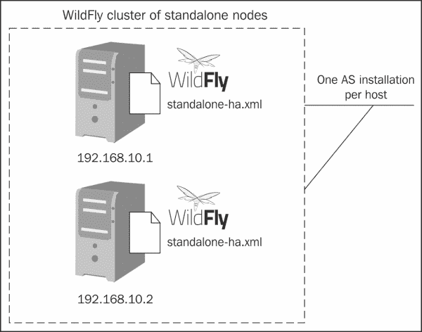

在每个 WildFly 发行版的`standalone-ha.xml`文件上打开，并导航到`interfaces`部分。在嵌套的接口元素中，插入独立服务器的 IP 地址。对于第一台机器（`192.168.10.1`），我们将定义以下内容：

```java
<interfaces>
        <interface name="management">
            <inet-address value="192.168.10.1"/>
        </interface>
        <interface name="public">
            <inet-address value="192.168.10.1"/>
        </interface>
</interfaces>
```

在第二台机器（`192.168.10.2`）上，我们将绑定到另一个 IP 地址：

```java
<interfaces>
        <interface name="management">
            <inet-address value="192.168.10.2"/>
        </interface>
        <interface name="public">
            <inet-address value="192.168.10.2"/>
        </interface>
</interfaces>
```

这是你需要更改配置的唯一内容。要启动集群，你必须使用`standalone-ha.xml`配置文件启动你的独立服务器，如下所示：

```java
./standalone.sh -c standalone-ha.xml

```

### 注意

而不是在`standalone-ha.xml`文件中更新每个服务器的 IP 地址，你可以使用`-b`选项，它允许你在服务器启动时提供绑定 IP 地址。此外，你可以使用`-bmanagement`标志来指定管理接口地址。使用这些选项，第一个服务器的先前配置可以重写为：

```java
standalone.sh -c standalone-ha.xml –b 192.168.10.1 -bmanagement 192.168.10.1
```

对于第二个服务器，它可以重写为：

```java
standalone.sh -c standalone-ha.xml –b 192.168.10.2 -bmanagement 192.168.10.2
```

几秒钟内，你的服务器将开始运行；然而，我们没有提到与控制台中的集群节点相关的任何细节。这是因为，在 WildFly 中，核心服务仅在需要时启动。这意味着集群服务仅在服务器检测到需要时启动，并在不再需要时停止。因此，仅使用包含集群子系统的配置启动服务器不会启动集群服务。为此，我们需要部署一个集群启用的应用程序。

因此，为了验证我们的安装，我们将部署一个基本的、集群启用的、名为`Example.war`的 Web 应用程序。要启用你的 Web 应用的集群，你必须将它们标记为`*distributable*`在`web.xml`描述符中：

```java
<web-app>
   <distributable/>
</web-app>
```

当你将应用程序部署到两台机器上时，你会看到集群服务现在已启动，并且每台机器都能在集群中找到其他成员，如下所示：

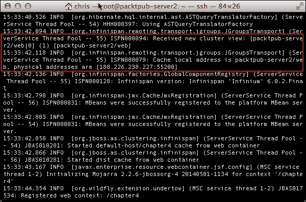

### 运行在同一台机器上的节点集群

当你的服务器节点（全部或部分）位于同一台机器上时，独立配置的第二种变体开始发挥作用。这种情况通常适用于你通过向计算机添加更多硬件资源来垂直扩展你的架构时。

在同一台机器上配置服务器节点显然需要你在文件系统中复制你的 WildFly 发行版。为了避免服务器发行版之间的端口冲突，你必须在这两个选项之间进行选择：

+   在同一台机器上定义多个 IP 地址

+   为每个服务器发行版定义端口偏移量

#### 在同一台机器上使用多个 IP 地址设置集群

这也被称为 **多宿主**，需要少量配置才能工作。每个操作系统都有不同的方法来实现这一点。本书不涉及配置多宿主的可能方法，但如果你对多宿主感兴趣，我们提供了有关如何在 Linux 和 Windows 上设置多宿主的详细说明链接。

如果你使用 Linux，这篇教程详细介绍了如何将多个 IP 地址分配给单个网络接口，也称为 **IP 别名**：

[`www.tecmint.com/create-multiple-ip-addresses-to-one-single-network-interface/`](http://www.tecmint.com/create-multiple-ip-addresses-to-one-single-network-interface/)

Windows 用户可以参考以下博客，了解如何在 Windows 7 中设置多宿主：

[`shaheerart.blogspot.com/2011/05/how-to-configure-multihomed-server-in.html`](http://shaheerart.blogspot.com/2011/05/how-to-configure-multihomed-server-in.html)

一旦你正确设置了网络接口，你将需要更新你的 `standalone-ha.xml` 文件。你需要将每个 IP 绑定到不同的 WildFly 实例，就像我们在设置多主机集群时做的那样。在配置文件中，导航到 `interfaces` 部分，并在嵌套的 `interface` 元素中插入要绑定到该独立服务器的 IP 地址：

```java
<interfaces>
        <interface name="management">
            <inet-address value="192.168.10.2"/>
        </interface>
        <interface name="public">
            <inet-address value="192.168.10.2"/>
        </interface>
</interfaces>
```

在这个例子中，第一个服务器分配绑定到 IP 地址 `192.168.10.1`，第二个绑定到 `192.168.10.2`。（记住，你还可以使用前面描述的 `-b` 和 `-bmanagement` 开关）。

下图展示了这个场景：

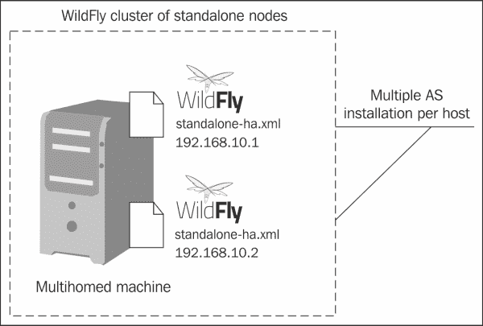

#### 在同一台机器上使用端口偏移设置集群

配置多宿主并不总是可行的选择，因为它需要一定量的网络管理经验。一个更简单、更直接的选择是为每个集群成员定义一个端口偏移量。通过为每个服务器定义端口偏移量，所有默认服务器绑定接口都将按固定数值移动，因此你不会有两个服务器在相同的端口上运行，从而避免端口冲突。

当使用端口偏移时，你将每个服务器绑定到相同的 IP 地址。因此，对于所有你的服务器发行版，你将按照以下方式配置 `standalone-ha.xml` 文件：

```java
<interfaces>
        <interface name="management">
            <inet-address value="192.168.10.1"/>
        </interface>
        <interface name="public">
            <inet-address value="192.168.10.1"/>
        </interface>
</interfaces>
```

然后你将第一个服务器配置保持不变。它将使用默认的套接字绑定端口：

```java
<socket-binding-group name="standard-sockets" default-interface="public" port-offset="0">
...
</socket-binding-group>
```

对于第二个服务器配置，你将指定 `port-offset` 值为 `150`：

```java
<socket-binding-group name="standard-sockets" default-interface="public" port-offset="150"
...
</socket-binding-group>
```

您的集群配置现在已完成。您可以通过将配置文件作为参数传递给每个服务器分布来验证此操作：

```java
standalone.sh -c standalone-ha.xml

```

从以下屏幕截图可以看出，已应用 150 的端口偏移：

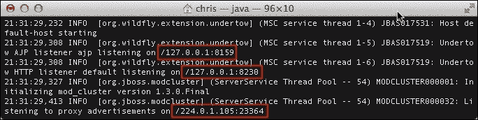

## 设置域服务器的集群

当您配置域集群时，您会发现聚类子系统已经包含在主配置文件`domain.xml`中。

实际上，WildFly 域将聚类处理得就像应用程序服务器使用的另一个配置文件一样。打开`domain.xml`文件，您会看到应用程序服务器附带以下四个配置文件：

+   针对非集群环境的`default`配置文件

+   针对集群环境的`ha`配置文件

+   针对非集群环境的`full`配置文件，包含所有子系统

+   针对集群环境的`full-ha`配置文件，包含所有子系统

因此，为了在域上使用聚类，您必须首先配置您的服务器组以指向其中一个`ha`配置文件。

让我们看看一个使用两个服务器组的示例配置。以下代码片段来自`domain.xml`：

```java
<server-groups>
 <server-group name="main-server-group" profile="ha">
        <jvm name="default">
            <heap size="64m" max-size="512m"/>
        </jvm>
 <socket-binding-group ref="ha-sockets"/>
    </server-group>
 <server-group name="other-server-group" profile="ha">
        <jvm name="default">
            <heap size="64m" max-size="512m"/>
        </jvm>
 <socket-binding-group ref="ha-sockets"/>
    </server-group>
</server-groups>
```

如`socket-binding-group`元素所强调的，我们正在引用包含集群中所有套接字绑定的`ha-sockets`组。请看以下代码：

```java
<socket-binding-group name="ha-sockets" default-interface="public">
    <socket-binding name="ajp" port="8009"/>
    <socket-binding name="http" port="8080"/>
    <socket-binding name="https" port="8443"/>
    <socket-binding name="jgroups-mping" port="0" multicast-address="230.0.0.4" multicast-port="45700"/>
    <socket-binding name="jgroups-tcp" port="7600"/>
    <socket-binding name="jgroups-tcp-fd" port="57600"/>
    <socket-binding name="jgroups-udp" port="55200" multicast-address="230.0.0.4" multicast-port="45688"/>
    <socket-binding name="jgroups-udp-fd" port="54200"/>
    <socket-binding name="modcluster" port="0" multicast-address="224.0.1.105" multicast-port="23364"/>
    <socket-binding name="txn-recovery-environment" port="4712"/>
    <socket-binding name="txn-status-manager" port="4713"/>
    <outbound-socket-binding name="mail-smtp">
        <remote-destination host="localhost" port="25"/>
    </outbound-socket-binding>
</socket-binding-group>
```

接下来，我们需要定义属于域（和集群）的服务器。为了使事情简单，我们将重用默认`host.xml`文件中找到的域服务器列表，如下面的代码片段所示：

```java
<servers>
    <server name="server-one" group="main-server-group">
        <jvm name="default">
    </server>
    <server name="server-two" group="main-server-group" auto-start="true">
        <socket-bindings port-offset="150"/>
    </server>
    <server name="server-three" group="other-server-group" auto-start="false">
        <socket-bindings port-offset="250"/>
    </server>
</servers>
```

我们不需要为每个服务器指定套接字绑定组，因为这在`domain.xml`文件中已经配置好了。如果我们想覆盖套接字绑定组，则可以在`host.xml`文件中添加以下内容：

```java
<servers>
    ...
    <server name="server-one" group="other-server-group" auto-start="false">
        <socket-bindings socket-binding-group="ha-sockets"/>
    </server>
</servers>
```

以下图显示了此配置的概述：

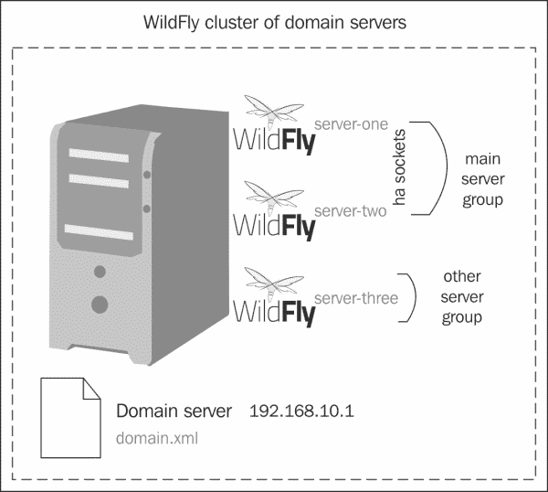

您现在可以使用标准批处理脚本（`domain.sh`或`domain.bat`）启动您的集群域。服务器组现在将指向`ha`配置文件，并形成一个由两个节点组成的集群。

### 聚集故障排除

通过集群中的节点进行通信是通过 UDP 和多播实现的。

### 注意

多播是一种协议，通过该协议数据同时传输到所有属于多播组的宿主。您可以将多播想象成一个只有调谐到特定频率的接收器才能接收数据的无线电频道。

如果您遇到问题，通常是由于以下原因之一：

+   节点位于防火墙之后。如果您的节点在不同的机器上，那么防火墙可能正在阻止多播。您可以通过为每个节点禁用防火墙或添加适当的规则来测试这一点。

+   您正在使用家庭网络或位于网关之后。通常，家庭网络会将任何 UDP 流量重定向到 **互联网服务提供商**（**ISP**），然后 ISP 要么丢弃它，要么它就丢失了。为了解决这个问题，您需要在防火墙/网关中添加一个路由，将任何多播流量重定向回本地网络。

### 提示

**Mac OS X**

如果您使用的是 Mac，当尝试以 `ha` 模式启动域时，可能会遇到 **java.io.IOException: Network is unreachable** 错误。为了解决这个问题，您需要创建一个合适的网络路由来使用 UDP，如下所示：

```java
sudo route add 224.0.0.0 127.0.0.1 -netmask 240.0.0.0
```

为了让您检查您的机器是否已正确设置以进行多播，JGroups 随带两个测试应用程序，可用于测试 IP 多播通信。测试类是 `McastReceiverTest` 和 `McastSenderTest`。

为了测试服务器上的多播通信，您首先需要导航到 `modules` 目录中 `jgroups` JAR 文件的位置，如下所示：

`JBOSS_HOME/modules/system/layers/base/org/jgroups/main`

在此目录中，您将找到包含测试程序的 `jgroups-3.4.3.Final.jar` 文件。

现在，通过运行以下命令来运行 `McastReceiverTest`：

```java
java -classpath jgroups-3.4.3.Final.jar org.jgroups.tests.McastReceiverTest -mcast_addr 224.10.10.10 -port 5555

```

在同一台机器上，但在不同的终端中，运行 `McastSenderTest` 命令，如下所示：

```java
java -classpath jgroups-3.4.3.Final.jar org.jgroups.tests.McastSenderTest -mcast_addr 224.10.10.10 -port 5555

```

如果多播工作正常，您应该在 `McastSenderTest` 窗口中输入，并在 `McastReceiverTest` 窗口中看到输出，如下面的截图所示：

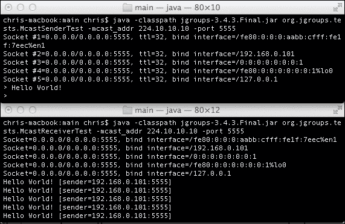

您应该在集群中的每台机器上执行此测试。一旦完成，您需要确保通过在一台机器上运行 `McastSenderTest` 和在另一台机器上运行 `McastReceiverTest` 来确保集群中每台机器之间的 UDP 通信正常工作。

最后，如果您在使用默认的多播地址或端口时遇到问题，您可以通过修改 `domain.xml` 文件中的 `jgroups-udp` socket-binding group 来更改它：

```java
<socket-binding-groups>
    ...
    <socket-binding-group name="ha-sockets" default-interface="public">
        ...
        <socket-binding name="jgroups-udp" port="55200" multicast-address="${jboss.default.multicast.address:230.0.0.4}" multicast-port="45688"/>
        ...
    </socket-binding-group>
</socket-binding-groups>
```

# 配置 WildFly 集群

WildFly 支持开箱即用的集群功能。有几个库协同工作以提供对集群的支持。以下图显示了 WildFly 采纳的基本集群架构：

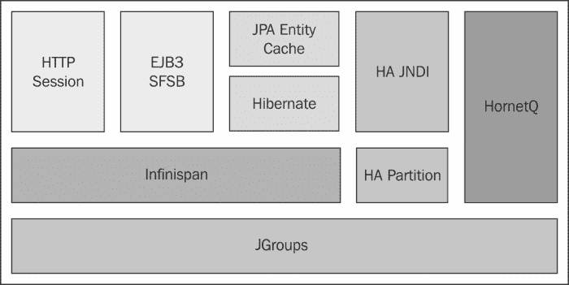

JGroups 库是 WildFly 集群的核心。它通过多播传输提供集群节点之间的通信通道。这些通道在部署集群应用程序时创建，并用于在集群中传输会话和上下文。

集群中的另一个重要组件是 **Infinispan**。Infinispan 通过分布式缓存的方式处理您的应用程序数据在集群中的复制。

## 配置 JGroups 子系统

在 JGroups 的范围内，节点通常被称为 **成员**，而集群被称为 **组**。

节点是在主机上运行的一个进程。JGroups 跟踪组内所有进程。当一个节点加入一个组时，系统会向该组的所有现有成员发送消息。同样，当一个节点离开或崩溃时，该组的所有其他节点都会收到通知。

如我们在本章前面概述的，一个组的进程（节点）可以位于同一主机上，也可以位于网络上的不同机器上。一个成员也可以是多个组的成员。以下图展示了 JGroups 架构的详细视图：

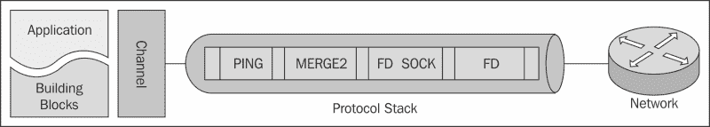

JGroups 进程大致由三部分组成，即**通道**、**构建块**和**协议栈**。

+   **通道**是一个类似于套接字的简单接口，应用程序程序员使用它来构建可靠的群组通信应用程序。

+   **构建块**共同形成了一个抽象接口，该接口位于通道之上，可以在需要高级接口时替代通道使用。

+   **协议栈**包含一个双向列表中的多个协议层。所有发送的消息都必须通过所有协议。一个层不一定对应一个传输协议。例如，一个分片层可能会将一个消息分成几个较小的消息，为每个片段添加一个带有 ID 的头部，并在接收方重新组装这些片段。

在前一个图中，当发送消息时，首先执行`PING`协议，然后是`MERGE2`，接着是`FD_SOCK`，最后是`FD`协议。当收到消息时，这个顺序会被颠倒，这意味着它首先会遇到`FD`协议，然后是`FD_SOCK`，接着是`MERGE2`，最后是`PING`。在 WildFly 中，JGroups 配置位于主`standalone-ha.xml/domain.xml`配置文件中的 JGroups 子系统内。

在 JGroups 子系统中，你可以找到配置的传输堆栈列表。以下代码片段显示了节点之间通信使用的默认 UDP 堆栈：

```java
<subsystem  default-stack="udp">
    <stack name="udp">
        <transport type="UDP" socket-binding="jgroups-udp"/>
        <protocol type="PING"/>
        <protocol type="MERGE3"/>
        <protocol type="FD_SOCK" socket-binding="jgroups-udp-fd"/>
        <protocol type="FD_ALL"/>
        <protocol type="VERIFY_SUSPECT"/>
        <protocol type="pbcast.NAKACK2"/>
        <protocol type="UNICAST3"/>
        <protocol type="pbcast.STABLE"/>
        <protocol type="pbcast.GMS"/>
        <protocol type="UFC"/>
        <protocol type="MFC"/>
        <protocol type="FRAG2"/>
        <protocol type="RSVP"/>
    </stack>
    ...
</subsystem>
```

UDP 是 JGroups 的默认协议，使用多播（如果不可用，则使用多个单播消息）来发送和接收消息。一个多播 UDP 套接字可以向多个客户端发送和接收数据报。多播的另一个特性是，客户端可以使用单个数据包联系多个服务器，而不需要知道任何主机的特定 IP 地址。

### 注意

切换到 TCP 协议就像更改`default-stack`属性一样简单：

```java
<subsystem  default-stack="tcp">
```

当 IP 多播由于某些原因无法使用时，通常使用 TCP 堆栈。例如，当你想在 WAN 上创建一个网络时。我们将在本章后面介绍 TCP 配置。

所有 JGroups 协议的详细描述超出了本书的范围，但为了方便，你可以在以下表中找到每个协议的简要描述。要了解更多关于这些协议或关于 JGroups 的信息，你可以参考 JGroups 网站[`jgroups.org/manual/html/index.html`](http://jgroups.org/manual/html/index.html)。

| 类别 | 用途 | 协议 |
| --- | --- | --- |
| 传输 | 这负责在网络中发送和接收消息 | `IDP`, `TCP`, 和 `TUNNEL` |
| 发现 | 这用于发现集群中的活动节点并确定协调者是谁 | `PING`, `MPING`, `TCPPING`, 和 `TCPGOSSIP` |
| 故障检测 | 此功能用于轮询集群节点以检测节点故障 | `FD`, `FD_SIMPLE`, `FD_PING`, `FD_ICMP`, `FD_SOCK`, 和 `VERIFY_SUSPECT` |
| 可靠投递 | 这确保消息确实以正确的顺序（FIFO）发送到目标节点 | `CAUSAL`, `NAKACK`, `pbcast`.`NAKACK`, `SMACK`, `UNICAST`, 和 `PBCAST` |
| 组成员 | 这用于在节点加入、离开或崩溃时通知集群 | `pbcast`.`GMS`, `MERGE`, `MERGE2`, 和 `VIEW_SYNC` |
| 流控制 | 这用于调整节点间数据发送速率以适应数据接收速率 | `FC` |
| 分片 | 这会将大于特定大小的消息分片，并在接收方处解分片 | `FRAG2` |
| 状态转移 | 此功能将现有节点上的应用程序状态（序列化为字节数组）与新加入的节点同步 | `pbcast`.`STATE_TRANSFER` 和 `pbcast`.`STREAMING_STATE_TRANSFER` |

### 自定义协议栈

如果你想要在较低级别自定义传输配置，那么你可以覆盖 JGroups 使用的默认属性，甚至可以覆盖单个协议属性。例如，以下配置可以用来更改 JGroups UDP 堆栈使用的默认发送或接收缓冲区：

```java
<subsystem  default-stack="udp">
  <stack name="udp">
    <transport type="UDP" socket-binding="jgroups-udp" diagnostics-socket-binding="jgroups-diagnostics">
      <property name="ucast_recv_buf_size">50000000</property>
      <property name="ucast_send_buf_size">1280000</property>
      <property name="mcast_recv_buf_size">50000000</property>
      <property name="mcast_send_buf_size">1280000</property>
    </transport>
    ...
  </stack>
</subsystem>
```

如果你想查看 JGroups 子系统内可用的所有属性，无论是在传输层还是在协议层，你可以查阅你的服务器发行版`JBOSS_HOME/docs/schema`文件夹中的 JGroups XSD 文件，`jboss-as-jgroups_2_0.xsd`。

# 配置 Infinispan 子系统

集群的一个要求是数据在其成员之间同步。这是因为，如果某个节点发生故障，应用程序及其会话可以在集群的其他成员上继续运行。这被称为**高可用性**。

WildFly 使用 Infinispan 作为其集群功能背后的分布式缓存解决方案。尽管 Infinispan 嵌入在应用程序服务器中，但它也可以作为一个独立的数据网格平台。

我们现在将快速查看 Infinispan 的配置，该配置位于主`standalone-ha.xml`或`domain.xml`配置文件中的 Infinispan 子系统内。

以下是 Infinispan 配置的核心：

```java
<subsystem >
    <cache-container name="server" aliases="singleton cluster" default-cache="default" module="org.wildfly.clustering.server">
    <transport lock-timeout="60000"/>
    <replicated-cache name="default" mode="SYNC" batching="true">
        <locking isolation="REPEATABLE_READ"/>
    </replicated-cache>
    </cache-container>
    <cache-container name="web" default-cache="dist" module="org.wildfly.clustering.web.infinispan">
        ...
    </cache-container>
    <cache-container name="ejb" aliases="sfsb" default-cache="dist" module="org.wildfly.clustering.ejb.infinispan">
        ...
    </cache-container>
    <cache-container name="hibernate" default-cache="local-query" module="org.hibernate">
        ...
    </cache-container>
</subsystem>
```

独立 Infinispan 配置与 WildFly 内部的 Infinispan 子系统之间的一个关键区别是，WildFly 配置公开了多个`cache-container`元素，而本地配置文件包含单个缓存容器的配置。

每个`cache-container`元素包含一个或多个缓存策略，这些策略定义了特定缓存容器中数据的同步方式。缓存容器可以使用以下缓存策略：

+   **本地**: 在这种缓存模式下，条目仅存储在本地节点上，无论是否形成了集群。Infinispan 通常作为本地缓存运行。

+   **复制**: 在这种缓存模式下，所有条目都复制到所有节点。Infinispan 通常作为临时数据存储运行，并不提供增加的堆空间。

+   **分布**: 在这种缓存模式下，条目仅分布到节点子集。Infinispan 通常作为提供增加堆空间的数据网格运行。

+   **失效**: 在这种缓存模式下，条目仅存储在缓存存储中（例如数据库）并从所有节点中失效。当一个节点需要条目时，它将从缓存存储中加载它。在这种模式下，Infinispan 作为由规范数据存储（如数据库）支持的分布式缓存运行。

在接下来的章节中，我们将更详细地查看一些缓存配置，例如`session`缓存（`web`缓存和`SFSB`缓存）以及`hibernate`缓存。如果您要正确配置您的集群应用程序，理解这些配置是至关重要的。

## 配置会话缓存容器

在本节中，我们将查看 HTTP 会话、有状态和单例会话 bean 的缓存配置。这三个缓存配置的方式非常相似。因此，我们将一起讨论它们，并展示它们之间的相似性。因此，以下是`web`缓存、`ejb`缓存和`server`缓存的`cache-container`配置。`web`缓存指的是 HTTP 会话缓存，`ejb`缓存与有状态会话 bean（SFSBs）相关，`server`缓存与单例会话 bean 相关：

```java
<subsystem >

    <cache-container name="server" aliases="singleton cluster" default-cache="default" module="org.wildfly.clustering.server">
        <transport lock-timeout="60000" />
        <replicated-cache name="default" mode="SYNC" batching="true">
            <locking isolation="REPEATABLE_READ" />
        </replicated-cache>
    </cache-container>

    <cache-container name="web" default-cache="dist" module="org.wildfly.clustering.web.infinispan">
        <transport lock-timeout="60000" />
        <distributed-cache name="dist" mode="ASYNC" batching="true" l1-lifespan="0" owners="2">
            <file-store />
        </distributed-cache>
    </cache-container>

    <cache-container name="ejb" aliases="sfsb" default-cache="dist" module="org.wildfly.clustering.ejb.infinispan">
        <transport lock-timeout="60000" />
        <distributed-cache name="dist" mode="ASYNC" batching="true" l1-lifespan="0" owners="2">
            <file-store />
        </distributed-cache>
    </cache-container>
</subsystem>
```

每个容器的配置可以包含一个或多个缓存策略元素。这些元素如下：

+   `复制缓存`

+   `分布式缓存`

+   `失效缓存`

+   `本地缓存`

每个这些缓存元素都可以定义零次或多次。要指定用于缓存容器的缓存元素，只需将缓存名称作为`default-cache`属性的属性引用。在下一节中，我们将详细探讨这些缓存模式之间的差异。在每个缓存定义中，您可能已经注意到与等效数据库隔离级别相对应的`locking`属性。Infinispan 支持以下隔离级别：

+   `NONE`: 没有隔离级别意味着没有事务支持。

+   `READ_UNCOMMITTED`：最低的隔离级别，允许脏读，这意味着一个事务可能看到来自另一个事务未提交的数据。行仅在写入数据时锁定，而不是在读取时锁定。

+   `READ_COMMITTED`：事务在检索的所有数据上获取读和写锁。写锁在事务结束时释放，读锁在数据被选中时立即释放。

+   `REPEATABLE_READ`：这是 Infinispan 使用的默认隔离级别。事务在检索的所有数据上获取读和写锁，并保持到事务结束。可能会发生幻读。幻读是指你在同一个事务中执行相同的查询，但得到的结果数量不同。

+   `SERIALIZABLE`：最严格的隔离级别。所有事务都以隔离方式发生，就像它们是按顺序（一个接一个）执行一样，而不是并发执行。

缓存配置中嵌套的另一个元素是`file-store`。此元素配置了存储缓存数据的路径。默认数据写入与缓存容器同名的文件夹下的`jboss.server.data.dir`目录。

例如，以下图显示了独立`web`缓存容器的默认`file-store`路径：

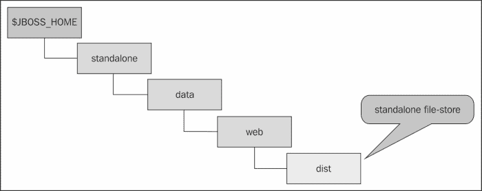

如果你愿意，可以使用`relative-to`和`path`元素自定义`file-store`路径，就像我们在第二章中做的那样，*配置核心 WildFly 子系统*，对于路径元素：

```java
<cache-container name="web" default-cache="dist" module="org.wildfly.clustering.web.infinispan">
    <distributed-cache name="dist" mode="ASYNC" batching="true" l1-lifespan="0" owners="2">
        <file-store relative-to="jboss.server.data.dir" path="my-cache"/>
    </distributed-cache>
</cache-container>
```

在继续之前，让我们简要地看看消息如何在各个节点之间发送。

成员之间的数据同步可以通过同步消息（`SYNC`）或异步消息（`ASYNC`）来完成，具体定义如下：

+   **同步**消息是两者中效率最低的，因为每个节点都需要等待来自其他集群成员的消息确认。然而，如果需要高一致性，同步模式是有用的。

+   **异步**消息是两者中较快的，但缺点是一致性会受到影响。异步消息在启用 HTTP 会话复制和粘性会话时特别有用。在这种情况下，会话总是从同一个集群节点访问。只有当节点失败时，数据才会从不同的节点访问。

同步（SYNC）和异步（ASYNC）属性是在缓存元素的`mode`属性中设置的：

```java
<distributed-cache name="dist" mode="ASYNC"    batching="true" l1-lifespan="0" owners="2">
```

## 选择复制和分布之间的选择

当使用**复制**缓存时，Infinispan 将在集群网格中的每个节点上存储每个条目。这意味着添加到这些缓存实例中的任何条目都将复制到集群中的所有其他缓存实例，并且可以从任何缓存中检索任何条目。箭头指示数据复制的方向。在下面的图中，您可以看到来自节点 1 的会话数据正在被复制到节点 2、3 和 4：

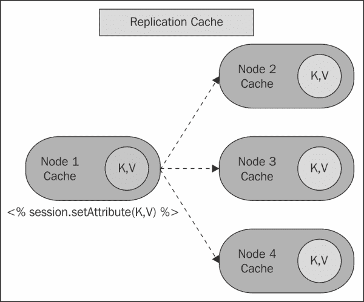

复制的可伸缩性是集群大小和平均数据大小的函数。如果我们有多个节点和/或大数据集，我们将遇到可伸缩性的上限。

### 注意

如果`DATA_SIZE * NUMBER_OF_HOSTS`小于每个主机可用的内存，那么复制是一个可行的选择。

另一方面，当使用**分布式**缓存时，Infinispan 将在网格的节点子集上存储每个集群条目。

分布式缓存利用一致性哈希算法来确定条目应在集群中存储的位置。您可以配置跨集群维护的缓存条目副本数量。您在这里选择的值是在性能和数据持久性之间的平衡。您维护的副本越多，性能越低，但服务器故障导致数据丢失的风险越低。

### 注意

您可以使用`owners`参数（默认值为`2`）来定义每个缓存条目的集群范围副本数：

```java
<distributed-cache name="dist" mode="ASYNC" batching="true" l1-lifespan="0" owners="2">
    <file-store/>
</distributed-cache>
```

以下图显示了当`owners`参数设置为`2`时，会话数据如何在节点之间进行复制。每个节点将其会话数据复制到另外两个节点：

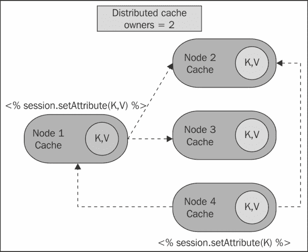

复制和分布之间的选择在很大程度上取决于集群大小。例如，复制提供了一种快速简单的方法在集群之间共享状态；然而，它仅在小型集群（少于十个服务器）中表现良好。这是因为随着集群大小的增加，需要发送的复制消息数量增加。在分布式缓存中，为了提供冗余和容错，节点间维护了条目的多个副本。保存的副本数量通常远少于集群中的节点数量。这意味着分布式缓存比复制缓存提供了更大的可伸缩性。

## 配置 Hibernate 缓存

Hibernate 缓存容器是您配置的关键部分，因为它处理数据层的缓存。WildFly 使用 Hibernate 作为默认的 JPA 实现，因此本章中描述的概念既适用于 Hibernate 应用程序，也适用于基于 JPA 的应用程序。Hibernate 缓存在概念上与基于会话的缓存不同。它们基于这样的假设，即您有一个永久存储数据的地方（数据库）。这意味着为了实现高可用性，不需要在集群中复制或分发实体的副本。您只需在数据被修改时通知您的节点，以便缓存中的条目可以被失效。如果缓存配置为失效而不是复制，每次缓存中的数据发生变化时，集群中的其他缓存都会收到一条消息，告知它们的数据现在已过时，应该从内存中移除。

这种方法的优点是双重的。首先，由于失效消息与复制更新数据相比非常小，因此网络流量最小化。其次，集群中的缓存只有在数据过时时才需要执行数据库查找。每次从数据库读取新的实体或集合时，它只**本地**缓存，以减少节点之间的流量：

```java
<cache-container name="hibernate" default-cache="local-query" module="org.hibernate">
    <transport lock-timeout="60000"/>
    <local-cache name="local-query">
        <transaction mode="NONE"/>
        <eviction strategy="LRU" max-entries="10000"/>
        <expiration max-idle="100000"/>
    </local-cache>
    ...
</cache-container>
```

默认情况下，`local-query` 缓存配置为在 LRU 向量中存储最多 10,000 个条目。如果条目在 100,000 毫秒内处于空闲状态，则根据 `max-idle` 属性，它将自动从缓存中驱逐。

以下是对 Infinispan 支持的驱逐策略的总结：

+   `NONE`: 此值禁用驱逐线程

+   `UNORDERED`: 现在已弃用。使用此值将导致使用 LRU

+   `LRU`: 此值会导致基于**最近最少使用**模式的驱逐发生

+   `LIRS`: 此值解决了 LRU 的不足。驱逐依赖于缓存条目的互引用最近性

### 小贴士

要了解更多关于 LIRS 如何工作的信息，请参阅 Infinispan 文档[`infinispan.org/docs/6.0.x/user_guide/user_guide.html#_eviction_strategies`](http://infinispan.org/docs/6.0.x/user_guide/user_guide.html#_eviction_strategies)。

一旦本地缓存实体被更新，缓存将向集群中的其他成员发送消息，告知它们实体已被修改。这就是`invalidation-cache`发挥作用的时候。看看以下代码：

```java
<invalidation-cache name="entity" mode="SYNC">
     <transaction mode="NON_XA"/>
     <eviction strategy="LRU" max-entries="10000"/>
     <expiration max-idle="100000"/>
</invalidation-cache>
```

无效化缓存的默认配置使用与本地查询缓存相同的驱逐和过期设置。最大条目数设置为 10,000，过期前的空闲时间为 100,000 毫秒。无效化缓存也可以配置为同步（`SYNC`）或异步（`ASYNC`）。如果您将无效化缓存配置为同步，则您的缓存将阻塞，直到集群中的所有缓存都收到无效化消息的响应。另一方面，异步无效化缓存不会阻塞并等待响应，这会导致性能提高。默认情况下，hibernate 配置为使用`REPEATABLE_READ`作为缓存隔离级别。对于大多数情况，默认的隔离级别`REPEATABLE_READ`将足够。如果您想将其更新为，例如，`READ_COMMITTED`，那么您需要将以下内容添加到您的配置中：

```java
<invalidation-cache mode="SYNC" name="entity">
    ...
 <locking isolation="READ_COMMITTED"/>
</invalidation-cache>
```

我们将在 Infinispan 子系统中查看的最后一点配置是`timestamp`缓存。`timestamp`缓存跟踪每个数据库表最后更新的时间。

`timestamp`缓存严格相关于查询缓存。它用于存储对数据库运行的查询的结果集。如果启用了查询缓存，在查询运行之前，会检查查询缓存。如果表上最后更新的时间戳大于查询结果缓存的時間，则条目将从缓存中删除，并执行新的数据库查找。这被称为缓存未命中。请看以下代码：

```java
<replicated-cache name="timestamps" mode="ASYNC">
          <transaction mode="NONE"/>
          <eviction strategy="NONE"/>
</replicated-cache>
```

默认情况下，`timestamps`缓存配置为异步复制作为集群模式。由于所有集群节点都必须存储所有时间戳，因此不允许本地或失效的缓存类型，也不允许驱逐/过期。

### 使用复制为 Hibernate 缓存

可能存在您想要在其他集群节点上复制实体缓存，而不是使用本地缓存和无效化的情况。这可能是在以下情况下：

+   执行的查询相当昂贵

+   查询很可能在不同的集群节点上重复

+   查询不太可能从缓存中失效（当查询的`WHERE`子句中涉及的实体类之一发生变化时，Hibernate 会从缓存中使查询结果失效）

为了切换到复制缓存，您必须配置您的`default-cache`属性，如下面的代码片段所示，以及添加相关的`replicated-cache`配置：

```java
<cache-container name="hibernate" default-cache="replicated-cache" module="org.hibernate">
    <replicated-cache name="replicated-cache" mode="SYNC">
        <locking isolation="REPEATABLE_READ"/>
    </replicated-cache>
</cache-container>
```

## 高级 Infinispan 配置

到目前为止，我们已查看使用集群应用程序所需的基本组件。Infinispan 提供了丰富的选项来进一步自定义您的缓存。

### 小贴士

要了解有关通过 Infinispan 子系统的高级配置的更多信息，你可以查看以下文档：[`infinispan.org/docs/6.0.x/infinispan_server_guide/infinispan_server_guide.html`](http://infinispan.org/docs/6.0.x/infinispan_server_guide/infinispan_server_guide.html)

### 配置 Infinispan 传输

Infinispan 子系统依赖于 JGroups 子系统在节点之间传输缓存数据。JGroups 使用 UDP 作为默认传输协议，这是由 JGroups 子系统中的`default-stack`属性定义的：

```java
<subsystem  default-stack="udp">
    ...
</subsystem>
```

然而，你可以为每个缓存容器配置不同的传输。如果你想将 TCP 作为 Web 缓存容器的传输协议，则可以添加`stack`属性并将其设置为`tcp`：

```java
<cache-container name="web" default-cache="dist">
  <transport lock-timeout="60000" stack="tcp"/>
</cache-container>
```

默认的 UDP 传输通常适用于大型集群。如果你正在使用复制或失效，它也可能适用，因为它可以最小化打开过多的套接字。

要了解 TCP 和 UDP 之间的区别，请参阅此外部链接：[`www.skullbox.net/tcpudp.php`](http://www.skullbox.net/tcpudp.php)。

### 配置 Infinispan 线程

重要的是要注意，在 WildFly 8 中，线程池子系统已被弃用。在 WildFly 9 中，它很可能将被完全移除。本节中的配置仍可用于 WildFly 8，但你需要将线程子系统添加到你的配置文件中。请看以下代码：

```java
<extensions>
    ...
    <extension module="org.jboss.as.threads"/>
</extensions>
```

就像你可以为 JGroups 传输外部化你的 Infinispan 线程配置一样，你可以将其移动到线程池子系统。以下线程池可以按缓存容器配置：

| Thread pool | 描述 |
| --- | --- |
| transport | 这给出了负责在网络中传输数据的有限线程池的大小 |
| listener-executor | 这给出了用于注册和接收某些缓存事件发生时的通知的线程池的大小 |
| replication-queue-executor | 这给出了用于复制缓存数据的预定复制执行器的大小 |
| eviction-executor | 这给出了用于定期运行驱逐清理任务的预定执行器服务的大小 |

在某些情况下可能需要自定义线程池，例如，你可能想应用缓存复制算法。你可能需要选择用于复制数据线程的数量。在以下示例中，我们通过定义最大 25 个线程用于有界队列线程池和 5 个线程用于复制数据来外部化`cache-container`的线程池：

```java
<subsystem >

  <cache-container name="web" default-cache="repl" listener-executor="infinispan-listener" eviction-executor="infinispan-eviction" replication-queue-executor="infinispan-repl-queue">
    <transport executor="infinispan-transport"/>
  </cache-container>
</subsystem>
...
<subsystem >
  <thread-factory name="infinispan-factory" priority="1"/>
  <bounded-queue-thread-pool name="infinispan-transport"/>
    <core-threads count="1"/>
    <queue-length count="100000"/>
    <max-threads count="25"/>
    <thread-factory name="infinispan-factory"/>
  </bounded-queue-thread-pool>
  <bounded-queue-thread-pool name="infinispan-listener"/>
    <core-threads count="1"/>
    <queue-length count="100000"/>
    <max-threads count="1"/>
    <thread-factory name="infinispan-factory"/>
  </bounded-queue-thread-pool>
  <scheduled-thread-pool name="infinispan-eviction"/>
    <max-threads count="1"/>
    <thread-factory name="infinispan-factory"/>
  </scheduled-thread-pool>
  <scheduled-thread-pool name="infinispan-repl-queue"/>
    <max-threads count="5"/>
    <thread-factory name="infinispan-factory"/>
  </scheduled-thread-pool>
</subsystem>
```

# 集群消息子系统

我们将通过讨论消息子系统来结束本章。

WildFly 中使用的 JMS 提供者是 **HornetQ**。为了共享消息处理负载，HornetQ 服务器可以一起组成一个集群。集群中的每个活动节点都包含一个活动的 HornetQ 服务器。HornetQ 管理自己的消息并处理自己的连接。在幕后，当一个节点与其他节点建立集群连接时，它们之间会创建一个核心桥接连接。一旦建立连接，消息就可以在各个节点之间流动。

如果在 HornetQ 中定义了一个或多个 `cluster-connection` 元素，则会自动启用集群。以下示例取自默认的 `full-ha` 配置文件：

```java
<subsystem >
    <hornetq-server>
        ...
        <cluster-connections>
             <cluster-connection name="my-cluster">
                 <address>jms</address>
                 <connector-ref>http-connector</connector-ref>
                 <discovery-group-ref discovery-group-name="dg-group1"/>
             </cluster-connection>
        </cluster-connections>
    </hornetq-server>
</subsystem>
```

现在，让我们看看如何配置 `cluster-connection`。以下是一个典型的集群连接配置。您可以选择更新默认的 `cluster-connection`，或者您可以在 `<hornetq-server>` 定义中添加自己的 `cluster-connection` 元素。

```java
<subsystem >
    <hornetq-server>
        ...
        <cluster-connections>
             <cluster-connection name="my-cluster">
                 <address>jms</address>
                 <connector-ref>http-connector</connector-ref>
                 <discovery-group-ref discovery-group-name="dg-group1"/>
                 <retry-interval>500</retry-interval>
                 <forward-when-no-consumers>false</forward-when-no-consumers>
                 <max-hops>1</max-hops>
             </cluster-connection>
        </cluster-connections>
    </hornetq-server>
</subsystem>
```

`cluster-connection` 的 `name` 属性显然定义了集群连接的名称，这是我们将要配置的。在您的消息子系统中可以配置零个或多个集群连接。

`address` 元素是一个必填参数，它确定消息如何在集群中分配。在这个例子中，集群连接将只负载均衡发送到以 `jms` 开头的地址的消息。实际上，这个集群连接将应用于所有 JMS 队列和主题订阅。这是因为它们映射到以子字符串 `jms` 开头的核心队列。

`connector-ref` 元素引用了在消息子系统的 `connectors` 部分中定义的连接器。在这种情况下，我们使用的是 http 连接器（有关可用连接器的更多信息，请参阅第三章 和 **随机** (`org.hornetq.api.core.client.loadbalance.RandomConnectionLoadBalancingPolicy`)。您还可以通过实现 `org.hornetq.api.core.client.loadbalance.ConnectionLoadBalancingPolicy` 接口添加自己的策略。

以下示例显示了如何为连接工厂使用随机策略：

```java
<connection-factory name="InVmConnectionFactory">
    ...
    <connection-load-balancing-policy-class-name>org.hornetq.api.core.client.loadbalance.RandomConnectionLoadBalancingPolicy
    </connection-load-balancing-policy-class-name>
</connection-factory>
```

最后，可选的`max-hops`值设置为`1`（默认），这是消息在节点之间可以转发最大次数。值为`1`表示消息仅被负载均衡到直接连接到此服务器的其他 HornetQ 服务器。HornetQ 还可以配置为将消息负载均衡到间接连接到它的节点，即其他 HornetQ 服务器是链中的中介。

### 小贴士

您还可以参考`jboss-as-messaging_2_0.xsd`以获取可用参数的完整列表。这可以在您的服务器发行版的`JBOSS_HOME/docs/schema`文件夹中找到。

## 配置消息凭据

如果您尝试启动使用`full-ha`配置文件的集群，您将在控制台看到以下错误日志：

```java
ERROR [org.hornetq.core.server] (default I/O-1) HQ224018: Failed to create session: HornetQClusterSecurityException[errorType=CLUSTER_SECURITY_EXCEPTION message=HQ119099: Unable to authenticate cluster user: HORNETQ.CLUSTER.ADMIN.USER]

```

这是因为，当尝试在节点之间建立连接时，HornetQ 使用集群用户和集群密码。正如您在默认配置中看到的，您需要更新密码值：

```java
<subsystem >
    <hornetq-server>
        <cluster-password>${jboss.messaging.cluster.password:CHANGE ME!!}</cluster-password>
        <journal-file-size>102400</journal-file-size>
        ...
    </hornetq-server>
</subsystem>
```

一旦您更改了此密码，启动您的集群，您应该会看到节点之间成功建立桥接：

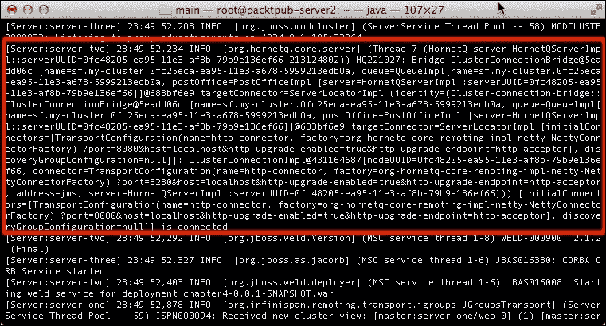

# 在您的应用程序中配置集群

我们现在将通过查看如何对以下内容进行集群来完成我们对集群系统的探索：

+   会话 Bean

+   实体

+   Web 应用程序

# 集群会话 Bean

在第三章 *配置企业服务* 中，我们讨论了**无状态会话 Bean**（**SLSB**）、**有状态会话 Bean**（**SFSB**）和**单例会话 Bean**之间的区别。

SLSB 无法在调用之间保留状态，因此集群 SLSB 的主要好处是在服务器数组之间平衡负载：

```java
@Stateless
@Clustered
public class ClusteredBean {
   public void doSomething() {
   // Do something
   }
}
```

如果您想进一步专业化您的 SLSB，那么您可以选择用于在您的 EJB 之间分配负载的负载均衡算法。以下是为您的 SLSB 提供的可用负载均衡策略：

| 负载均衡策略 | 描述 |
| --- | --- |
| `RoundRobin` | 这是默认的负载均衡策略。智能代理以固定顺序遍历 WildFly 服务器实例列表。 |
| `RandomRobin` | 在此策略下，每个请求都由智能代理重定向到集群中的随机节点。 |
| `FirstAvailable` | 它意味着对节点的随机选择，但后续调用将坚持使用该节点，直到节点失败。下一个节点将再次随机选择。 |
| `FirstAvailableIdenticalAllProxies` | 这与`FirstAvailable`相同，但随机节点选择将由所有动态代理共享。 |

然后，您可以根据以下示例应用负载均衡策略：

```java
@Clustered(loadBalancePolicy="FirstAvailable")
```

在 JBoss AS 7 中，您需要使用`@Clustered`注解您的 SFSB 以复制 SFSB 的状态。在 WildFly 中，情况并非如此，因为 SFSB 默认配置为启用钝化。这意味着只要您使用`@Stateful`注解您的 bean，并且您使用的是支持高可用性的服务器配置文件，您的 SFSB 的状态将在服务器之间进行复制。请看以下代码：

```java
@Stateful
public class ClusteredBean {
  public void doSomething() {
  // Do something
  }
}
```

要禁用钝化/复制，您只需将`passivationCapable`设置为`false`，如下所示：

```java
@Stateful(passivationCapable=false)
public class ClusteredBean {
   public void doSomething() {
   // Do something
   }
}
```

默认情况下，SFSBs 使用名为`ejb`的缓存容器，该容器会在所有节点之间复制会话。如果在会话运行期间应用程序服务器节点失败，EJB 代理将检测到这一点，并选择另一个已复制会话数据的节点。然而，您可以使用`@org.jboss.ejb3.annotation.CacheConfig`注解引用您的 SFSB 使用的自定义缓存容器。请看以下代码：

```java
@Stateful
@CacheConfig(name="custom-ejb")
public class ClusteredBean {
  ...
}
```

以下是一个使用分布式缓存的对应缓存容器：

```java
<cache-container name="custom-ejb" default-cache="dist" module="org.wildfly.clustering.ejb.infinispan" aliases="sfsb">
    <distributed-cache name="dist" batching="true" mode="ASYNC" owners="3">
        <locking isolation="REPEATABLE_READ"/>
        <file-store/>
    </distributed-cache>
</cache-container>
```

# 实体聚类

由于实体位于后端深处，因此不需要考虑负载均衡逻辑或会话复制。然而，缓存您的实体以避免往返数据库是有用的。WildFly 中的 EJB3 持久层实现是 Hibernate 4.3.5。Hibernate 框架包括一个复杂的缓存机制，该机制在 Session 级别和 SessionFactory 级别都得到了实现。

在 Session 级别使用的缓存称为一级缓存，并且只有会话作用域。此缓存在关闭使用它的 Hibernate 会话时立即清除。Hibernate 使用二级缓存来存储从数据库检索的实体或集合。它还可以存储最近查询的结果。正是这个二级缓存需要我们进行集群，因为这个缓存被跨会话使用。

为您的企业应用程序启用二级缓存相对简单。如果您正在使用 JPA，那么您只需将以下内容添加到您的`persistence.xml`配置文件中即可启用二级缓存：

```java
<shared-cache-mode>ENABLE_SELECTIVE</shared-cache-mode>
<properties>

    <property name="hibernate.cache.use_second_level_cache" value="true"/>
    <property name="hibernate.cache.use_minimal_puts" value="true"/>
</properties>
```

第一个元素`shared-cache-mode`是 JPA 2.x 指定持久单元的实体及其相关状态是否将被缓存的方式。`shared-cache-mode`元素有五个可能的值，如下表所示：

| 共享缓存模式 | 描述 |
| --- | --- |
| `ALL` | 此值导致所有实体及其相关状态和数据都被缓存。 |
| `NONE` | 此值导致持久单元的缓存被禁用。 |
| `ENABLE_SELECTIVE` | 此值允许在实体类上指定`@Cacheable`注解时进行缓存。 |
| `DISABLE_SELECTIVE` | 此值启用缓存，并导致除了那些指定了`@Cacheable(false)`的实体之外的所有实体都被缓存。 |

命名为 `hibernate.cache.use_minimal_puts` 的属性通过减少缓存中的写入量来对二级缓存进行一些优化，这以增加额外的读取为代价。当对实体进行集群时，这很有益处，因为 put 操作非常昂贵，因为它激活了缓存复制监听器。

此外，如果你计划在你的应用程序中使用 Hibernate 查询缓存，你需要通过一个单独的属性来激活它，如下所示：

```java
<property name="hibernate.cache.use_query_cache" value="true"/>
```

为了完整性，我们还将包括使用 Infinispan 作为原生 Hibernate 应用程序缓存提供者的配置。这是你必须添加到你的 `hibernate.cfg.xml` 中的属性列表：

```java
<property name="hibernate.cache.region.factory_class" value="org.hibernate.cache.infinispan.JndiInfinispanRegionFactory"/>
<property name="hibernate.cache.infinispan.cachemanager" value="java:CacheManager/entity"/>
<property name="hibernate.transaction.manager_lookup_class" value="org.hibernate.transaction.JBossTransactionManagerLookup"/>
<property name="hibernate.cache.use_second_level_cache" value="true"/>
<property name="hibernate.cache.use_minimal_puts" value="true"/>
```

如你所见，配置更加详细，因为你必须告诉 Hibernate 使用 Infinispan 作为缓存提供者。这需要使用 `hibernate.transaction.factory_class` 属性设置正确的 Hibernate 事务工厂。

`hibernate.cache.infinispan.cachemanager` 属性暴露了 Infinispan 使用的缓存管理器。默认情况下，Infinispan 将负责二级缓存的缓存管理器绑定到 JNDI 名称 `java:CacheManager/entity`。

最后，`hibernate.cache.region.factory_class` 属性告诉 Hibernate 使用 Infinispan 的二级缓存集成，该集成使用 `CacheManager`，如之前定义的，作为 Infinispan 缓存实例的来源。

# 缓存实体

除非你已将 `shared-cache-mode` 设置为 `ALL`，否则 Hibernate 不会自动缓存你的实体。你必须选择哪些实体或查询需要被缓存。这绝对是最安全的选项，因为无差别的缓存可能会损害性能。以下示例展示了如何使用注解为 JPA 实体进行此操作：

```java
import javax.persistence.*;
import org.hibernate.annotations.Cache;
import org.hibernate.annotations.CacheConcurrencyStrategy;

@Entity
@Cacheable
@Cache(usage = CacheConcurrencyStrategy.TRANSACTIONAL, region ="properties") 

public class Property {

@Id
@Column(name="key")
private String key;

@Column(name="value")
private String value;

// Getter & setters omitted for brevity
}
```

## 使用 JPA 注解

`@javax.persistence.Cacheable` 注解指定此实体类是否应该缓存在二级缓存中。这仅在 `shared-cache-mode` 未设置为 `ALL` 时适用。

## 使用 Hibernate 注解

`@org.hibernate.annotations.Cache` 注解是用于实现与 `@Cacheable` 相同目的的较旧注解。你仍然可以使用它来定义 Hibernate 应该使用哪种策略来控制缓存内容的并发访问。

`CacheConcurrencyStrategy.TRANSACTIONAL` 属性为 Infinispan 的完全事务性 JTA 环境提供支持。

如果你的应用程序数据有可能只读不修改，你可以应用 `CacheConcurrencyStrategy.READ_ONLY` 属性，该属性不会从缓存中驱逐数据（除非程序化执行）：

```java
@Cache(usage=CacheConcurrencyStrategy.READ_ONLY)
```

最后，最后一个属性是缓存区域，它定义了实体放置的位置。如果你没有为实体类指定缓存区域，则此类的所有实例都将缓存在 `_default` 区域中。定义缓存区域可能有助于你想要执行细粒度的缓存区域管理。

# 缓存查询

查询缓存可用于缓存查询的结果集。这意味着如果再次发出相同的查询，它将不会击中数据库，而是返回缓存的值。

### 注意

查询缓存不会缓存结果集中实际实体的状态；它只缓存标识值和值类型的结果。

在以下示例中，名为`listUsers`的查询结果集被配置为使用`@NamedQuery`注解内的`@QueryHint`注解进行缓存：

```java
@NamedQueries(
{
@NamedQuery(
name = "listUsers",
query = "FROM User c WHERE c.name = :name",
hints = { @QueryHint(name = "org.hibernate.cacheable", value =
"true") }
)
})
public class User {

@Id
@Column(name="key")
private String key;

@Column(name="name")
private String name;

...
}
```

### 注意

过度使用查询缓存可能会降低应用程序的性能，因此请明智地使用它。首先，如果您的查询（作为查询缓存映射中的键存储）由数百个字符组成，查询缓存将增加内存需求。

其次，更重要的是，每次查询的表中发生更改时，查询缓存的结果都会被无效化。这可能导致查询缓存命中率非常低。因此，除非您查询的表很少更新，否则建议关闭查询缓存。

# 集群 Web 应用程序

集群 Web 应用程序需要最少的努力。正如我们之前提到的，要在 Web 应用程序中启用集群，您只需在`web.xml`中添加以下指令：

```java
<web-app>
 <distributable/>
</web-app>
```

默认情况下，集群 Web 应用程序将使用 Infinispan 配置中包含的 Web 缓存。您还可以为每个部署单元设置特定的缓存。这可以通过向`jboss-web.xml`文件添加`replication-config`指令并指定要使用的缓存名称来实现：

```java
<jboss-web>
  <replication-config>
 <cache-name>web.dist</cache-name>
  </replication-config>
</jboss-web>
```

之前的配置显然应该引用主配置文件中定义的缓存：

```java
<cache-container name="web" default-cache="repl">
   <alias>standard-session-cache</alias>

   <distributed-cache mode="ASYNC" name="web.dist" batching="true">
        <locking isolation="REPEATABLE_READ"/>
        <file-store/>
   </distributed-cache>
</cache-container>
```

# 摘要

在本章中，我们探讨了围绕集群的大量配置选项。有很多信息需要吸收，但总的来说，我们将提到以下关键点。

WildFly 集群可以由独立节点组成，或者作为服务器域的一部分。集群子系统在`standalone-ha.xml`和`standalone-full-ha.xml`配置文件中定义。

集群需要三个主要组件：JGroups、Infinispan 和消息传递。JGroups 提供集群节点之间的通信。默认情况下，JGroups 使用 UDP 多播消息来处理集群生命周期事件。

在企业应用程序中，需要配置多个缓存以实现数据的一致性。WildFly 默认配置了四个缓存容器。这些是单例会话 Bean 集群`cache-container`、SLSB `cache-container`、Web `cache-container`和 Hibernate `cache-container`。

单例集群（服务器）`cache-container`被配置为在集群节点间复制单例会话 bean 数据。SFSB 的（ejb）`cache-container`被配置为在集群节点间复制状态化会话 bean 数据。Web `cache-container`被配置为在集群节点间复制 HTTP 会话数据。Hibernate `cache-container`通过定义一个`local-query`策略来处理本地实体，采用了一种更复杂的方法。当数据更新且其他集群节点需要被通知时，会使用`invalidation-cache`。最后，使用`replicated-cache`来复制查询时间戳。

最后，我们查看了一下消息子系统，该子系统可以通过定义一个`cluster-connection`元素轻松地进行集群化。这将导致消息在您的 JMS 服务器之间透明地负载均衡。

在下一章中，我们将探讨负载均衡，这是配置高可用性的故事的一半。
