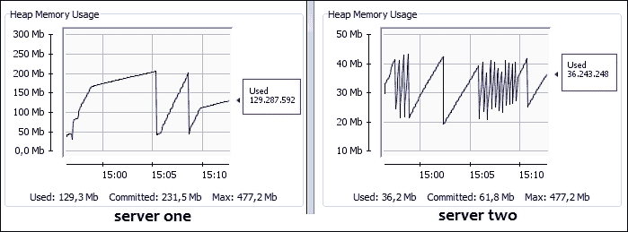

# 第九章 負載均衡 Web 應用程序

在上一章中，我们介绍了如何对 Web 应用程序进行聚类的基礎概念。然而，這只是故事的一部分。為了進一步提高可用性，我們需要考慮如何進行 WildFly 服務器的負載均衡。

負載均衡是在托管相同應用程序內容的服務器之間分配進來的流量。負載均衡通過確保任何單個服務器不會承擔過多的負擔，並在單個服務器故障時保持應用程序的可用性來提高應用程序的可用性。

历史上，JBoss AS 從 Tomcat 繼承了負載均衡庫，Tomcat 是應用服務器網絡模塊的一部分。網絡模塊使用`mod_jk`（一個 Apache 模塊）將 Tomcat 連接到 Web 服務器，如 Apache。對於那些不熟悉 Tomcat 和 Apache 的您，Tomcat（也稱為 Apache Tomcat）是一個開源 servlet 容器，而 Apache（也稱為 Apache2 或 Apache HTTPD）是一個 HTTP 網絡服務器。

尽管您仍然可以使用`mod_jk`將 Undertow 連接到 Web 服務器，但您應該考慮使用`mod_cluster` API。`mod_cluster` API 是一個基於 HTTPD 的負載均衡器，它相比`mod_jk`有許多優勢，例如性能和可靠性的提升。我們將在本章中涵蓋`mod_jk`和`mod_cluster`的安裝。

在這個簡短的介紹之後，我們將介紹在您的 Web 應用程序前面使用 Web 服務器的優勢。然後我們將繼續介紹以下主題：

+   使用`mod_jk`和`mod_proxy`將 WildFly 連接到 Apache

+   使用`mod_cluster` API 將 WildFly 連接到 Apache

# 使用 Apache Web 服務器與 WildFly 的優勢

在大多數實際情況中，您會發現 Apache Web 服務器作為您的應用服務器的進入點。這種做法的一些優勢包括：

+   **速度**：Apache 在服務靜態內容方面通常更快。

+   **安全性**：將 WildFly 放在 Apache 後面，您僅需要關注單一進入點的連接。WildFly 可以配置為只接受來自單一 IP（托管 Apache 的服務器）的連接，並不會直接從互聯網訪問。從根本上說，Apache 成為了一個智能代理服務器。

+   **負載均衡和集群**：使用 Apache 作為前端，您可以將流量分發到多個 WildFly 服務器實例。如果您的某個服務器出現故障，通訊將透明地繼續到集群中的另一個節點。

如前所述，連接 Apache 和 WildFly 可以通過兩種方式進行：使用 Tomcat 的`mod_jk`庫或 Apache 的`mod_proxy`庫。由於`mod_jk`和`mod_proxy`的安裝與早期的 AS 版本無異，我們將只提供一個快速設置指南供您參考。

然而，如果您计划设置一个高性能、动态的 Web 服务器集群，您应该考虑迁移到较新的`mod_cluster` API，这在本章的后续部分中讨论。

## 使用 mod_jk 库

`mod_jk`库是使用 Apache Web 服务器作为 WildFly 前端的一个常见解决方案。所有请求首先到达 Apache Web 服务器。然后，Apache 接受并处理任何静态资源请求，例如 HTML 页面或图形图像的请求。然后，借助`mod_jk`，Apache 请求动态资源，如 JSP 或 Servlet，到 Undertow。Apache 和 Undertow 之间的通信通过 AJP 协议在网络中发送，如下面的截图所示：


### 安装 Apache

对于实时环境，最常用的操作系统是 Linux。因此，我们将演示如何在 Ubuntu 中安装`mod_jk`。请注意，根据您使用的 Linux 版本，配置可能略有不同。这些说明适用于 Ubuntu 服务器。

在尝试安装`mod_jk`之前，您需要安装 Apache。您可以在终端中输入以下命令来安装 Apache：

```java
sudo apt-get update
sudo apt-get install -y apache2

```

确保在完成安装后您可以看到 Apache 欢迎页面。只需将服务器的 IP 地址作为浏览器中的 URL 输入。请查看以下截图：


### 安装 mod_jk

接下来，我们需要安装`mod_jk`。以下命令将安装模块，启用它，并重新启动 Apache：

```java
sudo apt-get install libapache2-mod-jk

```

您可以通过输入以下命令来确认模块已被启用。这将列出所有当前启用的模块：

```java
sudo apache2ctl -M

```

然后，您需要修改默认配置文件`default`中的虚拟主机，该文件位于`/etc/apache2/sites-enabled`目录下。配置显示了文件的更新默认配置。以下代码中需要添加的行已突出显示：

```java
<VirtualHost *:80>
    ServerAdmin webmaster@localhost

 JkMount /* loadbalancer
    <Directory />
        Options FollowSymLinks
        AllowOverride None
    </Directory>

     ErrorLog ${APACHE_LOG_DIR}/error.log
    CustomLog ${APACHE_LOG_DIR}/access.log combined
</VirtualHost>
```

`JkMount`指令告诉 Apache 它应该将哪些 URL 转发到`mod_jk`模块，该模块随后将它们转发到 Undertow Web 容器。在上面的示例中，所有 URL 路径为`/*`的请求都发送到`mod_jk`连接器。这意味着所有请求都被发送。您也可以将特定的 URL 转发到`mod_jk`，例如`/website*`。

如果您转发所有 URL，您可能希望卸载一个或两个 URL，以便从 Apache 服务器提供静态数据。这可以通过使用`JkUmount`指令来实现。例如，如果您希望 Apache 在`images`目录中提供静态媒体文件，您将有一个如下所示的配置：

```java
<VirtualHost *:80>
        ServerAdmin webmaster@localhost

        JkMount /* loadbalancer
 JkUmount /images/* loadbalancer

        <Directory />
                Options FollowSymLinks
                AllowOverride None
         </Directory>

        ErrorLog ${APACHE_LOG_DIR}/error.log
        CustomLog ${APACHE_LOG_DIR}/access.log combined
</VirtualHost>
```

接下来，你需要配置`mod_jk`工作器文件，即`workers.properties`文件，该文件位于`/etc/libapache2-mod-jk`文件夹中。此文件指定了 Undertow Web 服务器的 IP 地址，在这些服务器之间进行负载均衡。可选地，你可以添加一个配置，指定如何在每个服务器之间进行负载均衡。对于双节点设置，文件将如下所示：

```java
# Define worker list
worker.list=loadbalancer,jkstatus
# Set properties for worker1 (ajp13)
worker.worker1.type=ajp13
worker.worker1.host=192.168.0.1
worker.worker1.port=8009  

# Set properties for worker2 (ajp13)
worker.worker2.type=ajp13
worker.worker1worker12.host=192.168.0.2
worker.worker1worker12.port=8009
worker.worker1.lbfactor=1
worker.loadbalancer.type=lb
worker.loadbalancer.balance_workers=worker1,worker2
```

在`workers.properties`文件中，每个节点使用`worker.[n]`命名约定定义，其中`n`代表你为每个 Web 服务器容器选择的任意名称。对于每个工作器，你必须指定 Web 服务器中运行的 AJP13 连接器的主机名（或 IP 地址）和端口号。

负载均衡器类型`lb`表示工作器执行带粘性会话的加权轮询负载均衡。

你需要在修改`worker.properties`文件后重启 Apache。看看以下命令：

```java
sudo /etc/init.d/apache2 restart

```

在 WildFly 中，`ha`配置文件中的默认配置已经定义了 AJP 连接器。如果你没有使用`ha`配置文件之一，例如，你正在使用`standalone.xml`，你需要添加以下高亮显示的行：

```java
<subsystem >
    <buffer-cache name="default"/>
    <server name="default-server">
 <ajp-listener name="ajp" socket-binding="ajp"/>
        <http-listener name="default" socket-binding="http"/>
        ....
    </server>
</subsystem>
```

AJP 连接器也在`socket-binding-group`元素中定义了`ha`配置文件。同样，对于非`ha`配置文件，你需要 AJP 配置。在下面的代码片段中，你可以看到 AJP 连接器正在监听端口号 8009。看看以下代码：

```java
<socket-binding-group name="standard-sockets" default-interface="public" port-offset="0">
    <socket-binding name="management-http" interface="management" port="9990"/>
    <socket-binding name="management-https" interface="management" port="9993"/>
 <socket-binding name="ajp" port="8009"/>
    ...
</socket-binding-group>
```

一旦设置好此配置，你应该刷新显示 Apache 欢迎页面的页面。现在它将显示 WildFly 欢迎页面。这证明了 Apache 正在将请求定向到 WildFly。停止一个 WildFly 服务器，再次刷新页面。你将看到 WildFly 欢迎页面，因为现在所有请求都被定向到另一个 WildFly 服务器。

## 配置 mod_proxy

在 WildFly 中，支持一个名为`mod_proxy`的可选模块。安装后，它可以配置为 Apache 充当代理服务器。这可以用来将请求转发到特定的 Web 应用服务器，如 WildFly，而无需配置如`mod_jk`的 Web 连接器。

要安装和启用`mod_proxy`，你需要运行以下命令：

```java
sudo apt-get install libapache2-mod-proxy-html
sudo a2enmod proxy-http

```

然后，你需要将这些两个指令包含在你的默认站点文件中。你需要为每个你希望转发到 WildFly 的 Web 应用程序这样做，例如，为了转发一个上下文路径为`/app`的应用程序。看看以下代码：

```java
ProxyPass         /app  http://localhost:8080/app
ProxyPassReverse  /app  http://localhost:8080/app
```

这告诉 Apache 将匹配`http://localhost/app/*`的 URL 转发到监听在端口 8080 的 WildFly HTTP 连接器。


如前图所示，Apache 的`mod_proxy`是基于 TCP 的，并使用 HTTP，因此您不需要在 WildFly 配置中添加其他任何内容。除此之外，还有对另一个模块`mod_proxy_ajp`的支持。这个模块可以像`mod_proxy`一样使用，只是它使用 AJP 协议将 Apache 请求代理到 WildFly。在您可以使用它之前，您需要按照以下方式启用它：

```java
sudo a2enmod proxy-ajp

```

然后，将高亮显示的行添加到默认站点文件中的虚拟主机中：

```java
<VirtualHost *:80>
        ServerAdmin webmaster@localhost
        DocumentRoot /var/www/html

 ProxyPass / ajp://localhost:8009/
 ProxyPassReverse / ajp://localhost:8009/

        ErrorLog ${APACHE_LOG_DIR}/error.log
        CustomLog ${APACHE_LOG_DIR}/access.log combined
</VirtualHost>
```

在这里，我们只是将所有流量（`/`）重定向到监听在 localhost 端口 8009 的 Web 服务器。请看以下截图：


再次，如果您使用的是非 ha 配置文件，您需要将 AJP 监听器添加到您的 Undertow 配置中，如下所示：

```java
<subsystem >
    <buffer-cache name="default"/>
    <server name="default-server">
 <ajp-listener name="ajp" socket-binding="ajp"/>
        <http-listener name="default" socket-binding="http"/>
        ....
    </server>
</subsystem>
```

然后，您需要将 AJP 端口添加为 socket-binding 元素，如下所示：

```java
<socket-binding-group name="standard-sockets" default-interface="public" port-offset="0">
     <socket-binding name="management-http" interface="management" port="9990"/>
     <socket-binding name="management-https" interface="management" port="9993"/>
 <socket-binding name="ajp" port="8009"/>
    ....
</socket-binding-group>
```

# 使用 mod_cluster 进行负载均衡

`mod_cluster`是一个基于 HTTP 的负载均衡器，类似于`mod_jk`，可以用来将请求转发到一组应用服务器实例。使用`mod_cluster`相较于`mod_jk`或`mod_proxy`有以下几个优点：

+   动态聚类配置

+   由于能够使用服务器端负载指标，因此具有更好的负载均衡能力

+   与应用程序生命周期有更好的集成

+   AJP 是可选的

当使用标准负载均衡器，如`mod_jk`时，您必须提供一个静态节点列表，用于分配负载。这个过程不方便，尤其是如果您想根据应用程序周围的流量动态添加或移除节点。此外，使用平面集群配置可能会很繁琐且容易出错，尤其是如果您集群中的节点数量很多。

当使用`mod_cluster`时，节点会动态地添加到或从您的集群中移除。为了实现这一点，每个 WildFly 服务器都会将其生命周期状态通知 Apache。

Apache 在多播组上发送 UDP 消息，所谓的广告。集群中的每个 WildFly 服务器都会订阅这个组。WildFly 就是通过这个组来了解 HTTP 代理（在这个例子中是 Apache）。然后，每个 WildFly 实例会通知 HTTP 代理它们的可用性，然后代理将它们添加到节点列表中。如果 WildFly 服务器被移除，组中的其他 WildFly 服务器将会收到通知。

下面的图示有助于说明这一概念：


`mod_cluster`的另一个关键特性在于负载指标。负载指标在服务器端确定，然后根据情况变化发送到 Apache 端。因此，`mod_cluster`提供了一个比传统基于 HTTPD 的负载均衡器更为稳健的架构，后者在代理上静态地持有指标。

### 小贴士

关于服务器端负载指标如何计算的信息，请参阅`mod_cluster`文档中的[`docs.jboss.org/mod_cluster/1.2.0/html/java.load.html`](http://docs.jboss.org/mod_cluster/1.2.0/html/java.load.html)。

使用`mod_cluster`的另一个优点是能够拦截生命周期事件，例如卸载和重新部署。如本节之前所述，这些事件在 Apache 和集群中的节点之间是同步的。

# 安装 mod_cluster 库

在安装和配置`mod_cluster`时，有两个需要考虑的事项。第一个涉及 WildFly 配置，第二个涉及下载和安装`mod_cluster`库到 Apache。我们将首先查看 WildFly，因为它已经预配置，然后继续到`mod_cluster`的安装。

在你的 WildFly 安装中捆绑的，你会找到 mod_cluster 1.3.0 模块。此子系统作为集群配置的一部分包含在`standalone-ha.xml`和`domain.xml`配置文件中，如下所示：

```java
<subsystem >
    <mod-cluster-config advertise-socket="modcluster" connector="ajp">
        <dynamic-load-provider>
            <load-metric type="cpu"/>
        </dynamic-load-provider>
    </mod-cluster-config>
</subsystem>
```

上述默认配置通过`advertise-socket`元素引用其`socket-binding`：

```java
<socket-binding name="modcluster" port="0" multicast-address="224.0.1.105" multicast-port="23364"/>
```

此外，请注意，默认配置使用 AJP 协议。`connector`属性引用了`mod_cluster`反向代理将要连接到的 Undertow 监听器的名称。以下是有`ajp-listener`高亮的 Undertow 配置：

```java
<subsystem >
    <buffer-cache name="default"/>
    <server name="default-server">
 <ajp-listener name="ajp" socket-binding="ajp"/>
        <http-listener name="default" socket-binding="http"/>
        ....
    </server>
</subsystem>
```

你还需要确保你的接口配置正确，指向你的 WildFly 服务器（们）运行的 IP 地址。更新你的`hosts.xml`或`standalone-ha.xml`文件，用你的服务器的 IP 地址替换 IP：

```java
<interfaces>
    <interface name="management">
        <inet-address value="178.62.50.168"/>
    </interface>
    <interface name="public">
        <inet-address value="178.62.50.168"/>
    </interface>
</interfaces>
```

现在让我们继续到第二部分——在 Apache 中安装和配置`mod_cluster`。

如果你还没有安装 Apache，你应该遵循本章前面的说明（见*安装 Apache*部分）。我们首先需要安装所需的 Apache 模块。这些模块用于与 WildFly 上的`mod_cluster`交互。

在此示例中，我们使用 Apache 2.2，它需要`mod_cluster`的 1.2.x 版本。如果你使用 Apache 2.4，则可以使用`mod_cluster`的较新版本，即 1.3.x 版本。你也可以使用 1.2.x 版本，但需要为 Apache 2.4 编译。要查看你的 Apache 版本，请运行以下命令：

```java
apache2ctl -V

```

### 小贴士

在撰写本文时，1.3.x 的二进制文件尚未从下载网站提供，因此你可能需要从源代码编译它们([`github.com/modcluster/mod_cluster/tree/master`](https://github.com/modcluster/mod_cluster/tree/master))。

在决定编译源代码之前，请先检查下载网站。如果你希望编译模块，你应该检查[`www.openlogic.com/blog/bid/247607/JBoss-AS7-Clustering-Using-mod_cluster-and-http-2-4-Part-1`](http://www.openlogic.com/blog/bid/247607/JBoss-AS7-Clustering-Using-mod_cluster-and-http-2-4-Part-1)。

访问下载网站 ([`mod-cluster.jboss.org/downloads`](http://mod-cluster.jboss.org/downloads))，并选择您平台上的二进制文件。选择 **httpd 的 mod_cluster 模块**：


下载完二进制文件后，您需要将其提取到 Apache 的 `module` 目录中。当您提取下载的存档时，应该看到以下文件：

+   `mod_advertise.so`

+   `mod_manager.so`

+   `mod_proxy_cluster.so`

+   `mod_slotmem.so`

您可以使用以下命令来完成此操作。第一个命令使用下载页面中的 URL 从 `mod_cluster` 网站下载文件。第二个命令提取 TAR 文件，最后一个命令将库复制到 `modules` 目录。

```java
wget -c http://downloads.jboss.org/mod_cluster/1.2.6.Final/linux-x86_64/mod_cluster-1.2.6.Final-linux2-x64-so.tar.gz
tar -xzvf mod_cluster-1.2.6.Final-linux2-x64-so.tar.gz
cp ./*.so /usr/lib/apache2/modules

```

## mod_cluster 配置

接下来，我们需要在 `/etc/apache2/mods-available` 目录下创建两个文件。第一个文件名为 `mod_cluster.load`，其中包含该模块所依赖的库列表。以下是该文件的完整内容：

```java
LoadModule proxy_module /usr/lib/apache2/modules/mod_proxy.so
LoadModule proxy_http_module /usr/lib/apache2/modules/mod_proxy_http.so
LoadModule proxy_ajp_module /usr/lib/apache2/modules/mod_proxy_ajp.so
LoadModule slotmem_module /usr/lib/apache2/modules/mod_slotmen.so

LoadModule manager_module /usr/lib/apache2/modules/mod_manager.so
LoadModule proxy_cluster_module /usr/lib/apache2/modules/mod_proxy_cluster.so
LoadModule advertise_module /usr/lib/apache2/modules/mod_advertise.so
```

### 备注

在 1.3.x 版本中，`slotmen` 模块名称已从 `mod_slotmen.so` 更改为 `mod_cluster_slotmen.so`。

此列表包含我们刚刚复制到 `module` 文件夹中的四个库和现有的 `mod_proxy` 库。

这些模块中的每一个都在负载均衡功能中扮演着特定的角色。核心模块是 `mod_proxy`、`mod_proxy_ajp` 和 `mod_proxy_http`。它们使用 HTTP/HTTPS 协议或 AJP 协议将请求转发到集群节点。

接下来，`mod_manager` 是一个模块，它从 WildFly 读取信息，并与 `mod_slotmem` 一起更新共享内存信息。`mod_proxy_cluster` 是包含 `mod_proxy` 负载均衡器的模块。最后，`mod_advertise` 是一个额外的模块，允许 HTTPD 通过多播数据包、IP 地址和 `mod_cluster` 监听的端口号进行广告。

下一个我们需要创建的文件名为 `mod_cluster.conf`。该文件位于 `/etc/apache2/mods-available` 目录中，与 `mod_cluster.load` 文件并列，如下所示：

```java
CreateBalancers 1

<IfModule manager_module>
    Listen 127.0.1.1:6666
    ManagerBalancerName mycluster

    <VirtualHost 127.0.1.1:6666> 
        KeepAliveTimeout 300
        MaxKeepAliveRequests 0
        AdvertiseFrequency 5
        ServerAdvertise On
        EnableMCPMReceive

        <Location />
            Order deny,allow
            Allow from 127.0.1
        </Location>

    </VirtualHost>
</IfModule>
```

您必须将 `127.0.1.1` IP 地址替换为 WildFly 用于连接 Apache 的 IP 地址。如果您的 Apache 和 WildFly 在不同的服务器上，那么它将是您的 Apache 服务器 IP。您还需要将端口号 6666 更新为您想要与 WildFly 通信的端口号。

根据当前的配置，Apache 虚拟主机允许来自以下请求：

+   前缀为 `127.0.1` 的 IP 地址

+   子网络 `127.0.1.0/24`

`CreateBalancers` 指令配置了如何在虚拟主机中创建 HTTP 均衡器。`CreateBalancers` 的可能值为 `0`、`1` 和 `2`，如下所述：

+   `0`：在所有虚拟主机中创建均衡器

+   `1`：不创建任何均衡器

+   `2`：仅为主服务器创建均衡器

### 备注

将 `CreateBalancers` 设置为 `1` 意味着你必须在 `ProxyPass` 指令中配置一个均衡器（在章节中进一步展示）。更多信息，请参阅此链接：[`docs.jboss.org/mod_cluster/1.2.0/html/native.config.html#d0e485`](http://docs.jboss.org/mod_cluster/1.2.0/html/native.config.html#d0e485)

`KeepAliveTimeout` 指令允许在 300 秒内重用相同的连接。由于我们将 `MaxKeepAliveRequests` 设置为 `0`，因此每个连接的请求数量是无限制的。`ManagerBalancerName` 指令提供了你集群的均衡器名称（默认为 `mycluster`）。

对我们来说最重要的是 `ServerAdvertise` 指令。它使用广告机制告诉 WildFly 应该向谁发送集群信息。

你还可以使用 `AdvertiseFrequency` 指令来细化多播广告消息之间的时间间隔，默认为 10 秒。

### 小贴士

**广告机制的概述**

用于广告的默认多播 IP 地址和端口是 `224.0.1.105:23364`。这些值与以下名为 `modcluster` 的 WildFly 绑定定义相匹配：

```java
<socket-binding name="modcluster" port="0" multicast-address="224.0.1.105" multicast-port="23364"/>
```

如果你更改了 WildFly 中的这些值，你还需要在 HTTPD 端使用 `AdvertiseGroup` 指令进行匹配：

```java
AdvertiseGroup 224.0.1.105:23364
```

你需要配置的最后一件事情是在你的站点配置文件中的虚拟主机。在 `/etc/apache2/sites-enabled` 目录下创建一个名为 `wildfly` 的文件。添加以下高亮显示的代码行：

```java
<VirtualHost *:80>
    ServerAdmin webmaster@localhost

 ProxyPass / balancer://mycluster stickysession=JSESSIONID|jsessionid nofailover=On
 ProxyPassReverse / balancer://mycluster

    <Location />
        Order deny,allow
        Allow from All
    </Location>

    ErrorLog ${APACHE_LOG_DIR}/error.log
    CustomLog ${APACHE_LOG_DIR}/access.log combined
</VirtualHost>
```

最后一点，如果你还没有启用 `proxy_ajp` 和 `proxy_http`，你需要这样做以便 `mod_cluster` 能够工作，如下所示：

```java
a2enmod proxy proxy_ajp proxy_http

```

你现在可以启用 WildFly 站点：

```java
sudo a2ensite wildfly

```

现在，启用 `mod_cluster` 模块并重启 Apache：

```java
sudo a2enmod mod_cluster
sudo /etc/init.d/apache2 restart

```

## 测试 mod_cluster

为了验证一切是否正常工作，启动你的 WildFly 域，确保你的服务器组正在使用 `ha` 配置文件。将我们在 第四章 中使用的应用程序部署到同一个服务器组，即 *The Undertow Web Server*。如果一切配置正确，当你导航到 `http://178.62.50.168/chapter4` 的上下文根 `chapter4` 时，你应该能看到该应用程序。


# 通过 CLI 管理 mod_cluster

有一些工具可以用来管理和从你的集群中检索运行时信息。你的第一个选择是命令行管理界面，它允许你调查 `mod_cluster` 子系统。

你需要学习的第一个命令是 `list-proxies`，它仅返回已连接代理的主机名（和端口）：

```java
[domain@localhost:9990 /] /host=master/server=server-one/subsystem=modcluster:list-proxies
{
 "outcome" => "success",
 "result" => ["apache-wildfly:6666"]
}

```

虽然这可以用于快速检查你的集群成员，但你可以使用 `read-proxies-info` 命令获取更详细的信息，该命令实际上会向 HTTPD 服务器发送信息消息：

```java
[domain@localhost:9990 /] /host=master/server=server-one/subsystem=modcluster:read-proxies-info
{
 "outcome" => "success",
 "result" => [
 "apache-wildfly:6666",
 "Node: [1],Name: master:server-two,Balancer: mycluster,LBGroup: ,Host: 178.62.50.168,Port: 8159,Type: ajp,Flushpackets: Off,Flushwait: 10,Ping: 10,Smax: 26,Ttl: 60,Elected: 0,Read: 0,Transfered: 0,Connected: 0,Load: 97
Node: [2],Name: master:server-one,Balancer: mycluster,LBGroup: ,Host: 178.62.50.168,Port: 8009,Type: ajp,Flushpackets: Off,Flushwait: 10,Ping: 10,Smax: 26,Ttl: 60,Elected: 0,Read: 0,Transfered: 0,Connected: 0,Load: 98
Vhost: [1:1:1], Alias: localhost
Vhost: [1:1:2], Alias: default-host
Vhost: [2:1:3], Alias: localhost
Vhost: [2:1:4], Alias: default-host
Context: [1:1:1], Context: /chapter4, Status: ENABLED
Context: [2:1:2], Context: /chapter4, Status: ENABLED
"
 ]
}

```

`mod_cluster` 子系统还允许我们使用 `read-proxies-configuration` 命令，该命令提供了有关您的集群的更多详细信息。为了简洁起见，我们将省略其输出的打印。

您的集群中包含的代理列表也可以使用 CLI 进行修改。例如，您可以使用 `add-proxy` 命令添加一个未被 mod_cluster 的 `httpd` 配置捕获的代理。请查看以下代码：

```java
[domain@localhost:9990 /] /host=master/server=server-one/subsystem=modcluster:add-proxy(host=192.168.0.11, port=9999)
{
 "outcome" => "success"
}

```

您也可以使用相应的 `remove-proxy` 命令从列表中移除代理：

```java
[domain@localhost:9990 /] /host=master/server=server-one/subsystem=modcluster:remove-proxy(host=192.168.0.11, port=9999)
{
 "outcome" => "success"
}

```

# 使用 CLI 管理您的 Web 上下文

您可以使用 CLI 来管理您的 Web 上下文。例如，可以使用 `enable-context` 命令告诉 Apache 某个特定的 Web 上下文能够接收请求，如下所示：

```java
[standalone@localhost:9990 subsystem=modcluster] :enable-context(context=/app, virtualhost=default-host)
{"outcome" => "success"}

```

相应的 `disable-context` 命令可以用来防止 Apache 发送 *新* 请求：

```java
[standalone@localhost:9990 subsystem=modcluster] :disable-context(context=/app, virtualhost=default-host)
{"outcome" => "success"}

```

要停止 Apache 从 Web 上下文中发送请求，您可以使用 `stop-context` 命令，如下所示：

```java
[standalone@localhost:9990 subsystem=modcluster] :stop-context(context=/app, virtualhost=default-host, waittime=50)
{"outcome" => "success"}

```

# 添加原生管理功能

如果您无法（或者只是不想）使用 CLI，那么您也可以配置 Apache 网络服务器通过浏览器提供基本的管理界面。

为了做到这一点，您只需要添加 `mod_cluster_manager` 应用程序上下文，如下所示：

```java
<Location /mod_cluster_manager>
       SetHandler mod_cluster-manager
       Order deny,allow
       Deny from all
       Allow from 192.168.10
</Location>
```

您可以通过导航到 `http://192.168.10.1/http://192.168.10.1/mod_cluster_manager` 来测试您的 `mod_cluster` 管理员应用程序。

在我们的示例中，`mod_cluster` 管理员显示了通过多播公告发现的全部 WildFly 节点的信息。请查看以下截图：


在 `mod_cluster` 管理员页面上，您有很多有用的信息，例如当前活跃的主机数量（在我们的示例中，两个节点）和可用的 Web 上下文。默认情况下，所有 Web 上下文都会自动挂载（不需要像 `mod_jk` 那样显式挂载），但您可以通过点击旁边的 **禁用**/**启用** 链接来排除或包含它们。

# 使用配置文件管理 Web 上下文

为了完整起见，我们将添加一个可以用来通过您的应用程序服务器配置文件管理 Web 上下文的选项。默认情况下，所有 Web 上下文都是启用的；然而，您可以使用 `excluded-contexts` 指令从主配置文件中排除 Web 上下文。请查看以下代码：

```java
<subsystem >
    <mod-cluster-config excluded-contexts="ROOT, webapp1"/>
</subsystem>
```

# mod_cluster 故障排除

在 Apache 上安装和启用 `mod_cluster` 只需几个步骤即可开始工作。然而，如果您遇到问题，可以允许输出详细信息，这将导致显示您的配置概览。将 `AllowDisplay` 指令添加到您的 `mod_cluster_manager` 应用程序上下文中，如下所示：

```java
<Location /mod_cluster_manager> 
    SetHandler mod_cluster-manager 
    Order deny,allow 
    Deny from all 
    Allow from 192.168.10 
</Location> 

AllowDisplay On

```

当添加此指令时，你将获得有关加载到 HTTPD 中的模块的更多信息。此输出可能有助于缩小任何问题，如下面的截图所示：


错误的另一个可能原因是防火墙阻止了广告消息的广播。请记住，广告消息使用 UDP 端口号 23364 和多播地址 224.0.1.105。为了验证广告是否是问题，你可以在 HTTPD 端尝试将其关闭，如下设置：

```java
ServerAdvertise Off
```

此指令应在应用服务器端通过`proxy-list`元素匹配。此元素定义了 WildFly 服务器最初将与之通信的 HTTPD 服务器列表：

```java
<mod-cluster-config proxy-list="192.168.10.1:6666">
  ...
</mod-cluster-config>
```

如果有多个代理，那么`proxy-list`将包含一个以逗号分隔的列表。

你还可以通过运行一个名为`Advertise`的测试类来检查`mod_cluster`是否正确地发布了广告消息，该类可以在[`github.com/modcluster/mod_cluster/blob/master/test/java/Advertize.java`](https://github.com/modcluster/mod_cluster/blob/master/test/java/Advertize.java)找到。你需要编译该类，然后按照以下方式运行它：

```java
java Advertise 224.0.1.105 23364

```

如果该模块，即广告，配置正确，你将看到如下命令行显示：

```java
received from /192.168.0.10:23364
received: HTTP/1.0 200 OK
Date: Sat, 26 Jul 2014 20:03:12 GMT
Sequence: 121
Digest: 4dedd3761d451227f36534b63ca2a8a1
Server: b23584e2-314f-404d-8fde-05069bfe5dc7
X-Manager-Address: 127.0.1.1:6666
X-Manager-Url: /b23584e2-314f-404d-8fde-05069bfe5dc7
X-Manager-Protocol: http
X-Manager-Host: 127.0.1.1

```

最后，别忘了检查 Apache `logs`目录中的错误日志，看看是否有任何错误。

此外，请确保你已经启用了`mod_proxy_http`模块，因为没有它`mod_cluster`将无法工作。

# 节点间的负载均衡

我们将运行几个测试，以研究`mod_cluster`如何在几个不同的客户端之间分配负载。

对于这些测试，我们将使用一个非常基本的 Web 应用程序。该应用程序的源代码可以在本书的源代码中找到；项目名为`chapter9-balancer`。它包含一个简单的`index.jsp`页面，该页面在控制台上输出一条消息：

```java
<%
Integer counter = (Integer)session.getAttribute("counter");
if (counter == null) {
  session.setAttribute("counter",new Integer(1));
}
else {
  session.setAttribute("counter",new Integer(counter+1));
}
System.out.println("Counter"+session.getAttribute("counter"));          
%>
```

部署应用程序后，转到 URL `http://192.168.0.10/balancer/index.jsp`。在发送几个请求后，你会看到每个后续请求都发送到同一服务器。这表明`mod_cluster`遵循粘性会话策略。请看下面的截图：


为了我们的测试，我们需要一个可以用来向我们的集群发送多个请求的软件应用程序。我们将使用 JMeter，这是一个 Java 桌面应用程序，通常用于测试负载、测试功能行为和测量性能。JMeter 可以从[`jmeter.apache.org/download_jmeter.cgi`](http://jmeter.apache.org/download_jmeter.cgi)下载。

简而言之，JMeter 测试计划由一个或多个线程组、逻辑控制器、监听器、计时器、断言和配置元素组成。

为了我们示例的目的，我们只需创建以下元素：

+   **线程组**，配置为运行 100 个后续请求

+   一个包含有关 Web 应用程序端点信息的**HTTP 请求**元素

要执行此操作，请打开 JMeter 并导航到**测试计划** | **添加** | **线程** | **线程组**，如图所示：


将线程数（用户数）设置为 100。现在右键单击新创建的**线程组** | **添加** | **采样器** | **HTTP 请求**。在此处，添加服务器 IP 和路径，如图所示。端口号可以留空，因为它默认为端口号 80。请查看以下截图：


此外，您还应添加一个**监听器**元素，将测试计划结果汇总到表格/图中，以便您查看结果。为此，导航到**HTTP 请求** | **添加** | **监听器** | **在表格中查看结果**。现在，从顶部菜单导航到**运行** | **开始**，JMeter 测试将被执行。

运行测试显示请求大致在两个服务器之间分配。请查看以下截图：


## 使用负载指标

从每个服务器收集各种系统负载指标。这些统计数据允许为每个服务器计算一个标准化的负载值。当集群负载较轻时，传入的请求会均匀地分配到每个服务器节点。随着负载的增加，发送到特定节点的流量量取决于其当前负载，也就是说，更多的流量将被导向负载最轻的节点。

默认的`mod_cluster`配置使用动态负载提供者，如下面的代码所示：

```java
<subsystem >
    <mod-cluster-config advertise-socket="modcluster" connector="ajp">
        <dynamic-load-provider>
            <load-metric type="cpu"/>
        </dynamic-load-provider>
    </mod-cluster-config>
</subsystem>
```

您可以通过添加进一步的`负载指标`元素来自定义负载均衡。例如：

```java
<subsystem >
  <mod-cluster-config advertise-socket="modcluster" connector="ajp">
    <dynamic-load-provider history="10" decay="2">
       <load-metric type="cpu" weight="2" capacity="1"/>
 <load-metric type="sessions" weight="1" capacity="512"/>
    </dynamic-load-provider>
  </mod-cluster-config>
</subsystem>
```

计算负载均衡时最重要的因素是`权重`和`容量`属性。`权重`（默认为`1`）表示指标相对于其他指标的影响。在上一个示例中，CPU 指标的影响将是具有`1`负载系数会话的两倍。

另一方面，`容量`属性可用于对负载指标进行精细控制。通过为每个指标设置不同的容量，您实际上可以偏向一个节点而不是另一个，同时保留指标权重。

支持的负载指标列表总结在下表中：

| 指标 | 组成指标使用的系数 |
| --- | --- |
| cpu | CPU 负载 |
| 堆 | 堆内存使用量占最大堆大小的百分比 |
| 会话 | Web 会话数量 |
| 请求 | 每秒请求数量 |
| 发送流量 | 流量中的出站请求数量 |
| 接收流量 | 流量后的入站请求数量 |

上述度量也可以使用 CLI 设置，例如，假设您想添加一个基于代理使用的堆内存量的度量。当通知您重新加载配置时（输入`reload`命令），不要忘记重新加载配置。以下是您需要执行的命令：

```java
[standalone@localhost:9990 /] /subsystem=modcluster/mod-cluster-config=configuration/dynamic-load-provider=configuration/load-metric=heap:add(type=heap)
{
 "outcome" => "success",
 "response-headers" => {
 "operation-requires-reload" => true,
 "process-state" => "reload-required"
 }
}
[standalone@localhost:9990 /] /subsystem=modcluster/mod-cluster-config=configuration/dynamic-load-provider=configuration:read-resource()
{
 "outcome" => "success",
 "result" => {
 "decay" => 2,
 "history" => 9,
 "custom-load-metric" => undefined,
 "load-metric" => {
 "cpu" => undefined,
 "heap" => undefined
 }
 }
}

```

您也可以使用`remove`命令来移除度量，如下所示：

```java
[standalone@localhost:9990 /] /subsystem=modcluster/mod-cluster-config=configuration/dynamic-load-provider=configuration/load-metric=heap:remove()
{
 "outcome" => "success",
 "response-headers" => {
 "operation-requires-reload" => true,
 "process-state" => "reload-required"
 }
}

```

## 在集群上设置动态度量的示例

在以下示例中，我们有一个由两个节点组成的非常简单的集群。每个节点具有相同的 JVM 操作默认值，并且每个节点都在两台相同的机器上运行。

然而，我们将对第一个节点进行内存密集型操作的模拟，以便每个服务器使用的堆内存量不同，如下面的截图所示：



这是在 Web 应用程序中一个常见的场景，不同的情况对每个服务器的内存有不同的影响，例如，在 HTTP 会话中暂时保留数据。

在这种情况下，使用轮询方法分配请求可能会导致集群中某些节点出现“内存不足”的情况。您可以尝试通过简单地修改加载度量的配置来减轻这种情况，如下所示：

```java
<subsystem >
  <mod-cluster-config advertise-socket="mod_cluster">
    <dynamic-load-provider history="10" decay="2">
       <load-metric type="heap" weight="2" /> 
       <load-metric type="mem"  weight="1" />
       <load-metric type="cpu"  weight="1" />
    </dynamic-load-provider>
  </mod-cluster-config>
</subsystem>
```

当在两个节点上使用此配置时，堆内存的使用对其他列出的度量（操作系统内存和 CPU 速度）的影响是两倍。

结果是，第二个服务器处理了 55%的请求，而第一个服务器处理了 45%。

通过设置适当的容量，您可以进一步提高节点权重的粒度，例如，通过在第一个服务器上设置更高的容量，如下所示：

```java
       <load-metric type="heap" weight="2" capacity="512"/>
```

您可以对第二个服务器设置较低的容量，如下所示：

```java
       <load-metric type="heap" weight="2" capacity="1"/>
```

因此，测试的结果将不同，因为第二个服务器现在提供的响应比第一个服务器多，从而抵消了权重度量。

### 注意

每个度量的容量默认为 512，应该配置为`0 <= (load / capacity) >= 1`。

# 摘要

在本章中，我们展示了如何在节点集之间分配应用程序负载的各种方法。这被称为负载均衡。

负载均衡需要一个网络服务器，例如 Apache，它将流量导向您的各个应用服务器。

在本章的前半部分，我们说明了如何在 WildFly 中使用`mod_jk`和`mod_proxy`库。`mod_jk`库需要在 HTTPD 端和 AS 端进行一些配置。`mod_proxy`库是一个更直接的方法，当使用 WildFly 时是一个首选解决方案，因为它只需要在 HTTPD 端配置端点。

在本章的后半部分，我们探讨了使用`mod_cluster`在应用程序之间进行负载均衡的推荐方法。

与传统负载均衡器相比，使用 `mod_cluster` 的主要优势是它不需要静态的工作节点列表，而是通过基于多播的广告机制动态注册应用程序服务器及其应用程序。

这在云环境中尤其有用，因为在云环境中你不能依赖于一个静态的节点列表。动态地添加或删除节点要更有益得多。

最后，`mod_cluster` 的另一个主要好处是你可以使用在服务器端计算的一组动态指标来定义服务器节点之间的负载。例如，你可以优先考虑配置更好的服务器，比如具有更高内存或更好处理能力的服务器。

在下一章中，我们将探讨 WildFly 管理中最重要的一部分，那就是安全性。
