# 第十章. 保护 WildFly

安全性是企业应用程序的关键元素。您必须能够控制并限制谁有权访问您的应用程序以及用户可以执行哪些操作。

**Java 企业版**（**Java EE**）规范为**企业 JavaBeans**（**EJBs**）和 Web 组件定义了一个简单的基于角色的安全模型。JBoss 安全性的实现由 PicketBox 框架（以前称为 JBoss 安全）提供，该框架为 Java 应用程序提供认证、授权、审计和映射功能。

由于涉及安全性的主题数量需要一个专门的书籍来阐述，因此本章将重点关注大多数管理员和开发者感兴趣的主题。我们将详细讨论以下主题：

+   Java 安全 API 简介

+   WildFly 安全子系统的基本原理

+   定义登录模块及其与各种企业组件（例如，Web 应用 EJB）的集成

+   保护管理接口

+   使用**安全套接字层**（**SSL**）加密对 Web 应用的网络调用

# 接近 Java 安全 API

Java EE 安全服务提供了一种强大且易于配置的安全机制，用于验证用户并授权对应用程序功能和相关数据的访问。为了更好地理解与安全性相关的主题，我们首先提供一些基本定义：

**认证**是确保一个人是他所声称的人的过程。认证通常通过检查用户的登录凭证是否与存储在数据存储中的凭证匹配来执行。登录凭证通常包括用户名和密码，但也可以是 X.509 证书或**一次性密码**（**OTP**）的形式。以下图示展示了登录过程的流程。最终用户提供用户名和密码，并将其提交给应用程序服务器。登录模块将用户的详细信息与存储在数据存储中的信息进行核对。如果凭证匹配，则用户登录；如果凭证不匹配，则登录过程将失败。请查看以下图表：

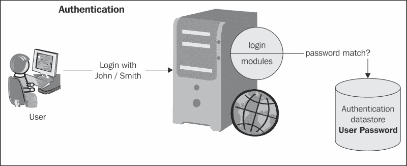

**授权**是验证用户是否有权访问特定系统资源的过程。授权应在认证之后进行。请查看以下图表：

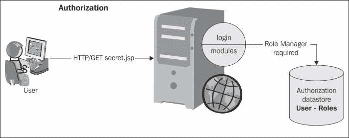

在 Java EE 中，组件容器负责提供应用程序安全。容器基本上提供两种类型的安全：**声明式**和**程序性**。

+   **声明式安全**通过部署描述符和/或注解定义应用程序组件的安全要求。部署描述符是一个外部文件，可以修改而不需要重新编译源代码。

    例如，企业 JavaBeans 组件可以使用一个名为`ejb-jar.xml`的 EJB 部署描述符，并将其放置在 EJB JAR 文件的`META-INF`文件夹中。

    Web 组件使用一个名为`web.xml`的 Web 应用程序部署描述符，该描述符位于`WEB-INF`目录中。

    注解是在类文件中指定的，这意味着任何更改都需要重新编译代码。

    使用注解比使用部署描述符提供了许多好处。首先，它在源代码中比在各个 XML 文件中分散的信息更清晰。其次，它更容易维护，因为配置文件更少。

    使用注解也意味着开发者需要更少的样板代码。

+   **程序式安全**在安全检查嵌入到应用程序代码中时出现。当仅使用声明式安全不足以表达应用程序的安全模型时，可以使用它。例如，Java EE 安全 API 允许开发者使用以下方法测试当前用户是否具有特定的角色：

    +   `isUserInRole()`: 在 servlets 和 JSPs 中使用此方法（在`javax.servlet.http.HttpServletRequest`中采用）

    +   `isCallerInRole()`: 在 EJBs 中使用此方法（在`javax.ejb.SessionContext`中采用）

    此外，还有其他 API 调用可以提供对用户身份的访问，如下所示：

    +   `getUserPrincipal()`: 在 servlets 和 JSPs 中使用此方法（在`javax.servlet.http.HttpServletRequest`中采用）

    +   `getCallerPrincipal()`: 在 EJBs 中使用此方法（在`javax.ejb.SessionContext`中采用）

    使用这些 API，你可以通过编程方式开发复杂的授权模型。

### 注意

虽然注解本身是程序性的，但它们使安全成为一种声明式风格。因此，注解被认为包含了声明式和程序式安全概念。

Java EE 安全模型是声明式的，因此将安全代码嵌入到业务组件中不是一个选择。这里的声明式意味着你在一个标准的 XML 描述符中描述安全角色和权限。声明式安全允许将来自这个横切关注点的逻辑从核心业务逻辑中提取出来。这导致代码更清晰、更易于阅读。

声明式安全模型的默认实现基于**Java 认证和授权服务**（**JAAS**）登录模块和主题。WildFly 安全有一个安全代理层，允许开发者创建自定义安全服务，如果默认实现不足以满足需求。这允许在不污染业务代码的情况下独立于使用它的 bean 对象构建自定义安全。

WildFly 使用基于 JAAS 的 PicketBox 框架，用于保护在应用服务器中运行的 Java EE 技术。

## WildFly 安全子系统

WildFly 安全子系统是应用服务器的一个扩展，默认包含在独立服务器和域服务器中。查看以下代码：

```java
<extension module="org.jboss.as.security"/>
```

以下是在服务器配置文件中包含的默认安全子系统：

```java
<subsystem >
  <security-domains>
    <security-domain name="other" cache-type="default">
      <authentication>
        <login-module code="Remoting" flag="optional">
          <module-option name="password-stacking"    value="useFirstPass"/>
        </login-module>
        <login-module code="RealmDirect" flag="required">
          <module-option name="password-stacking" value="useFirstPass"/>
        </login-module>
      </authentication>
    </security-domain>
    <security-domain name="jboss-web-policy" cache-type="default">
      <authorization>
        <policy-module code="Delegating" flag="required"/>
      </authorization>
    </security-domain>
    <security-domain name="jboss-ejb-policy" cache-type="default">
      <authorization>
        <policy-module code="Delegating" flag="required"/>
      </authorization>
    </security-domain>
  </security-domains>
</subsystem>
```

如您所见，配置相当简短，因为它在很大程度上依赖于默认值，特别是对于高级结构，如安全管理区域。

### 注意

安全域不明确要求授权策略。如果安全域没有定义授权模块，则使用默认的`jboss-web-policy`和`jboss-ejb-policy`授权。在这种情况下，应用委托授权策略，该策略简单地委托授权给另一个作为`<module-option>`声明的模块。

您可以通过定义自己的安全管理配置来覆盖默认的认证/授权管理器。您不太可能需要覆盖这些接口，因此我们将重点放在`security-domain`元素上，这是 WildFly 安全子系统的核心方面。

可以将**安全域**想象成外国人的海关办公室。在请求越过 WildFly 边界之前，安全域执行所有必要的授权和身份验证检查，并通知调用者他们是否可以继续。

安全域通常在服务器启动时或在运行中的服务器中进行配置，然后绑定到`java:/jaas/`键下的 JNDI 树。在安全域内，您可以配置登录身份验证模块，以便您可以简单地通过更改其登录模块来轻松更改您的认证提供者。

以下表格描述了所有可用的登录模块，包括它们的简要描述：

| 登录模块 | 描述 |
| --- | --- |
| `Client` | 此登录模块旨在在 AS 作为客户端时建立调用者身份和凭证。它不应作为实际服务器身份验证的安全域的一部分使用。 |
| `Database` | 此登录模块从数据库加载用户/角色信息。 |
| `Certificate` | 此登录模块旨在根据 X.509 证书对用户进行身份验证。 |
| `CertificateRoles` | 此登录模块扩展了`Certificate`登录模块，以添加从属性文件中获取的角色映射功能。 |
| `DatabaseCertificate` | 此登录模块扩展了`Certificate`登录模块，以添加从数据库表获取的角色映射功能。 |
| `DatabaseUsers` | 这是一个基于 JDBC 的登录模块，支持身份验证和角色映射。 |
| `Identity` | 此登录模块简单地将模块选项中指定的原则与对模块进行身份验证的任何主体关联。 |
| `Ldap` | 此登录模块从 LDAP 服务器加载用户/角色信息。 |
| `LdapExtended` | 此登录模块是一个替代的 LDAP 登录模块实现，它使用搜索来定位用户以及关联的角色以绑定认证。 |
| `RoleMapping` | 此登录模块用于将认证过程的结果角色映射到一个或多个声明性角色。 |
| `RunAs` | 此登录模块可用于允许其他登录模块与提供认证服务的受保护 EJB 交互。 |
| `Simple` | 此登录模块用于快速设置测试目的的安全设置。 |
| `ConfigureIdentity` | 这是一个将模块选项中指定的原则与模块中认证的任何主体关联的登录模块。 |
| `PropertiesUsers` | 此登录模块使用属性文件来存储用于认证的用户名和密码。不映射任何角色。 |
| `SimpleUsers` | 此登录模块将用户名和密码作为选项存储。 |
| `LdapUsers` | 此登录模块使用 LDAP 服务器进行用户认证。 |
| `Kerberos` | 此登录模块使用 Sun 的 `Kerberos` 登录模块作为认证机制。 |
| `SPNEGOUsers` | 此登录模块与 `SPNEGOAuthenticator` 协同工作以处理认证。 |
| `AdvancedLdap` | 此登录模块是对 `LdapExtLoginModule` 的重构，它能够分离登录步骤（查找、认证或映射角色），以便任何操作都可以单独执行。 |
| `AdvancedADLdap` | 此登录模块是 `AdvancedLdap` 登录模块的扩展，它也能够查询正在认证的用户的主组。 |
| `UsersRoles` | 此登录模块是一个简单的基于属性映射的登录模块，它咨询两个 Java 属性格式化的文本文件，将用户名映射到密码（`users.properties`）和用户名映射到角色（`roles.properties`）。 |

激活登录模块是一个两步过程，具体如下：

1.  首先，您需要在您的 `standalone.xml/domain.xml` 配置文件中定义登录模块。

1.  然后，您需要通知您的应用程序使用登录模块来执行认证和授权。

### 注意

在应用程序服务器的早期版本中，登录模块是在一个名为 `login-config.xml` 的单独文件中配置的。将早期登录模块迁移到新应用程序服务器并不复杂，因为登录模块的格式与新的应用程序服务器几乎相同。

我们现在将更详细地展开这些点。首先，让我们看看如何定义一些常用的登录模块，然后我们将将它们应用到 Java EE 组件中，如 servlet、EJB 和 Web 服务。

## 使用 UsersRoles 登录模块

`UsersRoles` 登录模块是您可以在应用程序中用于测试目的的最简单的安全域之一。它基于两个文件，如下所示：

+   `users.properties`：此文件包含用户名和密码列表

+   `roles.properties`: 此文件包含用户与角色之间的映射

这里是一个示例`UsersRoles`配置，它将安全文件存储在应用程序服务器的配置目录中：

```java
<security-domain name="basic" cache-type="default">
 <authentication>
   <login-module code="UsersRoles" flag="required">
       <module-option name="usersProperties" value="${jboss.server.config.dir}/users.properties"/>
       <module-option name="rolesProperties" value="${jboss.server.config.dir}/roles.properties"/>
   </login-module>
 </authentication>
</security-domain>
```

您要开始使用安全域，只需将两个属性文件添加到指定的路径（对于独立系统，默认为`JBOSS_HOME/standalone/configuration`）并在其中添加您的用户名和密码。此登录模块不支持哈希密码；仅支持明文密码。例如，`users.properties`文件可以包含以下内容：

```java
myusername=mypassword
```

`roles.properties`文件包含给定用户名的角色集合。在用户名后添加后缀，如以下代码的第二行所示，允许您将用户名角色分配给一组角色：

```java
myusername=myrole1,myrole2
myusername.MyRoleGroup1=myrole3,myrole4
```

这意味着使用管理员/admin 凭据进行认证将把管理员的角色分配给用户。

## 使用数据库登录模块

数据库安全域遵循与早期示例中相同的逻辑，不同之处在于它将凭据存储在数据库中。为了运行此示例，我们需要参考我们之前创建的`MySqlDS`数据源，在第三章，*配置企业服务*。请查看以下代码：

```java
<security-domain name="mysqldomain" cache-type="default">
    <authentication>
         <login-module code="Database" flag="required">
               <module-option name="dsJndiName" value="java:/MySqlDS"/>
               <module-option name="principalsQuery" value="select passwd from USERS where user=?"/>
               <module-option name="rolesQuery" value="select role, 'Roles' from USER_ROLES where user=?"/>
         </login-module>
     </authentication>
</security-domain>
```

### 注意

您会在`rolesQuery`模块选项中注意到有一个第二个选择项（`Roles`）。这对应于`RoleGroup`列，并且必须始终提供大写的"R"（R）。

为了开始使用此配置，您首先必须创建所需的表并将一些示例数据插入其中：

```java
CREATE TABLE USERS(user VARCHAR(64) PRIMARY KEY, passwd VARCHAR(64));
CREATE TABLE USER_ROLES(user VARCHAR(64), role VARCHAR(32));

INSERT INTO USERS VALUES('admin', 'admin');
INSERT INTO USER_ROLES VALUES('admin', 'Manager');
```

如您所见，管理员用户将映射到`Manager`角色。此配置的一个注意事项是它使用数据库中的明文密码，因此，在将此模块投入生产之前，您应该考虑为您的登录模块提供额外的安全性。让我们在下一节中看看如何做到这一点。

### 加密密码

将密码以明文字符串的形式存储在数据库中不被认为是良好的做法。事实上，数据库甚至比常规文件系统有更多的潜在安全问题。

幸运的是，保护应用程序密码相对简单，可以通过在登录模块中添加一些额外选项来实现。至少，您需要指定存储的密码使用**消息摘要算法**进行加密。例如，在`mysqlLogin`模块中，您可以在末尾添加突出显示的行：

```java
<login-module code="Database" flag="required">
    <module-option name="dsJndiName" value="java:/MySqlDS"/>
    <module-option name="principalsQuery" value="SELECT passwd FROMUSERS WHERE user=?"/>
    <module-option name="rolesQuery" value="SELECT role, 'Roles' FROMUSER_ROLES WHERE user=?"/>
 <module-option name="hashAlgorithm" value="MD5"/>
 <module-option name="hashEncoding" value="BASE64"/>
 <module-option name="hashStorePassword" value="true"/>
</login-module>
```

在这里，我们指定密码将使用`MD5`哈希算法进行哈希；您也可以使用 JCA 提供者允许的任何其他算法，例如 SHA。

### 小贴士

对于生产环境，应避免使用 MD5 散列，因为它非常弱。理想情况下，您应使用类似 SHA-512 的算法，并具有大量的散列迭代次数。您还应为每个用户使用单个随机生成的盐。在撰写本文时，最好的散列算法之一是 bcrypt，它会为您生成盐。在做出最终决定之前，您应该进行一些研究。这些加密不被`DatabaseServerLoginModule`支持，因此您需要创建自己的自定义登录模块。请参阅以下链接以编写自定义登录模块：[`docs.jboss.org/jbossas/docs/Server_Configuration_Guide/4/html/Writing_Custom_Login_Modules-A_Custom_LoginModule_Example.html`](https://docs.jboss.org/jbossas/docs/Server_Configuration_Guide/4/html/Writing_Custom_Login_Modules-A_Custom_LoginModule_Example.html)。

为了完整性，我们在此包含一个小型应用，该应用使用`java.security.MessageDigest`和`org.jboss.security.Base64Util`类来生成要插入数据库的 base-64 散列密码。请查看以下代码：

```java
public class Hash {

    public static void main(String[] args) throws Exception {
        String password = args[0];

        MessageDigest md = MessageDigest.getInstance("MD5");

        byte[] passwordBytes = password.getBytes();
        byte[] hash = md.digest(passwordBytes);
        String passwordHash = Base64.getEncoder().encodeToString(hash);
        System.out.println("password hash: "+passwordHash);
    }
}
```

使用`admin`作为参数运行主程序会生成散列值**X8oyfUbUbfqE9IWvAW1/3**。这个散列值将成为我们数据库管理员用户的更新密码。请查看以下屏幕截图：

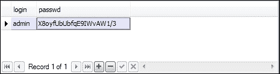

### 小贴士

如果您不使用 Java 8，可以使用本节中所示的`org.jboss.security.Base64Utils`库代替`Java 8`。

## 使用 LDAP 登录模块

**轻量级目录访问协议**（**LDAP**）是提供目录服务给应用程序的**事实标准**。LDAP 服务器可以为以下提供集中目录信息：

+   用户凭据（登录名和密码）

+   用户目录信息（如姓名和电子邮件地址）

+   网络目录

LDAP 的工作原理围绕一个称为**条目**的数据结构。一个条目有一组称为**属性**的命名组成部分，这些属性包含该条目的数据。这些属性就像数据库记录中的字段一样。

条目的内容和结构由其对象类定义。对象类（连同服务器和用户设置）指定在该特定条目中必须存在哪些属性，以及哪些属性可能存在。

存储在 LDAP 目录中的所有条目都有一个唯一的**区分名称**或**DN**。每个 LDAP 条目的 DN 由两部分组成：**相对区分名称**（**RDN**）和记录在 LDAP 目录中的位置。

实际上，RDN 是 DN 中与目录树结构无关的部分，并且反过来由一个或多个属性名称/值对组成。让我们看看以下图中的组织示例：

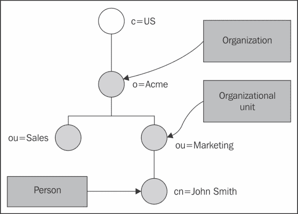

在前面的图中，`cn=John Smith`（其中`cn`代表“通用名称”）可能是一个 RDN。属性名称是`cn`，值是`John Smith`。

另一方面，`John Smith`的 DN 将是`cn=John Smith`，`ou=Marketing`，`o=Acme`，`c=US`（其中`ou`代表组织单元，`o`代表组织，`c`代表国家）。

### 将 LDAP 连接到 WildFly

通过几种 LDAP 登录模块可以实现 WildFly 和 LDAP 的连接。我们首先需要做的是运行一个 LDAP 服务器实例。今天，有大量的 LDAP 服务器可供选择（包括商业和开源），也许你已经在公司中配置了一个来运行。如果你没有，或者只是不想向其中添加示例数据，我们建议你查看 Apache Directory 项目（[`directory.apache.org/`](http://directory.apache.org/)）。它提供了一个出色的解决方案，用于开始使用 LDAP 并构建复杂的目录基础设施。

安装完成后，我们建议你使用 Apache Directory Studio（可在同一链接中找到），因为它允许你快速创建目录基础设施。从头开始创建目录的最简单方法是使用**LDAP 数据交换格式**（**LDIF**）文件。在此文件中，你可以指定所有将由 LDAP 引擎加载的条目。

### 注意

从 Apache Studio 导入 LDIF 文件的一个快速方法是，在文件菜单中选择**文件** | **导入** | **LDIF**到**LDAP**。

这里是一个我们将要使用的 LDIF 文件的基本示例：

```java
dn: dc=example,dc=com
objectclass: top
objectclass: dcObject
objectclass: organization
dc: example
o: MCC

dn: ou=People,dc=example,dc=com
objectclass: top
objectclass: organizationalUnit
ou: People

dn: uid=admin,ou=People,dc=example,dc=com
objectclass: top
objectclass: uidObject
objectclass: person
uid: admin
cn: Manager
sn: Manager
userPassword: secret

dn: ou=Roles,dc=example,dc=com
objectclass: top
objectclass: organizationalUnit
ou: Roles

dn: cn=Manager,ou=Roles,dc=example,dc=com
objectClass: top
objectClass: groupOfNames
cn: Manager
description: the JBossAS7 group
member: uid=admin,ou=People,dc=example,dc=com
```

一旦你将此信息导入 LDAP 服务器，你将得到一个如以下截图所示的小型目录：

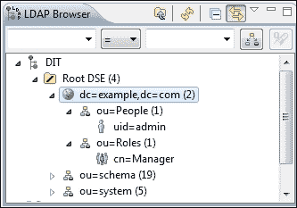

在此目录中，我们只注册了一个用户作为`admin`，属于`Manager`角色，就像我们在前面的章节中看到的其他登录模块一样。

现在，我们将配置 WildFly 上的 LDAP 连接。为了我们的目的，我们将使用`LdapExtended`登录模块实现，如下面的代码所示。此实现使用搜索来定位用户和关联的角色以进行认证绑定。`roles`查询将递归地跟随区分名（DN）以导航分层角色结构。请查看以下代码：

```java
<login-module code="LdapExtended" flag="required">

    <module-option name="java.naming.factory.initial"  value="com.sun.jndi.ldap.LdapCtxFactory"/>
    <module-option name="java.naming.provider.url" value="ldap://localhost:10389"/>
    <module-option name="java.naming.security.authentication" value="simple"/>
    <module-option name="bindDN" value="uid=admin,ou=system"/>
    <module-option name="bindCredential" value="secret"/>
    <module-option name="baseCtxDN" value="ou=People,dc=example,dc=com"/>
    <module-option name="baseFilter" value="(uid={0})"/>
    <module-option name="rolesCtxDN" value="ou=Roles,dc=example,dc=com"/>
    <module-option name="roleFilter" value="(member={1})"/>
    <module-option name="roleAttributeID" value="cn"/>
    <module-option name="searchScope" value="ONELEVEL_SCOPE"/>
    <module-option name="allowEmptyPasswords" value="true"/>
</login-module>
```

下面是`LdapExtended`模块属性的简要描述：

+   `bindDN`：这是用于对用户和角色查询绑定到 LDAP 服务器的 DN，在我们的案例中是"`uid=admin,ou=system`"。

+   `baseCtxDN`：这是从用户搜索开始上下文的固定 DN。在我们的例子中，它是"`ou=People,dc=example,dc=com`"。

+   `baseFilter`：这是一个用于定位要认证的用户上下文的搜索过滤器。从登录模块获得的输入`username`或`userDN`将在过滤器中任何出现`{0}`表达式的位置被替换。

+   `rolesCtxDN`：这是搜索用户角色的上下文的固定 DN。请考虑这并不是实际角色位置的 DN；相反，这是包含用户角色的对象的位置的 DN。

+   `roleFilter`：这是一个用于定位与已认证用户关联的角色的搜索过滤器。一个匹配输入用户名的示例搜索过滤器是`(member={0})`。另一个匹配已认证用户 DN 的替代方案是`(member={1})`。

+   `roleAttributeID`：这是与角色名称相对应的上下文角色属性的名称。

+   `searchScope`：此设置将搜索范围设置为以下字符串之一：

    +   `ONELEVEL_SCOPE`：此作用域在命名角色上下文直接下搜索用户和关联的角色。

    +   `SUBTREE_SCOPE`：如果角色的上下文是`DirContext`，则此作用域在命名对象及其子树中搜索，包括命名对象本身。如果角色的上下文不是`DirContext`，则此作用域仅搜索对象。

    +   `OBJECT_SCOPE`：此作用域仅在命名角色上下文中搜索。

+   `allowEmptyPasswords`：这是一个标志，表示是否应将`empty(length==0)`密码传递给 LDAP 服务器。

## 保护 Web 应用程序

好的！所以，我们提到了一些常用的登录模块。这些登录模块可以被任何 Java EE 应用程序使用，所以现在是时候展示一个具体的例子了。在本节中，我们将向您展示如何将登录模块应用于 Web 应用程序，以展示基本 Web 认证的实现。

### 注意

基本访问认证是在通过浏览器发出请求时提供用户名和密码的最简单方式。

它通过发送包含用户凭据的编码字符串来实现。此 Base64 编码的字符串由接收方传输和解码，结果是一个冒号分隔的用户名和密码字符串。

我们需要做的第一件事是启用 web 认证。这需要你在 web 应用程序配置文件（`web.xml`）中定义`security-constraints`。请看以下代码：

```java
<web-app>
...
  <security-constraint>
    <web-resource-collection>
      <web-resource-name>HtmlAuth</web-resource-name>
      <description>application security constraints
      </description>
 <url-pattern>/*</url-pattern>
      <http-method>GET</http-method>
      <http-method>POST</http-method>
      <http-method>PUT</http-method>
      <http-method>DELETE</http-method>
    </web-resource-collection>
 <auth-constraint>
 <role-name>Manager</role-name>
 </auth-constraint>
  </security-constraint>
  <login-config>
     <auth-method>BASIC</auth-method>
     <realm-name>Sample Realm</realm-name>
  </login-config>

 <security-role>
 <role-name>Manager</role-name>
 </security-role>
</web-app>
```

之前的配置将为所有 URL 添加一个安全约束，这显然包括你所有的 JSP servlets。访问将仅限于具有`Manager`角色的已认证用户。

### 注意

考虑到我们正在使用`Database`登录模块，`Manager`角色将授予使用管理员凭据认证的用户。

下一个配置调整需要在 JBoss web 部署的描述符`WEB-INF/jboss-web.xml`中执行。在那里，你需要声明用于认证用户的 security domain。请看以下代码：

```java
<jboss-web>
 <security-domain>java:/jboss/env/mysqldomain</security-domain>
</jboss-web>
```

注意`security-domain`元素。此元素的值必须与你在安全域的`name`属性中输入的值完全相同。

### 提示

有关 WildFly 中哪些 JNDI 名称是有效的概述，请参阅以下链接：[`docs.jboss.org/author/display/WFLY8/Developer+Guide#DeveloperGuide-ReviewtheJNDINamespaceRules`](https://docs.jboss.org/author/display/WFLY8/Developer+Guide#DeveloperGuide-ReviewtheJNDINamespaceRules)。

以下图概述了应用于 `Database` 登录模块的整个配置序列。请查看以下图：

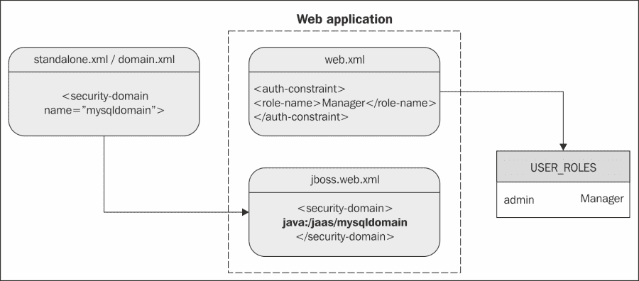

部署您的应用程序后，此操作的输出应该是一个弹出窗口，请求用户身份验证，如下面的屏幕截图所示：

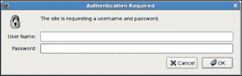

使用 `admin`/`admin` 登录将授予 `Manager` 角色访问应用程序的权限。

## 保护 EJB

通过 Web 登录表单保护应用程序是企业应用程序中最常见的选项。尽管如此，HTTP 协议并不是访问应用程序的唯一选择。例如，EJB 可以通过 RMI-IIOP 协议由远程客户端访问。在这种情况下，您应该进一步细化您的安全策略，通过限制对 EJB 组件的访问，这些组件通常涉及您应用程序的业务层。

### 小贴士

**EJB 层级的安全是如何实现的？**

在调用任何 EJB 方法之前必须执行身份验证，并且应该在每次 EJB 方法调用开始时执行授权。

基本的安全检查可以使用以下五个注解实现：

+   `@org.jboss.ejb3.annotation.SecurityDomain`：此注解指定安全域，它与一个特定的类相关联。

+   `@javax.annotation.security.RolesAllowed`：此注解指定了允许访问 EJB 中方法（s）的角色的列表。

+   `@javax.annotation.security.RunAs`：此注解在调用方法期间动态地将一个角色分配给 EJB。如果需要临时允许访问某个方法，可以使用它。

+   `@javax.annotation.security.PermitAll`：此注解允许所有角色访问特定的 bean 方法。此注解的目的是在您不确定哪个角色将访问 EJB 的情况下扩大某些方法的安全访问权限。（想象一下，某些模块是由第三方开发的，并且它们使用一些标识不清的角色访问您的 EJB）。

+   `@javax.annotation.security.DenyAll`：此注解拒绝所有角色的访问。它的目的与 `PermitAll` 类似。

在以下示例中，我们仅将访问名为 `SecureEJB` 的 EJB 的权限限制在授权的 Manager 角色中：

```java
import org.jboss.ejb3.annotation.SecurityDomain;
import javax.annotation.security.RolesAllowed;

@Stateless
@SecurityDomain("mysqldomain")
@RolesAllowed( { "Manager" })
public  class SecureEJB {
  ...
}
```

### 小贴士

小心！服务器类路径中存在多个 `SecurityDomain` 注解。如图所示，您必须包含 `org.jboss.ejb3.annotation.SecurityDomain`。另一方面，`@RolesAllowed` 注解需要导入 `javax.annotation.security.RolesAllowed`。

注解也可以应用于方法级别。例如，如果我们需要一个名为`SuperUser`的特殊角色来插入新用户，那么我们可以像以下那样标记方法：

```java
@RolesAllowed({"SuperUser"})
public void createUser(String country,String name) {
    User customer = new User ();  
    customer.setCountry(country);
    customer.setName(name);
    em.persist(customer);
}
```

## 保护 Web 服务

Web 服务授权可以通过两种方式执行，具体取决于我们是否处理基于 POJO 的 Web 服务或基于 EJB 的 Web 服务。

对 POJO Web 服务的安全更改与我们为 servlets 或 JSP 引入的更改相同，包括在`web.xml`中定义`security-constraints`以及在`jboss-web.xml`中定义登录模块。

如果您使用 Web 客户端访问您的 Web 服务，那么您只需要进行认证。如果您使用的是独立客户端，您将需要指定给 JAX-WS 工厂的凭据，如下面的代码片段所示：

```java
  JaxWsProxyFactoryBean factory = new JaxWsProxyFactoryBean();

  factory.getInInterceptors().add(new LoggingInInterceptor());
  factory.getOutInterceptors().add(new LoggingOutInterceptor());

  factory.setServiceClass(POJOWebService.class);
  factory.setAddress("http://localhost:8080/pojoService");
 factory.setUsername("admin");
 factory.setPassword("admin");
  POJOWebService client = (POJOWebService) factory.create();

  client.doSomething();
```

那么，基于 EJB 的 Web 服务怎么办？配置略有不同。由于安全域没有在 Web 描述符中指定，我们必须通过注解提供它：

```java
@Stateless
@WebService(targetNamespace = "http://www.packtpub.com/", 
    serviceName = "SecureEJBService")
@WebContext(authMethod = "BASIC",
 secureWSDLAccess = false)
@SecurityDomain(value = "mysqldomain")
public  class SecureEJB {
  ...
}
```

如您所见，`@WebContext`注解反映了与基于 POJO 的 Web 服务相同的配置选项，包括 BASIC 身份验证和无限制的 WSDL 访问。

现在您应该对`@SecurityDomain`注解很熟悉了，因为我们是在向您展示如何保护 EJB 时引入它的。正如您在先前的 Web 服务示例中所见，它与`jboss-web.xml`文件中的信息相当（它引用了`mysqldomain`安全域）。

### 提示

如果您更喜欢使用 XML 部署描述符，先前的安全配置也可以通过`META-INF/ejb-jar.xml`和`META-INF/jboss-ejb3.xml`文件指定。

# 保护管理接口

对于系统管理员来说，最重要的任务之一是限制对服务器管理接口的访问。如果没有安全策略，每个用户都可以访问应用服务器并修改其属性。

用于在管理接口上启用安全性的属性是一个需要在`security-realms`部分中定义的安全领域。请查看以下代码：

```java
<management>
    <security-realms>
 <security-realm name="ManagementRealm">
            <authentication>
                <local default-user="$local" skip-group-loading="true"/>
                <properties path="mgmt-users.properties" relative-to="jboss.server.config.dir"/>
            </authentication>
            <authorization map-groups-to-roles="false">
                <properties path="mgmt-groups.properties" relative-to="jboss.server.config.dir"/>
            </authorization>
        </security-realm>
    </security-realms>
    ...
    <management-interfaces>
 <http-interface security-realm="ManagementRealm" http-upgrade-enabled="true">
            <socket-binding http="management-http"/>
        </http-interface>
    </management-interfaces>
</management>
```

在默认配置下，用户属性存储在`mgmt-users.properties`文件中，组属性存储在`mgmt-groups.properties`文件中。这两个文件都可以在您的服务器`configuration`目录中找到。

### 注意

用户和组可以随时添加到这些属性文件中。服务器启动后的任何更新都会自动检测。

默认情况下，此管理领域期望条目以以下格式：

```java
username=HEX( MD5( username ':' realm ':' password))
```

这意味着每个用户都与一个由用户名、领域名称和密码组成的十六进制编码哈希相关联。

要添加新用户，您可以使用包含在您的 WildFly 安装的`bin`文件夹中的实用脚本，脚本名为`add-user.sh`（Linux）或`add-user.bat`（Windows）。从下面的屏幕截图可以看出，`add-user`脚本需要以下信息：

+   **领域**：这是用于保护管理界面的领域名称。如果您只按*Enter*键，用户将被添加到默认领域`ManagementRealm`。

+   **用户名**：这是我们打算添加的用户名（它必须是字母数字的）。

+   **密码**：这是密码字段，它需要与用户名不同。

+   **组**：这是您希望用户所属的组名称。如果您留空，您将不会被添加到任何组。

+   **AS 进程**：这决定了您是否希望用户用于连接到另一个 WildFly 实例。

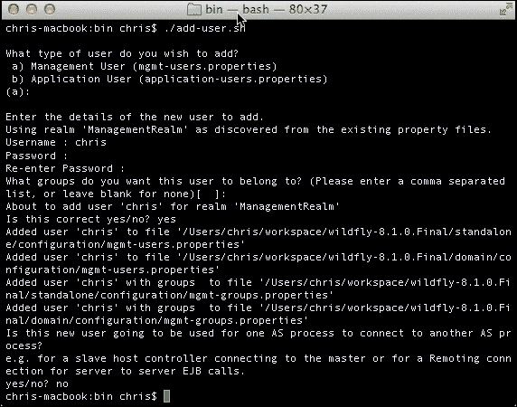

这里，我们已将用户`chris`添加到默认领域。这导致以下属性被添加到您的独立和域配置的`mgmt-users.properties`中：

```java
chris=554dadf6fa222d6ea11a470f3dea7a94
```

您现在可以使用此用户连接到远程 WildFly 管理界面，如下面的截图所示：

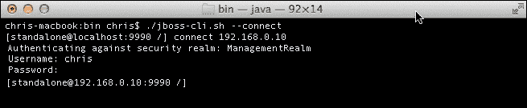

添加用户的一个更简单的方法是使用非交互式 shell。这种方法通过将用户名、密码以及可选的领域名称传递给`add-user`脚本来实现：

```java
add-user.sh myuser mypassword realm1
```

## 基于角色的访问控制

**基于角色的访问控制**（**RBAC**）是 WildFly 8 中引入的新功能。它允许系统管理员为管理控制台创建用户，但对其系统的一部分有权限限制。在 JBoss AS 7 中，管理控制台用户可以访问一切，这在 WildFly 8 中相当于超级用户角色。

RBAC 默认未启用。要启用它，请运行以下命令：

```java
jboss-cli.sh --connect --command="/core-service=management/access=authorization:write-attribute(name=provider,value=rbac)"

```

然后，重新加载服务器配置：

```java
jboss-cli.sh --connect --command=":reload"

```

如果在启用 RBAC 之前您已有现有用户，您需要手动为每个用户配置，通过将用户映射到角色。如果我们有一个名为 Yevai 的用户，并希望分配给她超级用户角色，我们会执行以下操作：

```java
jboss-cli.sh --connect --command="/core-service=management/access=authorization/role-mapping=SuperUser/include=user-yevai:add(name=yevai,type=USER)"

```

WildFly 8 中有七个预定义的角色。以下表格概述了每个角色。它们按最限制性的角色在上，最不限制性的角色在下排序。

| 角色 | 权限 |
| --- | --- |
| 监视器 | 此用户可以读取配置和当前运行时状态 |
| 操作员 | 此用户具有先前角色的所有权限，可以修改运行时状态，例如重启或重新加载服务器，以及刷新数据库连接池 |
| 维护者 | 此用户具有所有先前角色的所有权限，可以修改持久状态，例如部署应用程序和设置新的数据源 |
| 部署者 | 此用户具有所有先前角色的所有权限，但只有对应用程序的权限。此用户不能更改服务器的配置 |
| 管理员 | 此用户具有所有先前角色的所有权限，可以查看和修改敏感数据，例如访问控制系统 |
| 审计员 | 此用户具有所有先前角色的权限，可以查看和修改资源以管理审计日志系统 |
| 超级用户 | 此用户拥有所有权限 |

## 配置组

WildFly 的新特性之一是能够将用户分配到组中。这意味着您可以将一组用户分配到组中，然后将组分配到角色中。要创建新用户并将他们分配到组中，您可以运行以下非交互式命令：

```java
user-add.sh -u tavonga -p mypassword -g MyGroup

```

用户可以通过具有管理员或超级用户角色的用户通过管理控制台进行管理。为此，请登录到管理控制台，并导航到**管理**选项卡。在这里，您可以向组添加用户，创建组，并最终查看每个角色的成员。请看以下截图：

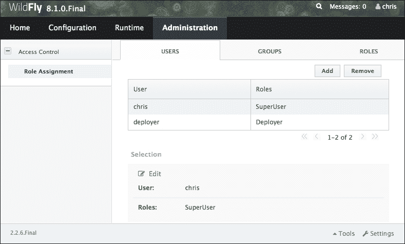

# 保护传输层

如果你只使用我们至今为止所涵盖的裸概念来创建一个关键任务应用程序，你不能保证能够免受所有安全威胁。例如，如果你需要设计一个支付网关，其中信用卡信息通过 EJB 或 servlet 进行传输，仅仅使用授权和认证堆栈是远远不够的。

为了防止信息泄露，你必须使用提供数据**加密**的协议。加密是将数据转换为人们或监听你网络的系统无法理解的形式。相反，**解密**是将加密数据转换回其原始形式的过程，以便它可以被理解。

用于保护通信的协议是 SSL 和 TLS，后者被认为是较旧 SSL 的替代品。

### 注意

这两种协议之间的差异很小。TLS 使用**更强的**加密算法，并且能够在不同的端口上工作。在接下来的章节中，我们将对这两种协议都使用 SSL。

加密信息有两种基本技术：**对称加密**（也称为**密钥加密**）和**非对称加密**（也称为**公钥加密**）。

对称加密是最古老且最知名的技术。它基于一个密钥，该密钥应用于消息的文本以以特定方式更改内容。只要发送者和接收者都知道密钥，他们就可以加密和解密使用此密钥的所有消息。这些加密算法通常运行得很快，非常适合一次性加密大量消息。

对称算法的一个显著问题是组织需要向用户分发密钥。这通常会导致在管理方面产生更多的开销，同时密钥仍然容易受到未经授权的披露和潜在滥用的威胁。

因此，一个关键任务的企业系统通常依赖于非对称加密算法。这些算法通常更容易部署、管理和维护，从而使系统最终更加安全。

非对称加密，也称为公钥加密，基于这样一个概念：用于加密消息的密钥不是用于解密消息的密钥。每个用户都持有两把密钥：公钥，它被分发给其他各方，私钥，它被保密保存。每条消息都使用接收者的公钥进行加密，并且只能用他们的私钥解密（由接收者解密）。看看下面的图示：

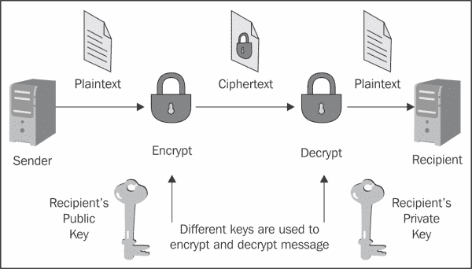

使用非对称加密，你可以确保你的消息不会被第三方泄露。然而，你**仍然**有一个漏洞。

假设你想与一个商业伙伴交换信息，因此你通过电话或电子邮件请求他们的公钥。一个欺诈用户拦截你的电子邮件或简单地监听你的对话，并迅速发送一个带有他们公钥的伪造电子邮件给你。现在，即使你的数据传输是安全的，它也会被错误地发送给错误的人！这种监听被称为中间人攻击。

为了解决这个问题，我们需要一个文件来验证公钥属于个人。这个文件被称为**数字证书**或公钥证书。数字证书由一个格式化的数据块组成，包含证书持有者的名称（可能是用户名或系统名）、持有者的公钥以及**认证机构**（**CA**）的数字签名以进行认证。认证机构证明发送者的名称与文件中公钥关联。

这里展示了一个数字证书的原型：

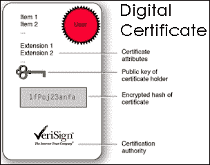

公钥证书通常用于与网站进行安全交互。默认情况下，网络浏览器附带一组预定义的 CA。它们用于验证当你输入一个安全网站时，浏览器收到的公钥证书确实是由网站所有者签发的。简而言之，如果你通过浏览器连接到`https://www.abc.com`并且你的浏览器没有给出证书警告，你可以确信你可以安全地与网站负责实体进行交互。

### 注意

**简单身份验证和客户端身份验证**

在前面的例子中，我们描述了一个简单的服务器身份验证。在这种情况下，唯一需要证明其身份的方是服务器。

然而，SSL 也能够在网络中的 SSL 握手期间执行**双向****认证**（也称为客户端或双向认证），如果服务器在 SSL 握手期间请求客户端证书的话。

客户端认证需要一个来自 CA 的 X.509 格式的客户端证书。X.509 格式是 SSL 证书的行业标准格式。在下一节中，我们将探讨可用的生成数字证书的工具，以及如何让您的证书由 CA 签名。

## 启用安全套接字层

WildFly 使用**Java 安全套接字扩展**（**JSSE**），这是 Java 标准版中捆绑的，以利用 SSL/TLS 通信。

企业应用程序可以安全地使用两种协议：HTTP 和 RMI。HTTP 通信由`standalone.xml`/`domain.xml`文件内的 Undertow 子系统处理。对于您的应用程序来说，确保 RMI 传输的安全性并不总是强制性的要求，因为在大多数生产环境中，WildFly 位于防火墙后面。

如以下图所示，您的 EJBs 不是直接暴露在不信任的网络中，通常是通过一个 Web 服务器连接的。

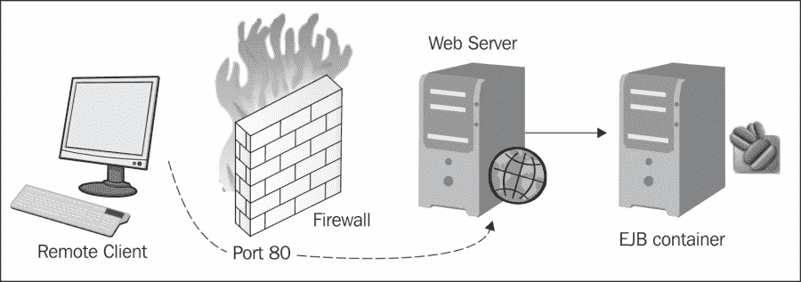

为了配置 WildFly 使用 SSL，我们需要一个工具，该工具以 X.509 证书的形式生成公钥/私钥对，用于 SSL 服务器套接字。这将在下一节中介绍。

## 证书管理工具

可以用来设置数字证书的一个工具是`keytool`，这是一个与 Java SE 一起提供的密钥和证书管理实用程序。它使用户能够管理自己的公钥/私钥对及其相关的证书，用于自我认证（用户向其他用户或服务进行身份验证）或使用数字签名进行数据完整性和认证服务。它还允许用户缓存其通信对等方的公钥（以证书的形式）。

`keytool`证书将密钥和证书存储在一个称为`keystore`的文件中，这是一个用于识别客户端或服务器的证书存储库。通常，`keystore`包含单个客户端或服务器的身份，并受密码保护。让我们看看`keystore`生成的示例：

```java
keytool -genkeypair -keystore wildfly.keystore -storepass mypassword -keypass mypassword -keyalg RSA -validity 180 -alias wildfly -dname "cn=packtpub,o=PackPub,c=GB"
```

此命令在当前工作目录中创建名为`wildfly.keystore`的`keystore`，并为其分配密码`mypassword`。它为具有“区分名称”中通用名`packtpub`、组织`PacktPub`和两个字母国家代码`GB`的实体生成一个公钥/私钥对。

这将生成一个自签名证书（使用 RSA 签名算法），其中包含公钥和区分名称信息。此证书将有效期为 180 天，并与`keystore`条目中引用的别名`wildflybook`关联的私钥相关联。

### 注意

自签名证书是一种未经 CA 验证的证书，因此会使您容易受到经典的中间人攻击。自签名证书仅适用于内部使用或测试，直到官方证书到达。

## 使用自签名证书确保 HTTP 通信

现在让我们看看如何使用这个`keystore`文件来确保你的 WildFly Web 通道的安全。打开服务器配置文件（`standalone.xml/domain.xml`），导航到 Undertow 子系统。

首先，我们需要在服务器配置中添加一个`https-listener`元素，如下面的代码片段中加粗所示：

```java
<subsystem >
    <buffer-cache name="default"/>
    <server name="default-server">
        <https-listener name="https" socket-binding="https" security-realm="CertificateRealm"/>
        <http-listener name="default" socket-binding="http"/>
        <host name="default-host" alias="localhost">
            <location name="/" handler="welcome-content"/>
            <filter-ref name="server-header"/>
            <filter-ref name="x-powered-by-header"/>
        </host>
    </server>
</subsystem>
```

现在，在`management`元素内创建一个新的安全域。以下代码中加粗的属性是必需的。其中包括密钥库的路径及其密码。`keystore`元素还接受`alias`、`relative-to`和`key-password`属性，这些都是可选的：

```java
<management>
    <security-realms>
        <security-realm name="CertificateRealm">
            <server-identities>
                <ssl>
                   <keystore path="wildfly.keystore" relative-to="jboss.server.config.dir" keystore-password="mypassword"/>  
                </ssl>
            <server-identities>
        </security-realm>
    </security-realms>
</management>
```

最后，你需要将`wildfly.keystore`文件复制到你的`JBOSS_HOME/standalone/configuration`文件夹。

重新启动 WildFly 以加载这些更改。在控制台日志的底部，在服务器启动期间，你应该看到以下输出（**Undertow HTTPS 监听器 https 正在监听/127.0.0.1:8443**）。

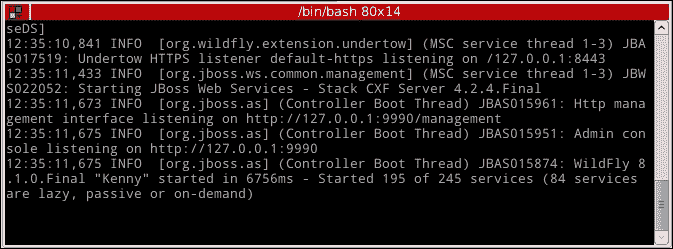

例如，如果你通过 SSL 配置的 WildFly 服务器上的 HTTPS 访问 Web 应用程序，比如部署`chapter4`并通过`https://localhost:8443/chapter4`访问它，你会看到以下屏幕（显示的屏幕将取决于你的浏览器）：

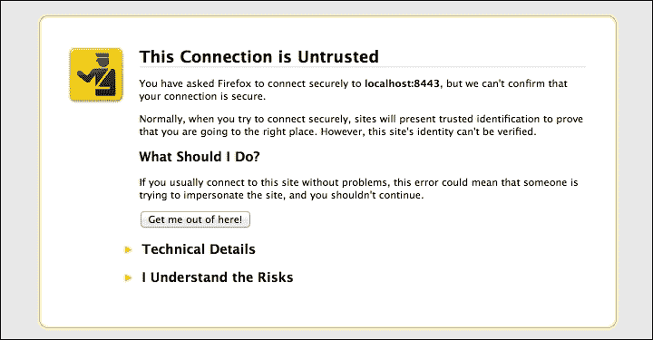

如果你对证书的工作方式不熟悉，一旦浏览器与 Web 服务器建立了安全连接，Web 服务器就会向浏览器发送一个证书。因为我们刚刚安装的证书**没有被**任何认可的 CA 签名，浏览器安全沙盒会警告用户潜在的安全威胁。

由于这是一个内部测试，我们可以通过选择**我了解风险** | **添加异常** | **确认安全异常**来安全地继续。这就是激活自签名证书的 SSL 所需做的全部。

## 使用 CA 签名的证书确保 HTTP 通信

为了获得浏览器能识别的证书，你需要向 CA 发出**证书签名请求**（**CSR**）。CA 随后将返回一个可以在你的服务器上安装的已签名证书。大多数这些服务都不是免费的。费用取决于你请求的证书数量、加密强度和其他因素。StartSSL 为公共域名服务器提供免费、低保证的证书。

因此，要生成 CSR，你需要使用你之前创建的`keystore`和`keyentry`。看看以下代码：

```java
keytool -certreq -keystore wildfly.keystore -alias wildfly -storepass mypassword -keypass mypassword  -keyalg RSA  -file certreq.csr
```

这将创建一个名为`certreq.csr`的新证书请求，格式如下所示：

```java
-----BEGIN NEW CERTIFICATE REQUEST-----
  ...
-----END NEW CERTIFICATE REQUEST-----
```

假设你选择了**Verisign** ([`www.verisign.com`](http://www.verisign.com)) 作为 CA，以下证书需要发送给 CA：

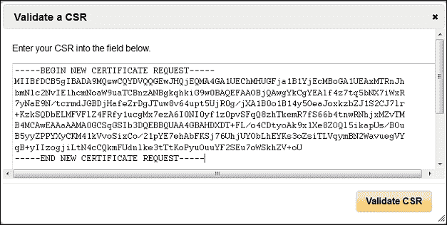

在提交你的 CSR 后，CA 将返回一个需要导入到你的密钥链中的已签名证书。假设你将你的 CA 证书保存在一个名为`signed_ca.txt`的文件中。请看以下命令：

```java
keytool -import -keystore wildfly.keystore -alias testkey1 -storepass mypassword -keypass mypassword -file signed_ca.txt
```

在这里，`-import`选项用于将证书或证书链添加到由`-keystore`参数指定并由`-alias`参数标识的受信任证书列表中。参数`-storepass`指定用于保护`keystore`的密码。如果未提供`-keypass`选项，并且私钥密码与`keystore`密码不同，系统将提示输入。

现在，你的网络浏览器将识别你的新证书是由 CA 签发的，并且将不再抱怨无法验证证书。

# 摘要

我们在本章开始时讨论了安全的基本概念以及认证和授权之间的区别。

认证用于验证用户的身份，而授权用于检查用户是否有权访问特定资源。

WildFly 使用 PicketBox 框架。PicketBox 位于 Java 身份验证和授权服务（JAAS）的顶部，并保护应用程序中运行的所有 Java EE 技术。安全子系统的核心部分包含在`security-domain`元素中，它执行所有必要的授权和身份验证检查。

我们接着查看了一些用于检查用户凭证与不同数据存储库的登录模块。每个登录模块都可以以编程方式或声明方式由企业应用程序使用。虽然编程安全可以提供细粒度的安全模型，但你应考虑使用声明式安全，它允许业务层和安全策略之间的清晰分离。

在本章的后面部分，你看到了如何通过向它们添加安全域来保护管理接口，即新的命令行界面。

在本章的最后部分，我们探讨了如何使用安全套接字层（Secure Socket Layer）加密通信通道，以及如何使用由`keytool` Java 实用程序生成的证书。

在下一章中，我们将通过展示如何在 OpenShift 上配置和分发企业应用程序来结束对 WildFly 的讨论，OpenShift 是一个 JBoss 云解决方案。
