# 第十一章。WildFly、OpenShift 和云计算

由于云计算领域使用的术语可能引起混淆，本章的第一节将概述云计算的基本概念。然后我们将讨论 OpenShift 项目及其将为您组织带来的好处。

# 云计算简介

什么是云计算？我们无处不在都能听到这个术语，但它究竟是什么意思呢？我们都有意或无意地使用过云。如果你使用 Gmail、Hotmail 或任何其他流行的电子邮件服务，你就已经使用过云了。简单来说，云计算是通过互联网提供的一组池化计算资源和服务的集合。

客户端计算在计算机行业中不是一个新概念。那些在 IT 行业工作了一二十年的人会记得，第一种客户端-服务器应用程序是主机和终端应用程序。当时，存储和 CPU 非常昂贵，主机将这两种资源集中起来，为瘦客户端终端提供服务。

随着个人电脑革命的到来，它为普通企业桌面带来了大量存储和廉价的 CPU，文件服务器因此成为实现文档共享和归档的一种流行方式。正如其名，文件服务器为企业客户端提供了存储资源，而进行生产性工作所需的 CPU 周期则全部在 PC 客户端内部产生和消耗。

在 20 世纪 90 年代初，新兴的互联网终于连接了足够的计算机，学术机构开始认真思考如何将这些机器连接起来，以创建比任何单个机构都能负担得起的更大的共享存储和计算能力。这就是“网格”这一想法开始成形的时候。

## 云计算与网格计算

通常，由于一些相似之处，“网格”和“云”这两个术语似乎正在趋同；然而，它们之间的重要差异往往不被理解，这在市场上造成了混淆和混乱。网格计算需要多台计算机的资源来解决单个问题，同时进行。因此，它可能位于云中，也可能不在云中，这取决于你对其的使用类型。关于网格的一个担忧是，如果一个节点上的软件部分出现故障，其他节点上的软件部分也可能出现故障。如果该组件在另一个节点上有一个故障转移组件，这可以缓解问题，但如果组件依赖于其他软件来完成一个或多个网格计算任务，问题仍然可能发生。请看以下截图：

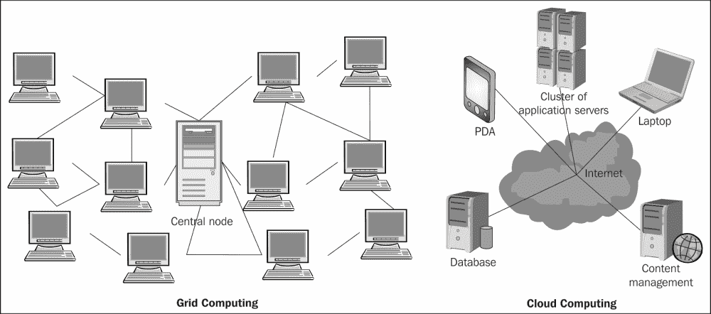

云计算是从网格计算演变而来的，允许按需提供资源。使用云计算，公司可以瞬间扩展到巨大的容量，而无需投资新的基础设施、培训新人员或购买新的软件。

### 注意事项

**网格和云 - 相似之处与不同之处**

网格和云之间的区别在于任务计算的方式。在计算网格中，一个大任务被分成许多小部分，并在多台机器上执行。这种特性是网格的基本特征。

云计算旨在让用户能够使用各种服务，而无需投资底层架构。云服务包括通过互联网提供软件、基础设施和存储，可以是单独的组件，也可以是一个完整的平台。

## 云计算的优势

我们刚刚介绍了云计算的基础知识，现在我们将概述如果您迁移到使用云服务可能会获得的一些好处：

+   **按需服务提供**：使用自助服务提供，客户可以快速轻松地访问云服务，无需麻烦。客户只需向服务提供商请求一定数量的计算、存储、软件、流程或其他资源。

+   **弹性**：这意味着客户不再需要预测流量，但可以积极且自发地推广他们的网站。为高峰流量进行工程已成为过去式。

+   **成本降低**：通过按需购买适量的 IT 资源，组织可以避免购买不必要的设备。对于中小企业来说，使用云计算也可能减少对内部 IT 管理员的需求。

+   **应用程序编程接口（API）**：API 使得组织的软件能够与云服务交互。这意味着系统管理员可以与其云模型交互。云计算系统通常使用基于 REST 的 API。

尽管云计算带来了许多优势，但也有一些不利因素或潜在风险需要考虑。最引人注目的是，在企业外部处理敏感数据会带来固有的风险。这是因为外包服务绕过了软件公司对其内部程序施加的物理、逻辑和人员控制。此外，当您使用云时，您可能不知道您的数据托管在哪里。实际上，您甚至可能不知道它将存储在哪个国家，这可能导致与当地司法管辖权的问题。

如 Gartner 集团（[`www.gartner.com`](http://www.gartner.com)）建议，您应始终要求提供商提供有关聘请和监督特权管理员的特定信息。此外，云提供商应提供证据，证明加密方案是由经验丰富的专家设计和测试的。了解提供商是否会代表其客户做出合同承诺，遵守当地隐私要求，也很重要。

## 云计算选项

云计算可以根据云托管的位置分为以下三种可能的形式，每种选项都带来不同级别的安全性和管理开销：

+   **公有** **云**：当服务和基础设施在异地提供并且通常在多个组织之间共享时使用此选项。公有云通常由外部服务提供商管理。

+   **私有** **云**：此选项提供针对单一组织的 IT 云资源，并按需提供。私有云基础设施在私有网络上维护。

+   **混合** **云**：这种选项是将私有云和公有云作为一个单一实体来管理，允许您将业务的部分方面保持在最有效率的环境中。

采用不同云计算选项中的任何一个的决定是专家之间讨论的问题，并且通常取决于几个关键因素。例如，就安全性而言，尽管公有云提供了一个安全的环境，但私有云提供了一种固有的安全级别，甚至满足最高标准。此外，您可以添加安全服务，例如**入侵检测系统**（**IDS**）和专用防火墙。对于拥有大量备用容量的良好运行的数据中心的大型组织来说，私有云可能是一个合适的选择。即使您必须添加新软件将数据中心转变为云，使用公有云的成本也更高。

另一方面，就可扩展性而言，私有云的一个负面因素是它们的性能仅限于您的云集群中的机器数量。如果您达到计算能力的极限，则需要添加另一个物理服务器。此外，公有云通常提供一种*按使用付费*的模式，您按小时支付使用的计算资源。如果您定期启动和关闭开发服务器，这种类型的公用事业定价是经济的。

因此，大多数公共云部署通常用于 Web 服务器或开发系统，在这些系统中，大型组织及其客户的安全和合规性要求不是问题。中型和大型企业通常更倾向于使用私有云，因为它们满足更严格的安全和合规性要求。私有云的缺点是，实施这些云的组织需要专用的高性能硬件。请查看以下图表：

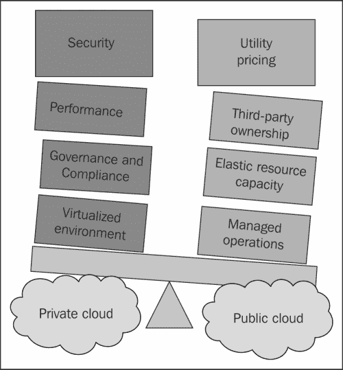

## 云服务类型

云计算服务可以广泛地分为以下三种类型。这些类型也被称为云服务模型或 SPI 服务模型。

+   **基础设施即服务 (IaaS)**: 此服务允许您按需启动计算机。对于每台服务器，您可以选择所需的内存大小、处理器数量、硬盘空间大小以及操作系统。它允许您在几分钟内完成所有这些操作，使硬件的获取更加容易、便宜和快速。此服务的知名提供商包括亚马逊 EC2、谷歌计算引擎、Rackspace 和 DigitalOcean。

    ### 注意

    DigitalOcean 在市场上相对较新。您可以在不到 60 秒内启动一个服务器实例！DigitalOcean 的主要卖点是其界面的简单性，这意味着您将不再需要翻阅一页又一页的文档。除此之外，它的价格也非常合理。如果您正在考虑 IaaS 提供商，DigitalOcean 绝对应该被列入您的清单。

+   **平台即服务 (PaaS)**: 此服务为开发者提供开发平台。最终用户编写自己的代码，PaaS 提供商将代码上传并在网络上展示。

    通过使用平台即服务 (PaaS)，您无需投资资金来为开发人员准备项目环境。PaaS 提供商将在网络上提供平台，在大多数情况下，您可以使用浏览器来使用该平台。无需下载任何软件。这种简单性和成本效益的结合赋予了小型和中型企业，甚至个人开发者，启动他们自己的云 SaaS 的能力。

    ### 注意

    PaaS 提供商的例子包括 Facebook 和 OpenShift。Facebook 是一个社交应用平台，第三方可以编写新的应用程序，这些应用程序可供最终用户使用。OpenShift 允许开发者像执行`git push`命令一样简单地将他们的 WildFly Web 或企业应用程序部署到云中。

+   **软件即服务（SaaS）**：这种服务基于从服务提供商租赁软件而不是购买软件的概念。软件通常通过浏览器访问。也称为*按需软件*，由于其高度灵活性、优质服务、增强的可扩展性和低维护成本，目前是云计算中最受欢迎的类型。SaaS 的例子包括 Zoho、Google Docs 和 SalesForce CRM 应用程序。请看以下截图：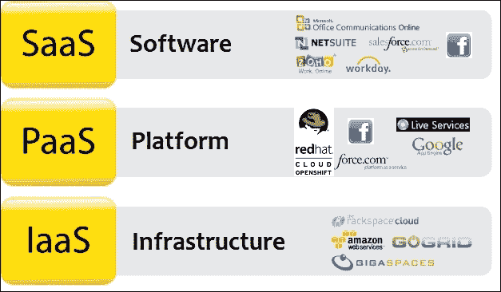

您可能会想知道是否有可能将某些提供商同时定义为*平台*和*软件*。答案是肯定的！例如，Facebook 可以被定义为平台（因为服务和应用程序可以通过 Facebook API 提供）和软件（因为它被数百万最终用户使用）。

Red Hat 最初开发 OpenShift 平台是为了在云上运行的 JBoss/WildFly 服务器上部署和管理 Java EE 应用程序。

OpenShift 提供三种软件版本，如下所示：

+   **在线版**：这个版本是一个免费、基于云的平台，用于在几分钟内将新的和现有的 Java EE、Ruby、PHP、Node.js、Perl 和 Python 应用程序部署到云上。

+   **起源版**：这个版本是软件的免费开源版本。它只提供社区支持。要运行此版本，您需要自己的基础设施。这个版本超出了本书的范围，因此不会涉及。

+   **企业版**：这个版本可以下载并在任何地方运行，包括 Amazon、Rackspace 或您自己的基础设施。它包含 Red Hat Enterprise Linux，稳定，并附带 Red Hat 的全面支持。

# 开始使用 OpenShift Online

OpenShift 允许您在云中创建、部署和管理应用程序。它提供磁盘空间、CPU 资源、内存和网络连接。您可以从包括 Tomcat、WildFly、Jenkins 在内的各种 Web 卡轮中进行选择。您还可以插入数据库卡轮，如 MySQL。根据您构建的应用程序类型，您还可以访问该类型的模板文件系统布局（例如，PHP、WSGI 和 Rack/Rails）。OpenShift 还为您生成有限的 DNS。

要开始使用 OpenShift Online，您需要做的第一件事是创建一个账户。访问 OpenShift 的主页[`www.openshift.com/`](https://www.openshift.com/)，并选择**注册**。完成在线注册并验证您的电子邮件地址。

在您能够创建应用程序之前，您需要创建一个**域名**。OpenShift 使用非严格域名（即没有前导点）。

登录您的 OpenShift 账户，并导航到**设置**标签页。输入您的域名并点击**保存**。请看以下截图：

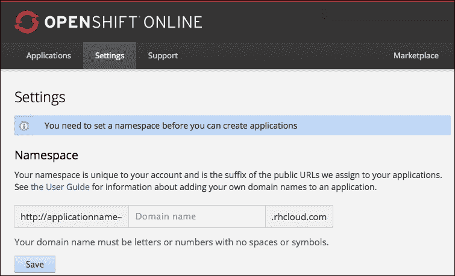

### 注意

每个账户只能支持单个域名。如果您希望使用多个域名，您需要创建一个具有不同用户名的单独账户。

## 安装 OpenShift 客户端工具

安装 OpenShift 客户端工具是一个简单的过程。以下指南显示了如何在 Ubuntu 14.04 上安装这些工具。如果您想在不同的 Linux 发行版或不同的操作系统上安装它们，请参阅 Red Hat 文档[`access.redhat.com/documentation/en-US/OpenShift_Online/2.0/html/Client_Tools_Installation_Guide/chap-OpenShift_Client_Tools.html`](https://access.redhat.com/documentation/en-US/OpenShift_Online/2.0/html/Client_Tools_Installation_Guide/chap-OpenShift_Client_Tools.html)。

1.  首先，确保您已执行以下命令以获取最新的软件包列表：

    ```java
    $ sudo apt-get update

    ```

1.  然后，您需要通过运行以下命令来安装所需的依赖项，`ruby`、`rubygems` 和 `git`：

    ```java
    $ sudo apt-get install ruby-full rubygems-integration git-core

    ```

1.  我们现在可以通过运行以下命令来安装客户端工具：

    ```java
    $ gem install rhc

    ```

    执行此命令后，您应该会看到以下类似的内容：

    ```java
    Fetching: net-ssh-2.9.1.gem (100%)
    ...
    Fetching: rhc-1.28.5.gem (100%)
    ==========================================================
    If this is your first time installing the RHC tools, please run 'rhc setup'
    ==========================================================
    Successfully installed net-ssh-2.9.1
    ...
    Successfully installed rhc-1.28.5
    10 gems installed
    Installing ri documentation for net-ssh-2.9.1...
    ...
    Installing RDoc documentation for rhc-1.28.5...

    ```

    ### 注意

    在使用客户端工具之前运行设置向导非常重要。未能这样做可能会在以后造成问题。

1.  要运行设置，请输入以下命令：

    ```java
    rhc setup

    ```

设置将需要您按照屏幕上出现的顺序输入以下查询的数据：

+   对于**输入服务器主机名**，只需按*Enter*键使用默认值，该默认值是用于 OpenShift Online 的服务器。

+   对于**输入用户名和密码**，请输入您的账户用户名和密码。

+   如果您的系统上没有 SSH 密钥，将会自动生成一个。您将被询问是否要将密钥上传到服务器。输入`yes`。

+   如果您之前没有创建域名，现在将会提示您添加一个域名。

## 从不同的计算机访问您的 OpenShift 账户

您的计算机与 OpenShift 之间的通信是通过 SSH 使用安全密钥进行的。为了从不同的机器使用您的域名，只需将 OpenShift 客户端工具下载并安装到您的另一台计算机上。当您运行工具设置时，您的计算机的密钥将被添加到服务器上的密钥中。

要撤销访问权限，您需要删除该计算机的密钥。您可以通过登录到 OpenShift，导航到**设置**，然后滚动到**公钥**处来完成此操作。现在，删除与您想要撤销访问权限的计算机相关的密钥。

# 创建我们的第一个 OpenShift 应用程序

在我们开发一个要在 OpenShift 上运行的应用程序之前，我们首先应该定义一些 OpenShift 术语：

+   **应用程序**：这显然是您将部署到 OpenShift 的应用程序。

+   **Gear**：这是包含您的服务器以及运行应用程序所需的各种资源（如 RAM、处理器和硬盘空间）的容器。

+   **卡式盒**：卡式盒是一个提供特定功能的插件。例如，您可以选择添加到您的齿轮中的 WildFly 卡式盒和数据库卡式盒。

## 安装您的第一个卡式盒

要查看所有可用的卡式盒，请运行以下命令：

```java
$ rhc cartridge list

```

创建应用程序的语法如下：

```java
$ rhc app create app_name cartridge_name

```

在撰写本文时，在卡式盒列表中尚无 WildFly 卡式盒可用。为此示例，我将使用 GitHub 上可用的卡式盒（[`github.com/openshift-cartridges/openshift-wildfly-cartridge`](https://github.com/openshift-cartridges/openshift-wildfly-cartridge)）。导航到您希望代码所在的位置的文件夹。如果您使用的是 Eclipse，您可能想将当前目录切换到您的项目工作区文件夹。使用前面的语法，但将卡式盒名称替换为卡式盒 URL，我们将创建应用程序，如下所示：

```java
$ rhc app create wildfly https://cartreflect-claytondev.rhcloud.com/reflect?github=openshift-cartridges/openshift-wildfly-cartridge#WildFly8

```

运行此命令后，控制台将打印出大量信息。我们将逐个处理这些输出。第一条信息是与卡式盒和齿轮相关的详细信息。我们可以看到卡式盒是从哪个 URL 克隆的，齿轮大小和域名：

```java
Application Options
-------------------
Domain:     chrisritchie
Cartridges: https://cartreflect-claytondev.rhcloud.com/reflect?github=openshift-cartridges/openshift-wildfly-cartridge#WildFly8
Gear Size:  default
Scaling:    no

```

下一个部分显示了应用程序正在创建，并且正在齿轮上部署一个工件：

```java
Creating application 'wildfly' ... Artifacts deployed: ./ROOT.war
done

```

接下来打印出管理控制台的相关详细信息，如下所示：

```java
 WildFly 8 administrator added.  Please make note of these credentials:
 Username: admin6vIBvE6
 Password: B_vh3CA5v4Dc
 run 'rhc port-forward wildfly to access the web admin area on port 9990.
Waiting for your DNS name to be available ... done

```

下面的部分显示了远程 Git 仓库正在克隆到您的本地硬盘。一旦您允许，齿轮的 SSH 密钥将被添加到您的`known_hosts`文件中：

```java
Cloning into 'wildfly'...
The authenticity of host 'wildfly-chrisritchie.rhcloud.com (50.16.172.242)' can't be established.
RSA key fingerprint is cf:ee:77:cb:0e:fc:02:d7:72:7e:ae:80:c0:90:88:a7.
Are you sure you want to continue connecting (yes/no)? yes
Warning: Permanently added 'wildfly-chrisritchie.rhcloud.com,50.16.172.242' (RSA) to the list of known hosts.
Your application 'wildfly' is now available.

```

最后，您的应用程序 URL、远程 Git 仓库和 SSH 位置都会打印出来，如下所示：

```java
 URL:        http://wildfly-chrisritchie.rhcloud.com/
 SSH to:     53e905324382ecc7c30001d0@wildfly-chrisritchie.rhcloud.com
 Git remote: ssh://53e905324382ecc7c30001d0@wildfly-chrisritchie.rhcloud.com/~/git/wildfly.git/

Run 'rhc show-app wildfly' for more details about your app.

```

现在，您可以验证服务器是否正在运行，并且可以通过将浏览器指向前面输出中指定的 URL 来访问已部署的应用程序。请查看以下屏幕截图：

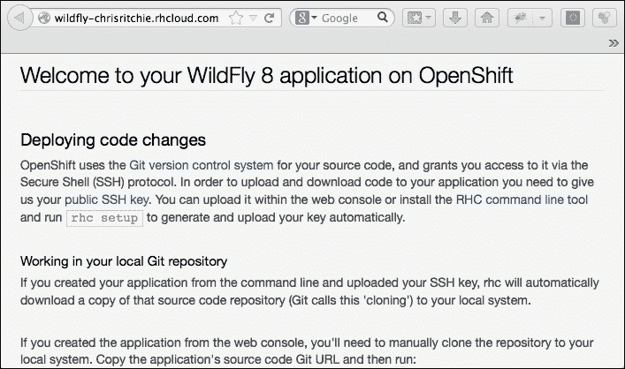

现在，让我们将注意力转向您计算机上的本地仓库。

### 提示

您可以通过选择**文件** | **导入** | **项目**从**GIT** | **现有本地仓库** | **添加**将仓库导入 Eclipse。然后，浏览到您的`git`仓库位置，将其作为新的 Maven 项目导入，以便 Eclipse 可以自动为您生成项目配置文件。

如果您查看以下屏幕截图所示的`git`仓库结构，您将看到`src`文件夹遵循典型的 Maven 项目结构，适用于 Web 应用程序：

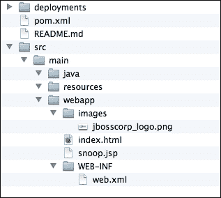

如果您通过命令行检查根文件夹，您也会注意到隐藏的文件夹。有两个重要的隐藏文件夹。`.git` 文件夹包含所有版本信息以及 Git 配置。`.openshift` 文件夹包含 OpenShift 的各种配置。请查看以下截图：

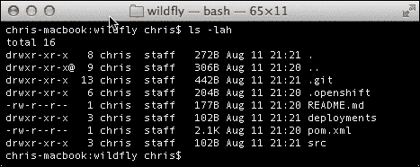

`deployments` 文件夹执行与 `JBOSS_HOME/standalone/deployments` 目录相同的任务。放置在此处的应用程序在将仓库推送到远程 Git 仓库时将自动部署。

## 理解工作流程

在我们开始编写实际应用程序的代码之前，我们需要了解工作流程以及代码是如何部署到服务器的。以下是基本步骤：

1.  修改本地 Git 仓库中的源代码。

1.  将任何部署，如 JDBC 连接器，添加到 `deployments` 文件夹。此步骤是可选的。

1.  将所有文件阶段到本地仓库，准备提交。

1.  将文件提交到本地仓库。

1.  将更改推送到远程仓库。这将触发您的设备上的部署。您不需要将应用程序 WAR 添加到 `deployments` 文件夹。

## 构建应用程序

因此，现在我们需要创建我们自己的应用程序。对于第一个示例，我们将部署一个简单的服务，该服务将文本区域内的文本下载为 PDF 文件。此应用程序由一个 servlet 组成，该 servlet 使用 **iText** 库（可在 [`itextpdf.com/download.php`](http://itextpdf.com/download.php) 获取）将请求转换为 PDF 响应。以下是 servlet：

```java
package com.packtpub.chapter11;

import java.io.IOException;

import javax.servlet.*;
import javax.servlet.annotation.WebServlet;
import javax.servlet.http.*;

import com.itextpdf.text.*;
import com.itextpdf.text.pdf.PdfWriter;

@WebServlet("/convert")
public class TextToPdf extends HttpServlet {

    public void init(ServletConfig config) throws ServletException{
        super.init(config);
    }

    public void doGet(HttpServletRequest request, HttpServletResponse response) throws ServletException, IOException{
        doPost(request, response);
    }

    public void doPost(HttpServletRequest request, HttpServletResponse response) throws ServletException, IOException {
        String text = request.getParameter("text");
        response.setContentType("application/pdf");
        Document document = new Document();
        try{
            PdfWriter.getInstance(document, response.getOutputStream());
            document.open();
            document.add(new Paragraph(text));
            document.close(); 
        }catch(DocumentException e){
            e.printStackTrace();
        }
    }
}

public void init(ServletConfig config) throws ServletException{
    super.init(config);
}

public void doGet(HttpServletRequest request, 
    HttpServletResponse response) throws ServletException, IOException{
    doPost(request, response);
}

public void doPost(HttpServletRequest request, HttpServletResponse response) throws ServletException, IOException{
    String text = request.getParameter("text");
    response.setContentType("application/pdf");  
    Document document = new Document();
    try{
        PdfWriter.getInstance(document, response.getOutputStream());  
    document.open();

    document.add(new Paragraph(text));

    document.close();
    }catch(DocumentException e){
        e.printStackTrace();
    }
}
```

我们还需要将 `itextpdf` 库添加到项目的 `pom.xml` 文件中，以便代码可以编译。请查看以下代码：

```java
<dependency>
    <groupId>com.itextpdf</groupId>
    <artifactId>itextpdf</artifactId>
    <version>5.5.2</version>
</dependency>
```

此外，我们还需要一个包含文本区域的 HTML/JSP 页面。此代码位于 `createpdf.html` 文件中：

```java
<form action="TextToPdf" method="post">
    <textarea cols="80" rows="5" name="text">
        This text will be converted to PDF.
    </textarea>
    <input type="submit" value="Convert to PDF">
</form>
```

我们现在已经完成了应用程序。我们需要使用以下 `git add` 命令将应用程序添加并提交到我们的本地 Git 仓库：

```java
$ git add *

```

然后，输入以下 `git commit` 命令：

```java
$ git commit -m "Initial commit of wildfly app"

```

最后，您需要将本地更改推送到位于您设备上的远程仓库，如下所示：

```java
$ git push

```

这将推送您的代码并触发各种 Git 钩，导致您的代码被编译、打包和部署，如以下输出所示。为了简洁，省略了构建输出。

```java
Counting objects: 19, done.
Compressing objects: 100% (8/8), done.
Writing objects: 100% (12/12), 1.58 KiB | 0 bytes/s, done.
Total 12 (delta 3), reused 0 (delta 0)
remote: Stopping wildfly cart
remote: Sending SIGTERM to wildfly:72039 ...
remote: Building git ref 'master', commit 7d63607
...
remote: [INFO] Scanning for projects...
remote: [INFO]                                                                         
remote: [INFO] ------------------------------------------------------------------------
remote: [INFO] Building wildfly 1.0
remote: [INFO] ------------------------------------------------------------------------
...
remote: [INFO] ------------------------------------------------------------------------
remote: [INFO] BUILD SUCCESS
remote: [INFO] ------------------------------------------------------------------------
...
remote: Preparing build for deployment
remote: Deployment id is aed5acfd
remote: Activating deployment
remote: Deploying WildFly
remote: Starting wildfly cart
...
remote: CLIENT_MESSAGE: Artifacts deployed: ./ROOT.war
remote: -------------------------
remote: Git Post-Receive Result: success
remote: Activation status: success
remote: Deployment completed with status: success
To ssh://53e905324382ecc7c30001d0@wildfly-chrisritchie.rhcloud.com/~/git/wildfly.git/
   76af36f..7d63607  master -> master
```

我们现在可以最终通过 [`wildfly-chrisritchie.rhcloud.com/createpdf.html`](http://wildfly-chrisritchie.rhcloud.com/createpdf.html) 访问我们的应用程序。请查看以下截图：

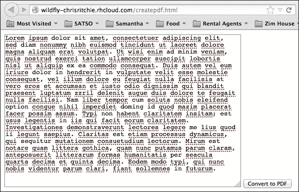

在输入一些文本并点击 **转换为 PDF** 按钮后，将下载包含文本的 PDF 文件，如下所示：

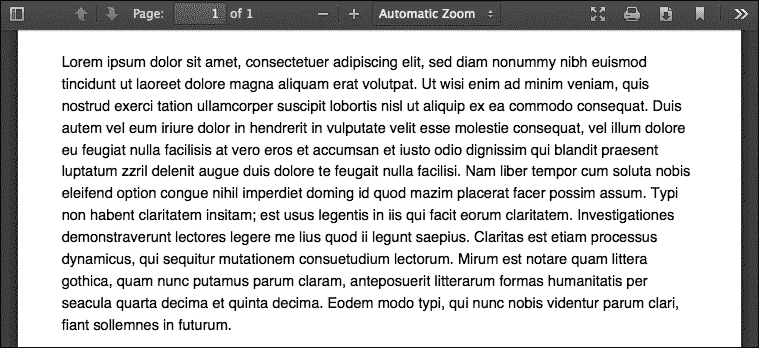

启动我们的应用程序会生成一个 PDF 文件作为结果——你的第一个云应用程序！现在我们已经将一个简单的应用程序部署到你的 OpenShift 组件中，在下一节中，我们将向你展示如何管理你的 OpenShift 应用程序并介绍一些高级功能。

# 查看 OpenShift 服务器日志文件

在某个时候，你可能需要查看服务器端的情况。也许你的应用程序部署失败，或者你在遇到错误后需要查看日志。你可以通过以下几种方式查看 OpenShift 服务器日志：

+   使用客户端工具跟踪日志文件

+   通过 SSH 进入组件

## 跟踪日志文件

跟踪应用程序服务器日志很简单。你只需要运行 `rhc tail` 命令。例如，要查看我们称为 `wildfly` 的示例应用程序的日志，你需要执行以下操作：

```java
$ rhc tail -a wildfly

```

这将打印出日志文件的最新条目，如下所示：

```java
2014-08-11 22:11:39,270 INFO  [org.wildfly.extension.undertow] (MSC service thread 1-4) JBAS017534: Registered web context: /
2014-08-11 22:11:41,411 INFO  [org.jboss.as.server] (ServerService Thread Pool -- 54) JBAS018559: Deployed "ROOT.war" (runtime-name : "ROOT.war")
2014-08-11 22:12:26,849 INFO  [org.jboss.as] (Controller Boot Thread) JBAS015961: Http management interface listening on http://127.6.97.1:9990/management
2014-08-11 22:12:26,862 INFO  [org.jboss.as] (Controller Boot Thread) JBAS015951: Admin console listening on http://127.6.97.1:9990
2014-08-11 22:12:26,864 INFO  [org.jboss.as] (Controller Boot Thread) JBAS015874: WildFly 8.1.0.Final "Kenny" started in 219903ms - Started 299 of 429 services (177 services are lazy, passive or on-demand)

```

要退出日志，只需按下 *Ctrl* + *C*。

## 通过 SSH 查看日志

使用 `rhc tail` 命令只在一部分时间内有用。很可能会想查看整个日志或搜索日志。为此，你需要 SSH 进入组件。我们使用 `-a` 开关指定应用程序名称，如下所示。

```java
$ rhc ssh -a wildfly

```

通过输入 `ls app_name`，你可以看到目录结构类似于 WildFly 安装。现在你可以使用 `less` 命令查看你的文件，这意味着你可以在文件中进行导航和搜索：

```java
$ less wildfly/standalone/logs/server.log
...

==> example/logs/server.log <==
14:41:18,706 INFO  [org.jboss.as.connector.subsystems.datasources] (Controller Boot Thread) Deploying JDBC-compliant driver class org.h2.Driver (version 1.2)
14:41:18,712 INFO  [org.jboss.as.connector.subsystems.datasources] (Controller Boot Thread) Deploying non-JDBC-compliant driver class com.mysql.jdbc.Driver (version 5.1)
14:41:18,732 INFO  [org.jboss.as.clustering.infinispan.subsystem] (Controller Boot Thread) Activating Infinispan subsystem.
14:41:18,860 INFO  [org.jboss.as.naming] (Controller Boot Thread) Activating Naming Subsystem
14:41:18,877 INFO  [org.jboss.as.naming] (MSC service thread 1-1) Starting Naming Service 

```

### 小贴士

使用 `less` 命令比使用 `tail` 命令提供了更多的控制。按下 *Shift* + *F* 开始跟踪文件，按下 *Ctrl* + *C* 停止跟踪文件。反斜杠允许你向后搜索，而问号允许你向前搜索文件。这使得查找异常和错误的发生变得容易。

# 管理 OpenShift 中的应用程序

起初，你可能觉得在远程服务器上管理应用程序可能很困难。一旦你学会了管理应用程序的命令，这种担忧应该会大大减少。

为了控制你的应用程序，你可以使用 `rhc app` 命令，它接受要执行的操作和 `-a` 命令，该命令指定应用程序名称。例如：

```java
$rhc app restart -a app_name

```

以下表格显示了可用于管理应用程序的命令列表。你可以通过命令行使用 `--help` 标志查看可用选项：

| 选项 | 描述 |
| --- | --- |
| `start` | 启动应用程序 |
| `stop` | 停止当前运行的应用程序 |
| `force-stop` | 杀死应用程序进程 |
| `restart` | 重新启动应用程序 |
| `reload` | 重新加载应用程序 |
| `delete` | 删除应用程序 |
| `configure` | 配置应用程序属性 |
| `create` | 创建应用程序 |
| `deploy` | 部署应用程序 |
| `scale-up` | 扩展应用程序组件 |
| `scale-down` | 缩小应用程序组件 |
| `show` | 显示应用程序信息 |
| `tidy` | 删除应用程序的日志文件和临时文件 |

如果您想删除我们之前创建的应用程序，您将使用以下命令：

```java
$ rhc app delete -a wildfly

This is a non-reversible action! Your application code and data will be permanently deleted if you continue!

Are you sure you want to delete the application 'atestapp'? (yes|no): yes

Deleting application 'wildfly' ... deleted

```

# 配置您的应用程序

当您创建一个应用程序时，您将有一个本地副本的仓库，其中包含您的应用程序代码和 WildFly 服务器的 `deployments` 文件夹。除此之外，在您的 Git 仓库中还有几个隐藏的文件夹。第一个是 `.git` 文件夹，其中包含所有与 Git 相关的配置。第二个文件夹是 `.openshift`。以下是 `.openshift` 文件夹的内容：

```java
chris-macbook:.openshift chris$ ls -lah
drwxr-xr-x   3 chris  staff   102B Aug 11 21:20 action_hooks
drwxr-xr-x   4 chris  staff   136B Aug 11 21:20 config
drwxr-xr-x   8 chris  staff   272B Aug 11 21:20 cron
drwxr-xr-x   3 chris  staff   102B Aug 11 21:20 markers

```

`action_hooks` 文件夹是开发者可以放置将在 OpenShift 构建生命周期中执行的动作钩子脚本的地方。

### 注意

您可以创建一个构建脚本以执行应用程序初始化，例如创建表或设置变量。有关支持的动作钩子的详细信息，请参阅[`openshift.github.io/documentation/oo_user_guide.html#build-action-hooks`](http://openshift.github.io/documentation/oo_user_guide.html#build-action-hooks)中的文档。

`cron` 文件夹允许开发者向 gear 添加 cron 作业。添加的脚本将根据它们是否放在 `minutely`、`hourly`、`daily`、`weekly` 或 `monthly` 文件夹中来安排。

`markers` 文件夹可以用来设置各种设置。例如，`skip_maven_build` 标记文件将指示 Maven 编译器跳过构建过程。最后但同样重要的是，`config` 文件夹具有以下结构：

```java
chris-macbook:.openshift chris$ ls -lah config/
drwxr-xr-x  3 chris  staff   102B Aug 11 21:20 modules
-rw-r--r--  1 chris  staff    29K Aug 11 21:20 standalone.xml

```

如您所预期，`standalone.xml` 文件是 WildFly 应用程序的配置文件。`modules` 文件夹是您可以添加自己的模块的地方，就像在 WildFly 的本地安装中一样。

我们只是触及了 OpenShift 可以做什么的基本知识。要深入了解，请参阅[`openshift.github.io/documentation/oo_user_guide.html`](http://openshift.github.io/documentation/oo_user_guide.html)中的 OpenShift 用户指南。

## 添加数据库卡式

每个企业应用程序都需要某种类型的存储来存储其数据。OpenShift 允许您在创建应用程序后添加数据库卡式。要查看可能的卡式列表，您可以发出以下命令：

```java
$ rhc cartridge list

```

在输出的列表中，您将看到各种数据库供应商的卡式选项。在这个例子中，我们将向我们的应用程序添加 MySQL 数据库卡式。为此，运行以下命令：

```java
$ rhc cartridge add mysql-5.5

```

### 注意

如果您将应用程序配置为可扩展的，数据库卡式将被安装到一个新的 gear 中。如果您的应用程序未配置为可扩展的，它将被添加到与您的应用程序相同的 gear 中。这是为了确保在您扩展或缩小 gears 时，您的数据库不会受到影响。

输出将打印与我们新数据库相关的信息，例如根密码、连接 URL 等：

```java
chris-macbook:wildfly chris$ rhc cartridge add mysql-5.5

Adding mysql-5.5 to application 'wildfly' ... done

mysql-5.5 (MySQL 5.5)
---------------------
 Gears:          Located with wildfly-wildfly-8
 Connection URL: mysql://$OPENSHIFT_MYSQL_DB_HOST:$OPENSHIFT_MYSQL_DB_PORT/
 Database Name:  wildfly
 Password:       y-rftt5LUl6j
 Username:       adminWfn4mG6

MySQL 5.5 database added.  Please make note of these credentials:

 Root User: adminWfn4mG6
 Root Password: y-rftt5LUl6j
 Database Name: wildfly

Connection URL: mysql://$OPENSHIFT_MYSQL_DB_HOST:$OPENSHIFT_MYSQL_DB_PORT/

You can manage your new MySQL database by also embedding phpmyadmin.
The phpmyadmin username and password will be the same as the MySQL credentials above.

RESULT:

Mysql 5.1 database added.  Please make note of these credentials:
 Root User: admin
 Root Password: SH-v4VuAZ_Se
 Database Name: example

```

这的好处是您不需要进一步配置您的 `standalone.xml` 文件，因为当您添加 MySQL 卡时，所有环境变量都已为您设置。您可以使用 `java:jboss/datasources/MysqlDS` 的 JNDI 命名空间立即访问数据源。查看 `standalone.xml` 文件中的数据源配置。您将看到所有属性都是外部环境变量，如下所示：

```java
<datasource jndi-name="java:jboss/datasources/MySQLDS" enabled="${mysql.enabled}" use-java-context="true" pool-name="MySQLDS" use-ccm="true">
    <connection-url>jdbc:mysql://${env.OPENSHIFT_MYSQL_DB_HOST}:${env.OPENSHIFT_MYSQL_DB_PORT}/${env.OPENSHIFT_APP_NAME}</connection-url>
    <driver>mysql</driver>
    <security>
        <user-name>${env.OPENSHIFT_MYSQL_DB_USERNAME}</user-name>
        <password>${env.OPENSHIFT_MYSQL_DB_PASSWORD}</password>
    </security>
    <validation>
        <check-valid-connection-sql>SELECT 1</check-valid-connection-sql>
        <background-validation>true</background-validation>
        <background-validation-millis>60000</background-validation-millis>
        <!--<validate-on-match>true</validate-on-match>-->
    </validation>
    <pool>
        <flush-strategy>IdleConnections</flush-strategy>
    </pool>
</datasource>
```

要删除数据库卡，从而禁用它，您可以简单地运行以下命令：

```java
$ rhc cartridge remove mysql-5.5

```

## 使用 OpenShift 工具和 Eclipse

除了客户端工具外，还有一个适用于 Eclipse 的插件，允许您与 OpenShift 集成。如果您更喜欢图形界面而不是命令行，应考虑此插件。

安装 OpenShift 工具需要与我们在 第二章 中安装 WildFly 插件相同的步骤，即 *配置 WildFly 核心子系统*。按照以下步骤安装 OpenShift 工具：

1.  在 Eclipse 中，通过点击 **帮助** | **Eclipse Marketplace** 来进入市场。

1.  搜索与您的 Eclipse 版本匹配的 JBoss Tools 版本。

1.  点击 **安装**。您将看到可用的完整功能列表。

1.  您现在可以选择 **JBoss OpenShift Tools** 以及您想要的任何其他功能，如以下截图所示：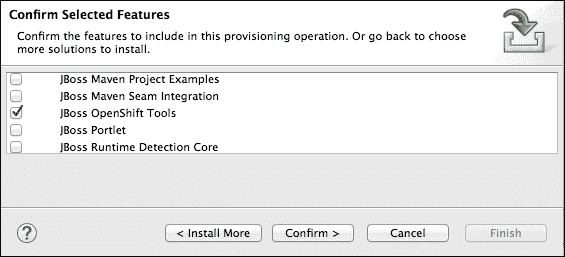

1.  点击 **确认**，接受许可条款，然后点击 **完成**。

当 Eclipse 重新启动时，您将能够创建新应用程序或导入现有应用程序。创建新应用程序很简单。执行以下步骤：

1.  导航到 **文件** | **新建** | **OpenShift 应用程序**。请查看以下截图：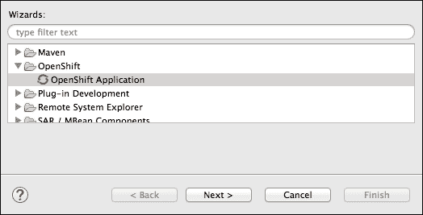

1.  您将看到一个弹出窗口，允许您输入您的 OpenShift 账户的用户名和密码。输入您的详细信息，然后点击 **确定**。

1.  下一屏将允许您从 OpenShift 云中下载现有的应用程序或创建一个新的。在这里我们将创建一个新的，如果您需要下载现有的应用程序，请调查该选项。在可能的快速启动卡中查找 WildFly 8。请查看以下截图：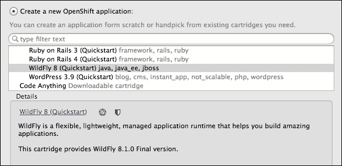

1.  点击 **下一步**，输入您的应用程序名称，并选择您的齿轮配置文件。请查看以下截图：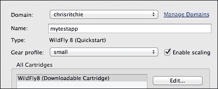

1.  点击 **下一步**，然后再次点击 **下一步**。您的新应用程序现在已完成，齿轮已配置。

本教程旨在简要介绍 OpenShift Tools 插件。如果您对使用 OpenShift Tools 感兴趣，请参阅[`docs.jboss.org/tools/4.1.0.Final/en/User_Guide/html_single/index.html#chap-OpenShift_Tools`](http://docs.jboss.org/tools/4.1.0.Final/en/User_Guide/html_single/index.html#chap-OpenShift_Tools)在线文档。

## 应用程序扩展

迄今为止，我们已介绍了一些 OpenShift 平台最基本的功能。尽管在一个章节内无法涵盖所有可用选项，但还有一个需要介绍的功能，那就是应用程序的扩展。

要使应用程序可扩展，您必须在创建应用程序时使用以下命令传递`-s`开关：

```java
$ rhc app create app_name type -s

```

### 注意

无法将不可扩展的应用程序变为可扩展。为此，您需要拍摄应用程序的快照，启动一个新的可扩展应用程序，然后将您的代码推送到它。

一旦创建了可扩展的应用程序，当某一时间段内并发请求数超过最大并发请求数的 90%时，它将自动向集群添加节点。当连续三个时间段内并发请求数低于最大并发请求数的 49.9%时，它将自动缩小规模。

您也可以通过命令行手动扩展应用程序。要手动扩展应用程序，请运行以下命令：

```java
$ 53e905324382ecc7c30001d0@wildfly-chrisritchie.rhcloud.com "haproxy_ctld -u"

```

要手动缩小应用程序的规模，请运行以下命令：

```java
$ 53e905324382ecc7c30001d0@wildfly-chrisritchie.rhcloud.com "haproxy_ctld -d"

```

最后，您可能想要禁用或启用自动扩展。这也可以通过命令行实现。要停止自动扩展，请运行以下命令：

```java
$ 53e905324382ecc7c30001d0@wildfly-chrisritchie.rhcloud.com "haproxy_ctld_daemon stop"

```

要启动自动扩展，请运行以下命令：

```java
$ 53e905324382ecc7c30001d0@wildfly-chrisritchie.rhcloud.com "haproxy_ctld_daemon start"

```

# 摘要

在本章中，我们探讨了在公司的自有基础设施上托管应用程序的传统方法的替代方案。OpenShift 平台提供了免费和付费版本的 PaaS，使开发者能够将应用程序部署到云端，无需担心下载和管理堆栈、编写脚本或安装代理。

OpenShift 平台与其他云解决方案（如 MS Azure）有一些相似之处。就像 Azure 一样，OpenShift 是由供应商管理和运行的云服务。OpenShift 提供了快速从多个卡宾中选择的能力，每个卡宾都连接到运行您的应用程序所需的一种资源。使用单个 Git 命令，您的源代码被推送到齿轮，然后您的应用程序被构建并部署到服务器。

管理您的 OpenShift 齿轮有几种方法。首先，您可以通过命令行来管理它们。这是最佳选择，因为您对您的齿轮有完全的控制权。其次，是 Web 界面，它具有有限的功能，但可以快速创建新应用程序。最后，是 OpenShift Tools，它是 JBoss Tools 插件套件的一部分，用于 Eclipse。

使用 OpenShift 时有三种选项可供选择。OpenShift Online 是一款提供免费和基于订阅的服务的产品。所有齿轮都托管在公有云上。OpenShift Enterprise 允许您下载一个稳定且受支持的 OpenShift 版本，以便在您自己的硬件上运行。最后，如果您想要最新的功能（仅提供社区支持）或想要为 OpenShift 的开发做出贡献，那么有 OpenShift Origin。
